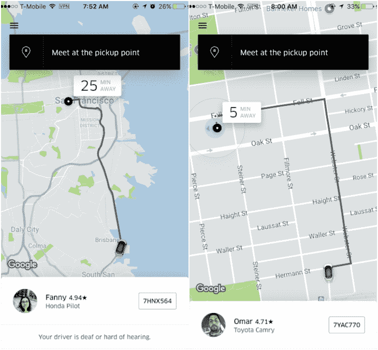

# 这不是你的想象，你在用你的通勤卡等待 Uber pool 

> 原文：<https://web.archive.org/web/https://techcrunch.com/2017/06/28/its-not-your-imagination-you-are-waiting-longer-for-an-uberpool-using-your-commuter-card/>

# 这不是你的想象，你用你的通勤卡等待 UberPOOL 的时间更长

用通勤福利卡坐 UberPOOL？你可能已经注意到，与那些只使用普通信用卡的人相比，你搭车的等待时间要长得多。

我们首先收到一个提示，这可能发生在通勤者身上，所以我四处打听，发现其他几个持通勤卡的朋友也经历了同样的事情。今天早上，我让我的一个朋友测试了一下，并把截图发给了我。使用他的通勤福利卡支付 UberPOOL 的等待时间是 25 分钟。然而，当他换成普通信用卡时，等待时间减少到了 5 分钟。巨大的差异！

他重复了这个实验，再次发现，他的通勤福利乘车将需要 15 分钟来接他，但另一种类型的乘车付款将需要他 6 分钟。

此外，请注意图片中他的第一个通勤卡司机不得不从布里斯班长途跋涉而来。第二次尝试的司机将不得不一路开车穿过城镇。但是普通卡司机就在几个街区外。

从成本的角度来看，优步支持定期支付而不是通勤福利是没有道理的。通勤者支付的费用是一样的。那么，为什么优步要对三藩市的好通勤者这样做呢？

根据优步的说法，这是一个税收问题。联邦税法允许使用免税的美元来支付通勤福利。然而，这些优惠只能用于能容纳六名或更多乘客的厢式车(共乘)。而且，因为不是每个 UberPOOL 司机都可以载六个人，所以利用这些通勤福利将乘客从 A 点带到 B 点的司机数量是有限的。

好处是你可以用税前美元开一辆优步去上班，就像你乘坐公共交通工具一样。缺点是你可能要花很长时间才能到达那里。但是，正如优步发言人指出的，“人们现在可以使用通勤福利来支付他们的 UberPOOL 乘车费用，这是一大进步。”

优步目前还没有加强小型货车司机的计划。尽管它说这是“我们正在考虑的事情”所以，在那之前，你只能先用你的通勤福利卡申请搭车，然后穿上鞋，收拾好你的工作用品，在出门取车之前做一些其他的事情。