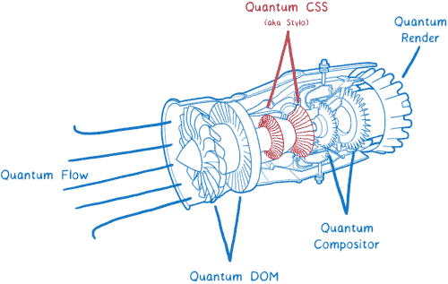
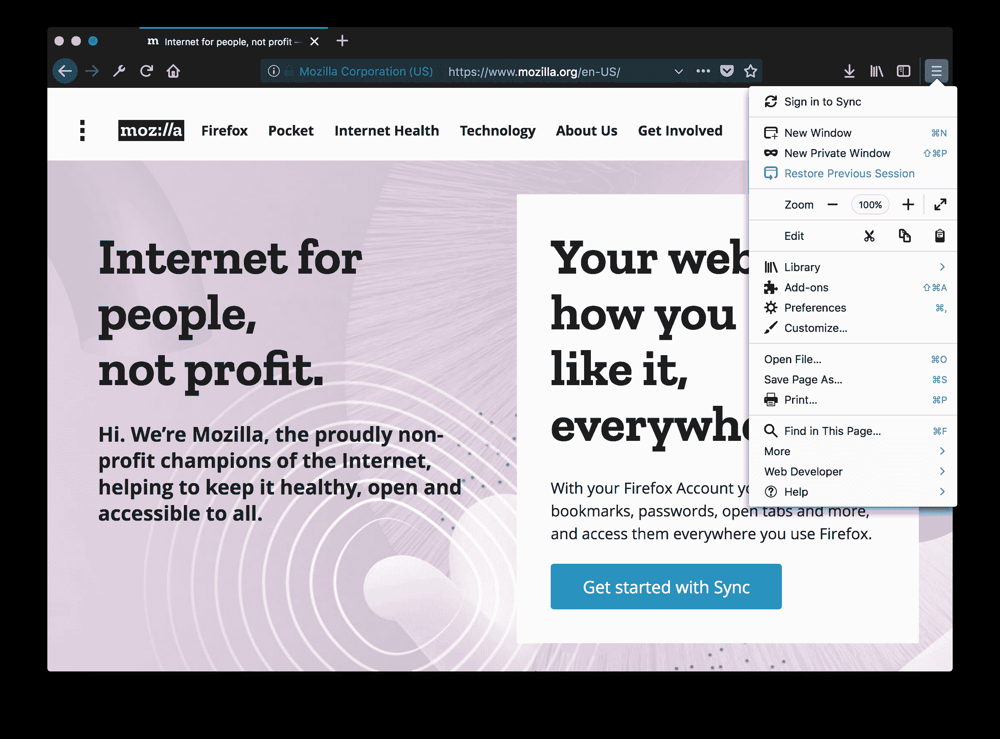

# 是时候再给火狐一次机会了

> 原文：<https://web.archive.org/web/https://techcrunch.com/2017/09/29/its-time-to-give-firefox-another-chance/>

如果你像我一样，几年前你将默认浏览器切换到 Chrome 浏览器，并且从未回头。很有可能，在你做出改变之前，你使用的是 [Firefox](https://web.archive.org/web/20230330010718/https://www.mozilla.org/en-US/firefox/) 或者——但愿不会如此——Internet Explorer。当时让 Chrome 脱颖而出的是它的速度和简单性，尤其是在 Firefox 每次更新都感觉越来越慢、越来越重的时候。但是时代变了。现在是时候再给火狐一次机会了。

本周早些时候，火狐背后的非营利组织 Mozilla[发布了](https://web.archive.org/web/20230330010718/https://blog.mozilla.org/blog/2017/09/26/firefox-quantum-beta-developer-edition/)[火狐 57](https://web.archive.org/web/20230330010718/https://www.mozilla.org/en-US/firefox/quantum/) 的第一个测试版。这听起来没什么大不了的，但版本 57 是多年来最重要的 Firefox 版本。这是多年来对许多用户从未见过但允许浏览器快速显示您的 Gmail 收件箱、YouTube 视频或 cat 论坛的移动内容所做工作的高潮。为了表明这是一个如此重要的版本，Mozilla 将这个版本命名为“Firefox Quantum”

众所周知，Mozilla 在各种无疾而终的项目上浪费了大量时间和精力(想想它的手机 OS、物联网服务、创建内置视频聊天服务等。).该组织还陷入了一些政治动荡，需要一段时间才能从这一切中恢复过来。没有必要对此进行过多的讨论。重要的是，Mozilla 似乎已经再次找到了自己的最佳状态和关注点——并且开始显现出来。

在过去的几年里，Mozilla 的工程师们努力工作，完成了几个项目，现在终于有了成果。构建这些花费了比预期更长的时间(也许是必要的)，但是有了 Quantum，Mozilla 现在提供了一个值得再次安装的浏览器。

Quantum 的许多更新来自 Mozilla 的实验性[伺服浏览器和引擎](https://web.archive.org/web/20230330010718/https://servo.org/)。Servo 从来没有打算作为一个独立的项目发布，但基本上是 Firefox 未来的孵化室。那个引擎是用 [Rust](https://web.archive.org/web/20230330010718/http://www.rust-lang.org/) 编写的，这是 Mozilla 为这种用例开发的一种编程语言。

这意味着，与以前的版本不同，Firefox Quantum 现在可以充分利用多个 CPU 核心——特别是当它涉及到 CSS 引擎时，CSS 引擎在网页渲染速度方面起着重要作用。理想情况下，这也意味着 Firefox 现在使用更少的内存(通常这意味着它实际上比 Chrome 使用更少的内存)。

该团队还利用这个版本引入了一个新的界面。例如，这意味着圆形标签消失了。新界面注重简单性和速度。像以前的版本一样，你仍然可以根据自己的意愿修改界面，但现在这个界面在高 DPI 屏幕上也很好看，在带触摸屏的笔记本电脑上效果更好。

 和以前一样，Mozilla 继续搭载内置支持 Pocket 的 Firefox。我很欣赏这一点，因为我是一个重度口袋用户，但不是每个人都喜欢这个决定。Firefox Quantum 还具有内置的截屏工具和不受干扰的阅读模式。

我已经使用 Firefox 的夜间版本几个星期了，这导致了这个版本的发布，这些新版本和旧版本之间的区别是白天和黑夜。它感觉起来又快又轻，一旦稳定版到来，我可能会让它再次成为我的默认浏览器。

当然，我还是有一些小小的不满。例如，为什么 Tweetdeck 中的 scollbars 如此丑陋？为什么 LastPass 还没有为 Firefox 57 测试版推出兼容版本的插件(这不是 Mozilla 的错，但用户不在乎)？

火狐 Quantum 是否明显优于 Chrome？没有。但他们又不相上下了，选择浏览器往往是一个非常个人化的选择。就我个人而言，我喜欢从独立方获得浏览器的想法。直到现在，对我来说，在快速的谷歌链接浏览器和缓慢的独立浏览器之间进行权衡是不值得的。现在他们又有可比性了，这种平衡正在改变。此外，在 Mozilla 没有注意到的时候，竞争对手如[维瓦尔第](https://web.archive.org/web/20230330010718/https://vivaldi.com/?lang=en_US)、[勇者](https://web.archive.org/web/20230330010718/https://brave.com/)(来自 Mozilla 的[被罢黜的](https://web.archive.org/web/20230330010718/https://blog.mozilla.org/blog/2014/04/05/faq-on-ceo-resignation/)前 CEO 布伦丹·艾希)和其他人已经涌现，而 Opera 和其他人也仍然在那里。

Firefox 57 的最终版本计划于 11 月 14 日推出。在那之前，你可以查看当前 [beta](https://web.archive.org/web/20230330010718/https://www.mozilla.org/en-US/firefox/beta/all/) 和 [developer](https://web.archive.org/web/20230330010718/https://www.mozilla.org/en-US/firefox/developer/all/) 版本中的所有新特性。