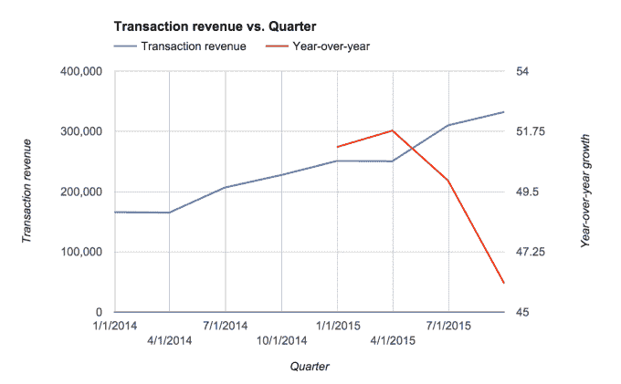

# 杰克·多西有很多工作要做

> 原文：<https://web.archive.org/web/http://techcrunch.com/2016/01/20/jack-dorsey-has-a-lot-of-work-to-do/>

Twitter 的股票在创下历史新低后，今天出现了小幅反弹，因为有传言称新闻集团正在考虑与该公司结盟。Twitter 没有对该报道置评，新闻集团表示，该传言是不真实的，但该传言浮出水面并迅速升温的事实表明，作为一家上市公司，或许作为一家企业，该公司现在感到多么不稳定。

更广泛地说，自从杰克·多西接任 Twitter 首席执行官以来，该公司的股价已经下跌了 40%以上。Square 的股价曾短暂跌破其 IPO 价格。诚然，这在一定程度上是由于市场上的更大抛售，但鉴于 Twitter 和 Square 的持续下跌，事情对多尔西来说并不顺利。

股价低可能会导致士气低落，招募顶级人才的机会减少，还可能会受到维权投资者的关注，他们认为这是一个趁虚而入、夺取董事会席位的机会——掌控公司，建立自己的管理层。这是降临到雅虎头上的命运，我们已经看到了迄今为止的进展。

所有这些也使这些公司成为有吸引力的收购目标。

让我们来看看自从多尔西成为 Twitter 的首席执行官以来发生了什么。除了股价下跌，该公司还无法显示出可持续的用户增长——这是该公司增长的一个关键因素——尽管其核心业务表现相对良好。

Square 仍然显示，它尚未解决其财务问题，这些问题显示亏损正在扩大。该公司的第一份收益报告将于 3 月份发布，它可能会显示出在寻找增长途径的过程中，其核心业务仍在苦苦挣扎。

多尔西本人也不能幸免于这些斗争。据《福布斯》报道，这位 Square 和 Twitter 的双重 CEO[已经不再是亿万富翁](https://web.archive.org/web/20230319143115/http://www.forbes.com/sites/katevinton/2016/01/20/jack-dorsey-no-longer-billionaire-as-square-and-twitter-shares-fall/#2715e4857a0b787f901b6833)，尽管他在两家上市的、以前炙手可热的私营公司都有股份。这可能不会让多尔西太烦恼——他已经向 Twitter 员工发放了部分股票，并将一些 Square 股票捐给了 Start Small Foundation。

简而言之，多尔西有很多工作要做。

## 成长中的 Twitter

首先也是最重要的是弄清楚如何重新点燃 Twitter 每月活跃用户的增长。这对公司的发展很重要，因为登录用户提供了更好的广告定位机会，这可以产生更好的收入流，而不是简单地针对注销用户做广告。

当然，多尔西承认这一点。他自己在最近的推特盈利电话中说:“我们在 Q2 的结果显示了盈利的良好进展，但是我们对观众的增长不满意。”这有几个潜在的原因，但一个主要的浮动理论是，该服务仍然令人困惑——无论是保持在线，还是首次签约。

[grafiq id = " 4 swk 5 uhz 7 wn " title = " Twitter MAU 随时间的变化" width = " 600 " height = " 565 " URL = " https://w . grafiq . com/w/4 swk 5 uhz 7 wn " link = " http://web-browsers . software insider . com " link _ text = " Twitter MAU 随时间的变化| SoftwareInsider"]

推特也在艰难地挣扎着，要么做一个反时间顺序的服务，要么像脸书策划新闻一样提供最好的推特。推特工程主管 Alex Roetter 在接受 TechCrunch 采访时，可能说得最好:“每次你打开推特，我们都应该向你展示最好的东西。”

推特允许用户发布多少字符也是一个问题，据《T2》报道，该公司将把 140 个字符的限制扩大到更大的 T3，并将其转变成一个更强大的出版平台。该服务在历史上是为了简洁，但是用户自己已经找到了发布更大文本串的新方法——通常是截图的形式。如果说历史已经证明了什么的话，那就是用户群最终会找出服务的杀手级用例。

这些只是推特混乱状态的几个例子。无论好坏，尽管每月有数亿活跃用户，该服务仍需要弄清楚自己想要成为什么样的人。推特试图从注销用户的角度来讲述它的部分增长故事，但最终，它需要让这些用户登录该服务。

话虽如此，推特的业务也有亮点。推特的核心广告业务继续超出预期，并以健康的速度增长。这要归功于该公司打造的强大广告产品，以及该公司将其用户群货币化的能力。

[grafiq id = " gjw 861 gne5f " title = " Twitter Inc .(TWTR)实际和估计收入-最近 5 个季度" width = " 650 " height = " 527 " URL = " https://w . grafiq . com/w/gjw 861 gne5f " link = " http://list . find company . com/l/445483/Twitter-Inc-in-San-Francisco-CA " link _ text = " Twitter Inc .(TWTR)实际和估计收入-最近 5 个季度

Twitter 也在努力推动自己成为一个开发平台，这可能有助于将其广告触角延伸到核心服务之外。同样，这有助于公司的核心业务继续扩张，但这些事情总是有上限的。Twitter 正在与其他开发平台竞争，并且必须让开发者相信这是构建和货币化他们的应用程序的最佳方式——在已经放弃并不得不向开发者道歉之后。

但尽管如此，Twitter 的股票表现非常糟糕。

[graphiq id = " iiyohrhcj 49 " title = " Twitter Inc .(TWTR)股价–90 天" width = " 600 " height = " 490 " URL = " https://w . graphiq . com/w/iiyohrhcj 49 " link = " http://listings . findcompany . com/l/445483/Twitter-Inc-in-San-Francisco-CA " link _ text = " Twitter Inc .(TWTR)股价–90 天| FindTheCompany "

总之，Twitter 需要重新开始增长。它需要弄清楚如何将产品方向转变为既不会疏远现有用户又能吸引大量新用户的产品。这是多尔西和他的团队还没有完全搞清楚的事情。

## 解开 Square 的商业之谜

超越 Twitter 困境的是 Square，它最近跌破了该公司的首次公开发行价格。Square 也在努力向投资者证明，它可以成为一家强大、盈利和独立的公司，其价值相当于之前在私募市场上的数十亿美元。

要了解事情的进展，请考虑以下情况:该公司的私人融资对其估值为 60 亿美元，Square 现在价值约 30 亿美元。诚然，公开市场是艰难的，但该公司的估值已被腰斩，这只是多尔西启动 Square 增长引擎面临巨大挑战的又一个例子。不管是好是坏，Square 现在是一个转折点。

Square 的财务问题之一是与星巴克的灾难性交易，该交易继续拖累该公司的盈利能力。但该公司仍需要展示其核心业务的实力，并克服像星巴克交易这样的绊脚石，如果它要安抚投资者，让股价上涨。

[Graphiq id = " EB 3 dezeviwb " title = " Square-A(SQ)股票价格–90 天" width = " 600 " height = " 490 " URL = " https://w . Graphiq . com/w/EB 3 dezeviwb " link = " https://www . Graphiq . com " link _ text = " Visualization by Graphiq "]

Square 的主要业务一直是其销售点服务，该服务旨在使快速接受资金变得容易，并帮助小企业更快地加快运营。当然，这项服务面临着竞争对手和更大的现有公司的激烈竞争，但鉴于 Square 正在获得大量收入(第三季度 3.32 亿美元)，它似乎做得相对不错——如果不是过于雄心勃勃的话。

但该公司已经快速进行了实验，以了解如何扩展其核心业务，包括[收购食品配送服务 Caviar](https://web.archive.org/web/20230319143115/https://techcrunch.com/2015/04/08/square-caviar-fastbite/) 和[建立其他服务，如 Square Cash](https://web.archive.org/web/20230319143115/https://techcrunch.com/2013/10/15/square-cash-goes-head-to-head-with-venmo-and-google-wallet-to-allow-anyone-to-send-money-via-email/) ，这是 Venmo 的竞争对手，用于与朋友快速交换现金。目前还不清楚这是否是 Square 的增长途径，但有一点是肯定的:随着交易收入的增长下降，该公司本身正在寻找新的方法来刺激收入增长。

公司的交易收入仍有强劲增长，但随着公司变得越来越大，这一引擎可能会有所放缓——这使得寻找新业务对于保持增长变得更加重要。对于 Square 这样的企业来说，这将是让投资者相信它可以成为一家强大、持久和独立的上市公司的关键。

## 走向

多尔西的道路将会很艰难。同时经营两家公司并非闻所未闻，但经营两家都在苦苦挣扎的上市公司是罕见的，也是一种挑战。

对于 Square 来说，[多尔西参与 Twitter 被列为风险因素](https://web.archive.org/web/20230319143115/https://techcrunch.com/2015/10/14/squares-ipo-filing-lists-jack-dorseys-ceo-role-at-twitter-as-a-risk-factor/)。他是 Twitter 最初产品开发的一部分，当然也建立了 Square，但经营两家公司可能会导致分心和艰难的生活方式。这可能会对他管理两家公司的能力造成压力，这两家公司的总估值约为 150 亿美元。

不管他在这两家公司的诞生中扮演什么角色，多尔西都将不得不在 Square 和 Twitter 上表现出色，他的工作是为他量身定做的。他需要让投资者相信这些公司不是收购目标，并避开激进投资者。他需要让员工相信公司是有价值的——他们的股票也是值得他们花时间投资的。他还必须让潜在员工相信，作为薪酬方案的一部分，这些公司的股票足以吸引他们。

现在的问题是，努力经营两家公司的多尔西是否是完成一切的合适人选。