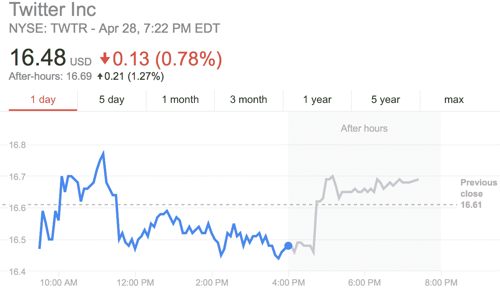

# 杰克·多西刚刚花了 950 万美元购买更多 Twitter 股票 

> 原文：<https://web.archive.org/web/https://techcrunch.com/2017/04/28/jack-dorsey-just-spent-9-5m-buying-more-twitter-stock/>

# 杰克·多西刚刚花了 950 万美元购买更多 Twitter 股票

杰克·多西又来了——在二月份购买了 700 万美元的 Twitter 股票后，这位 Twitter 首席执行官今天又买了 950 万美元给 T2。在完成购买后，多尔西在~~脸书~~推特上发布了这一消息，引发该公司股价在盘后交易中上涨 1%。

来源于谷歌财经。

根据 SEC 的文件，多尔西以大约 16.62 美元的价格购买了 574，002 股 Twitter 股票。如果你与 Twitter 近 70 美元的峰值股价相比，这个价格要么很便宜，要么如果你看到上周低于 2 美元的股价，这是一笔非常糟糕的交易。无论如何，这位首席执行官表达了对他的公司的信心，该公司不久前刚刚发布了第一份不错的收益报告。

本周早些时候， [Twitter 向投资者](https://web.archive.org/web/20221207014403/https://beta.techcrunch.com/2017/04/26/twitters-first-quarter-was-a-surprise-much-needed-hit/)报告称，它在 2017 年 Q1 带来了 5.48 亿美元的收入，超出了投资者 5.119 亿美元的预期。这让 Twitter 的股票走上了上升轨道，让股东受益。但是尽管有这些好消息，多尔西实际上并没有从他在二月份购买的超过 40 万股股票中获利多少。

加上这两次购买，仅今年一年，多尔西就额外获得了超过 100 万股 Twitter 股票。相比之下，他一直在抛售他的 side-hustle Square 的股票。Square 股票的股价一直在上涨。多尔西出售 Square 股票所得的钱此前已用于资助他自己的 Start 小型基金会。