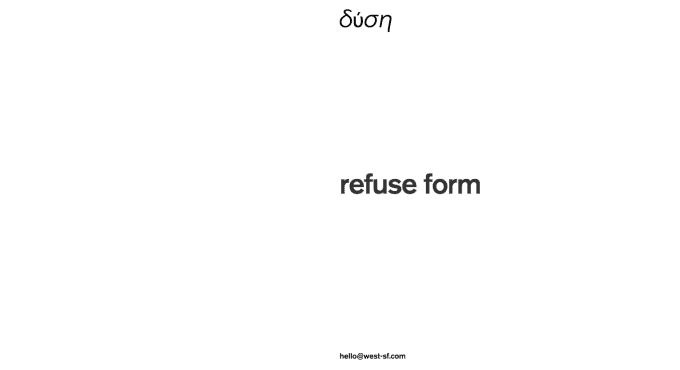
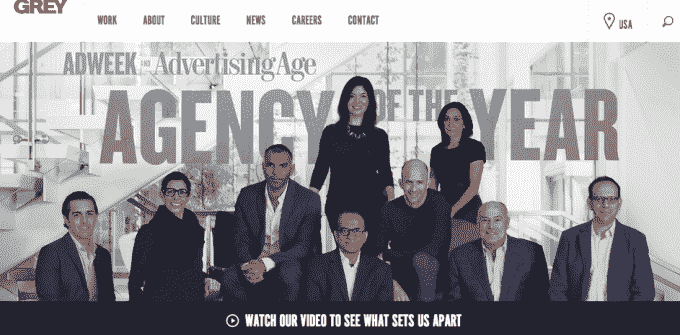
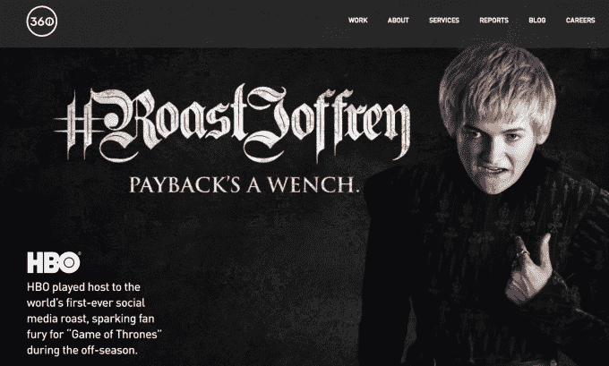
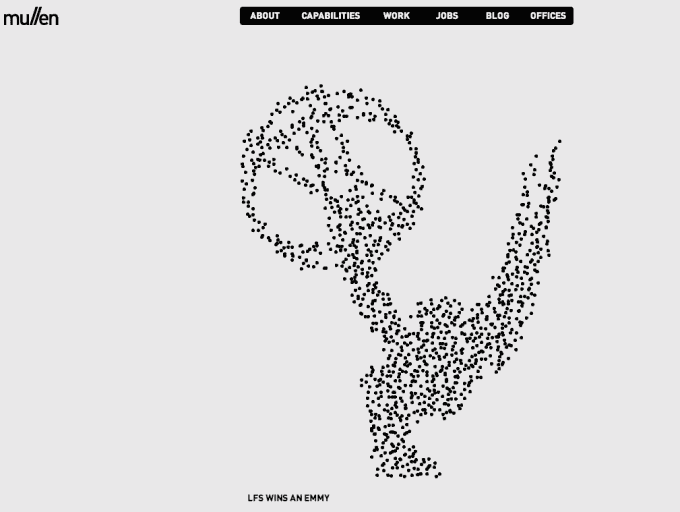

# 如果杰克·多西的广告公司尝试 TechCrunch，就不会有比这更自命不凡的网站了

> 原文：<https://web.archive.org/web/https://techcrunch.com/2014/09/24/jack-dorseys-advertising-agency-couldnt-make-a-more-pretentious-website-if-it-tried/>

[Quid 经营得很好](https://web.archive.org/web/20221007125503/https://beta.techcrunch.com/2010/09/17/quid-futuere/)，但看起来我们在无休止的争夺最自命不凡的创业网站的战斗中有了一个新的冠军。 [West](https://web.archive.org/web/20221007125503/http://west-sf.com/) ，一家由前苹果高管 Allison Johnson 在杰克·多西和雷·钱伯斯的支持下于 2011 年创立的广告公司，已经成功地通过一个完全不提供谁在那里工作或他们提供什么样的服务的网站来占据那个位置。相反，你看到的是一组旋转的图像，上面覆盖着以不同语言显示的单词“west ”,包括盲文和二进制。

[gallery ids="1062272，1062279，1062271，1062277"]

就在该机构推出之前，一位[消息人士告诉卡拉·斯威舍](https://web.archive.org/web/20221007125503/http://allthingsd.com/20110808/a-new-kind-of-marketing-company-from-former-apple-exec-will-have-backing-from-twitters-dorsey/?mod=tweet)它将会有一个不同的新模式，“不符合典型的机构。”这种描述在网站的设计中很明显。

虽然可能有一些公司不想要“典型的”广告代理，但我要说的是，大多数人很有可能想知道一家公司可能会提前为他们提供什么，然后再来回发送电子邮件，询问他们可能有什么好的解决方案。

为了证实这一点，我去了 [Ad Age 的 2014 年最佳广告公司名单](https://web.archive.org/web/20221007125503/http://adage.com/article/special-report-agency-alist-2014/ad-age-s-2014-agency-a-list/291441/)中排名前三的广告公司的网站。你猜怎么着？所有这些都突出了与公司作品、团队、文化等的链接:

当然，在硅谷创业公司的封闭世界里，你认识谁往往比你如何展示自己更重要。有可能，那些使用西氏服务的人要么被定位为“一个前苹果营销主管在负责！”或者“杰克·多西支持这些家伙！”然后被卖掉了。当你有了这样的名字，谁会在乎你的网站看起来像什么？

但我无法摆脱这样一幅画面:某个初创公司高管收到了她新雇佣的助理发来的电子邮件(因为公司刚刚筹集了资金，因此可以负担得起广告和助理费用)，信中列出了可以运营初创公司首次大型活动的机构候选人名单。

这位高管在她的 iPhone 上滚动，点击 West，在 Safari 中打开一个新标签。在给网站 30 秒的加载时间后，主管仍然只能看到一张随机的照片和一个单词的文本。她刷新页面，只看到一张不同的照片和一些随机的百分比符号。慌乱之中，这位高管迅速给她的助理发了一封电子邮件，斥责他没有看清楚这家公司做得不好——他们甚至没有一个正常运行的网站！

一位消息人士告诉 TechCrunch，由于最初几年的坎坷，多尔西公司对 West 保持沉默。尽管他们名气很大，而且该机构为资金充足的初创公司(包括 Path)做了很多工作，但该机构已经失去了一些优秀人才。尽管如此，这并没有阻止一些谣言进入我们的提示框，表明该机构在旧金山的办公室有所增长，并刚刚在纽约开设了一个位置。