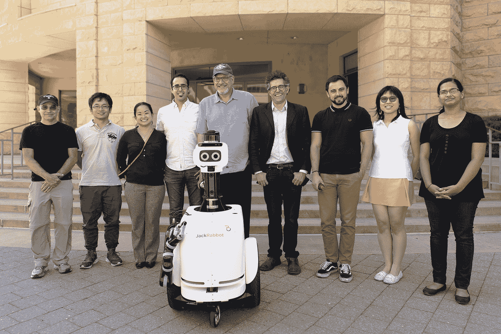
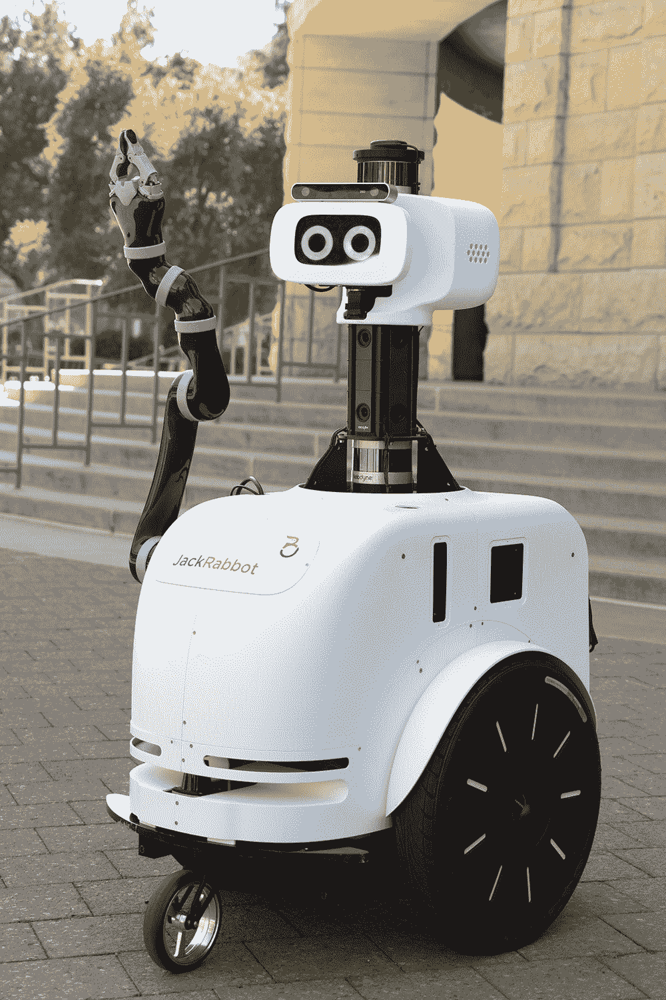

# “杰克机器人 2”走上人行道，学习人类如何礼貌地导航

> 原文：<https://web.archive.org/web/https://techcrunch.com/2018/09/19/jackrabbot-2-takes-to-the-sidewalks-to-learn-how-humans-navigate-politely/>

自动驾驶汽车和机器人必须知道如何在不撞到障碍物或行人的情况下从 A 点到达 B 点——但它们如何做到既礼貌又不打扰附近的人呢？这就是斯坦福大学 Jackrabbot 项目的目标，现在一个重新设计的机器人将在校园里漫游，学习人类谈判彼此个人空间的微妙之处。

“我们人类下意识地遵循许多行为——当我穿过人群时，我保持个人距离，或者，如果我与你说话，有人不会走到我们中间打断我们，”研究生 Ashwini Pokle 在斯坦福大学的新闻发布会上说。“我们正在研究这些深度学习算法，以便机器人能够适应这些行为，对人更加礼貌。”

当然，也有关于最后一英里问题和机器人送货的实际应用。如果有人在你面前停下来，你会怎么做？如果后面有一群人跑上来怎么办？经验是最好的老师，一如既往。

第一个机器人于 2016 年投入使用，并一直在努力建立一个人类(嗯，大多数是大学生)如何安全行走的模型，在选择有效路径的同时避免彼此，并在整个时间内发出信号。但是技术进步如此之快，以至于[呼吁对](https://web.archive.org/web/20230320185203/https://news.stanford.edu/2018/09/18/jackrabbot-2-polite-pedestrian-robot/)进行新的迭代。

JackRabbot 项目组与 JackRabbot 2(从左至右):Patrick Goebel、Noriaki Hirose、Tin Tin Wisniewski、Amir Sadeghian、Alan Federman、Silivo Savarese、Roberto Martín-Martín、Pin Pin Tea-mangkornpan 和 Ashwini Pokle

与前代相比，新机器人的传感器套件有了很大的改进:两个威力登激光雷达单元提供 360 度的覆盖范围，加上一组立体相机组成它的脖子，为它提供了另一个深度传感 360 度视图。它头上的摄像头和传感器也可以指向任何需要的地方，当然就像我们的一样。所有这些图像都由底座/机身中的一对新 GPU 进行整理。

其中一名研究人员 Amir Sadeghian 表示，这使得 Jackrabbot 2 成为“有史以来最强大的机器人之一”。

这将使机器人能够比以前更精确地感知人类的运动，并且操作更加安全。这也将让研究人员有机会看到以前的机器人创建的运动模型如何与新的图像相结合。

另一个主要的增加是一个看起来完全正常的手臂，Jackrabbot 2 可以用来向其他人做手势。毕竟，我们做到了，对吗？当不清楚谁应该先进门，或者他们应该走哪条路的时候，挥挥手就能把事情弄清楚。通常情况下。希望这个扭曲的小夹子能完成同样的事情。

Sadeghian 说，Jackrabbot 2 可以一次放大几个小时。“在安全项目的这一阶段，我们有一个带安全开关的人陪着机器人，但机器人能够以完全自主的方式导航。”

了解人们如何利用周围的空间以及如何预测他们的运动对 Kiwi、Starship 和 Marble 这样的初创公司非常有用。送货机器人第一次撞到某人的腿，是他们最后一次考虑通过机器人点餐。