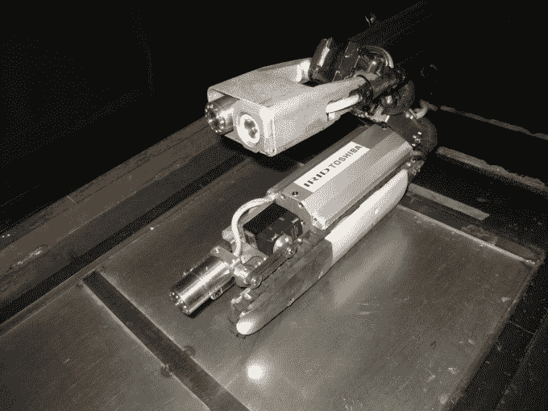

# 日本当局谴责福岛正在发生的机器人故障

> 原文：<https://web.archive.org/web/https://techcrunch.com/2017/03/25/japanese-authorities-decry-ongoing-robot-failures-at-fukushima/>

六年前，一场大地震、随之而来的海啸和核危机袭击了日本。国际组织匆忙帮助该国受灾居民，并找出如何清理福岛第一核电站。在深不可测的损失中，机器人带来了一线希望。至少他们是这样，直到最近。

正如[朝日新闻](https://web.archive.org/web/20221204095950/http://www.asahi.com/ajw/articles/AJ201703240064.html)昨天报道的那样，[日本核能监管机构](https://web.archive.org/web/20221204095950/https://www.nsr.go.jp/english/)的成员正在敦促核电站运营商东京电力公司寻找新的技术和方法来帮助清理工作。机器人在执行任务时不断被烧焦，实际上是因为辐射损伤，或者被困在现场浪费宝贵的金钱和时间。

这意味着，如果东京电力公司的能源和政府的资金被重新导向[化学](https://web.archive.org/web/20221204095950/http://energyenvironment.pnnl.gov/highlights/highlight.asp?id=1745)、[生物](https://web.archive.org/web/20221204095950/http://www.nature.com/news/2011/110330/full/news.2011.195.html)和所谓的“安全遏制”，在福岛第一核电站周围建造某种结构，就像切尔诺贝利周围的[、](https://web.archive.org/web/20221204095950/http://news.nationalgeographic.com/2016/04/042516-chernobyl-new-safe-confinement-contains-radiation/)一样，清理工作可能会进展得更快。或者也许人类需要信任人工智能来让机器人完成一些任务。到目前为止，所有部署在清理工作中的机器人都是由人远程操作的。在政府监管机构发表批评意见之前，东京电力公司披露了最新的机器人故障。

PMORPH 勘测机器人正被用于清理福岛。

3 月 23 日，该公司表示，它曾试图将一个测量机器人发送到一个安全壳内，以寻找燃料碎片，这是关闭该工厂所需的信息。但是由日立-GE 核能公司和国际核退役研究所(IRID)开发的 [PMORPH 勘测机器人](https://web.archive.org/web/20221204095950/http://www.world-nuclear-news.org/RS-Survey-under-way-of-unit-1-vessel-2003174.html)无法将其相机置于预定位置。结果，它只发回了一份不完整的报告。

就在一个月前，东京电力公司中止了一项使用东芝“蝎子”机器人的任务，该机器人是为了在瓦砾中攀爬，捕捉工厂设施内的图像和数据而制造的。这个机器人可以忍受高达 1000 西弗的辐射。然而，它在被派遣的 2 号反应堆的恶劣环境中遇到了麻烦。

在此之前，该工厂的一系列机器人损失可追溯到灾难后第一个进入工厂的机器人[昆斯 1 号](https://web.archive.org/web/20221204095950/http://www.neimagazine.com/features/featureexploring-inside/)。由千叶技术研究所、国际救援系统研究所和日本东北大学开发的 Quince 进入了电厂的 2 号反应堆建筑，在那里测量辐射水平，收集灰尘样本和视频片段。它运行了几次任务，但最终断开了通信电缆，被困在大楼里。

*这个“蝎子机器人”是为了调查福岛第一核电站的安全壳内部而制造的。*

这并不像任何人认为的那样，让机器人能够找到并回收熔化的核燃料，或者退役并净化核电站是件容易的事。正如 Timothy Hornyak 去年在《科学》杂志上所写的那样，日本研究人员自 80 年代以来一直试图创造具有这些能力的机器人。机器人仍然是令人难以置信的诱人技术。

有了相机、剂量计和其他工具，机器人表面上可以去对人类致命的地方。如果他们足够强壮和灵活，他们也许能够将核心样本带上来供科学家们测试，或者发现并堵塞漏洞，清理路径并冲刷掉放射性物质。最终的任务将是让机器人识别和回收来自福岛的大约 600 吨熔化的核燃料和碎片。

尽管核监察机构最近发出警告，许多机器人，甚至是被烧毁的机器人，都在清理现场的微小进展中发挥了作用。

iRobot 的 PackBot 510 E.T

早些时候， [iRobot 的](https://web.archive.org/web/20221204095950/https://beta.techcrunch.com/2017/03/08/colin-angle-interview/)陆基 PackBot 和 Warrior 机器人，Honeywell 的 [T-Hawk 无人机](https://web.archive.org/web/20221204095950/http://spectrum.ieee.org/automaton/robotics/industrial-robots/robotic-aerial-vehicle-at-fukushima-reactors)帮助 TEPCO 处理其设施周围的放射性和状况，包括灾难发生后几周内受损的反应堆。游泳和爬行机器人也是由日立和通用核能公司开发的，在 2014 年的一次任务中被用于捕捉受损反应堆内的图像和读数。

然而，随着每一次失败或流产的任务，每一笔 100 万美元的支出，越来越难告诉被危机摧毁的人们，机器人是他们最大的希望。日本 3/11 危机导致数万人死亡，数千人失踪，25 万人流离失所。当辐射首次从福岛第一核电站涌出时，数百万居民因寒冷潮湿的冬末天气而断水断电，陷入悲痛之中。

根据日本政府的调查，超过一半逃离或撤离该地区的人没有计划回来，甚至仍然没有。科学研究得出结论，某些地区的居民返回是安全的。但福岛周围没有多少学校、商店或其他重要的社区支持，恐惧挥之不去。日本政府估计，清理工作将耗资 1890 亿美元，耗时数十年。

让我们期待技术的下一次“阶跃变化”,无论是在机器人还是另一个有前途的领域，将加速福岛的恢复，并防止核灾难再次发生。