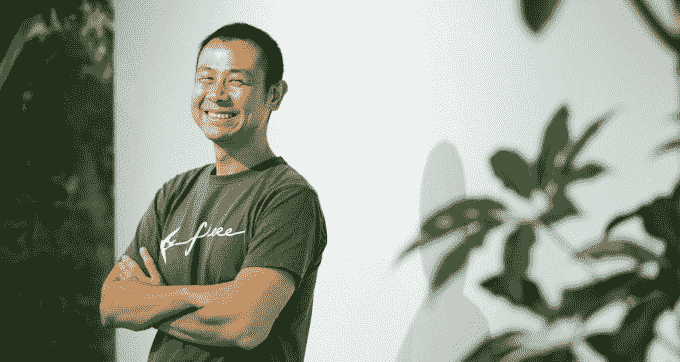

# 日本 Freee 融资 6000 万美元发展其云会计业务

> 原文：<https://web.archive.org/web/https://techcrunch.com/2018/08/07/japans-freee-raises-60m/>

总部位于日本的会计软件公司 Freee 是日本最著名的初创公司之一，它已经筹集了 6000 万美元的 E 轮融资，试图将其服务扩展到客户的其他管理领域。

Freee 成立于六年前——[我们在 2013 年](https://web.archive.org/web/20230318000220/https://techcrunch.com/2013/07/25/japanese-cloud-based-accounting-software-startup-freee-raises-2-7m-in-series-a-funding-from-dcm-and-infinity-capital-partners/)报道了这家初创公司，这使它成为日本“最古老”的初创公司之一，而这一轮也是日本的一次大融资。日本的创业生态系统有一种文化，鼓励创始人比世界上大多数地方更早地让他们的公司上市，以减轻一些风险，但也有替代方法的迹象，包括这一轮，当然还有最近的 Mercari，[的 IPO，今年夏天上市，筹集了超过 10 亿美元](https://web.archive.org/web/20230318000220/https://techcrunch.com/2018/05/15/mercari-japans-first-unicorn-files-to-raise-1-1b-in-tokyo-ipo/)。

“日本是一个非常尊重先例的国家，”Freee 创始人兼首席执行官景岛乐·佐佐木在接受 TechCrunch 采访时表示。“接手这些案子将极大地改变(文化)，我们保持私有化，并投资于增长。生态系统还没有改变，但(初创公司、创始人和风投)现在有了更多选择。”

Free 是第一批从海外投资者那里融资的日本创业公司之一，此举有助于让日本风投对企业和 Saas 感兴趣，这一次它吸引了一系列知名投资者的资本:聊天应用公司 Line、日本最大的银行三菱 UFJ 金融集团(MUFG)、消费信贷公司 Life Card 和“几家(未透露姓名的)国际机构投资者”

DCM 和 Infinity Investments 是这家初创公司的最早支持者。

如今，Freee 提供基于云的会计和人力资源软件，并声称拥有超过 100 万个商业账户。它有超过 5000 名注册会计师顾问——他们帮助它接触新客户，并在自己的工作中使用它——该公司表示，超过 3500 个应用程序和服务，主要包括金融产品，正在与它的软件集成。

展望未来，曾经是谷歌员工的 Sasaki 表示，Freee 将利用这笔新资本建立一个 API 生态系统，以实现更多的集成——目前它的一些实际应用包括 Slack 和 sales force——同时它正在计划与 Line 进行重大合作，以允许 Line 商业客户将他们对应用的使用与 Free 集成，同时它正在探索如何围绕 Line Pay 进行合作。

Freee 创始人兼首席执行官景岛乐·佐佐木

Freee 还专注于扩大其服务范围，以扩展到有助于更一般的管理和运营任务的产品。

“我们不仅希望关注后台办公，还希望通过仪表盘、报告和洞察力为客户增加价值，让他们的业务变得更好。使用[现有业务]报告的客户增长更快。我们的愿景是通过人工智能提供更好的见解和商业建议，为此，我们需要更多的数据，不仅是后台，还有前台，”佐佐木说。

最后，这家初创公司正在探索让银行和金融机构与其客户群更紧密合作的方法。客户已经可以在 Freee 中与银行共享数据，以评估贷款和其他信贷产品，该公司正在探索引入一个市场的可能性，该市场将为客户提供一个以更优惠的利率搜索金融产品的地方。

佐佐木告诉 TechCrunch:“最初我们专注于小企业，但现在我们最大的客户有数百名员工，所以我们正在向高端市场进军。”

Freee 不会涉足的一个领域是海外市场。然而至少。Sasaki 解释说，该公司希望在扩展到新的国家之前，建立一个扩展的互联服务生态系统和更深入的商业工具。

SmartHR 是 free 的年轻竞争对手，顾名思义，专注于人力资源，今年早些时候筹集了 1330 万美元，以推进薪资等领域。这可能开始对 Freee 构成威胁，尤其是因为 SmartHR 是一个提供第三方应用和服务的开发者平台。