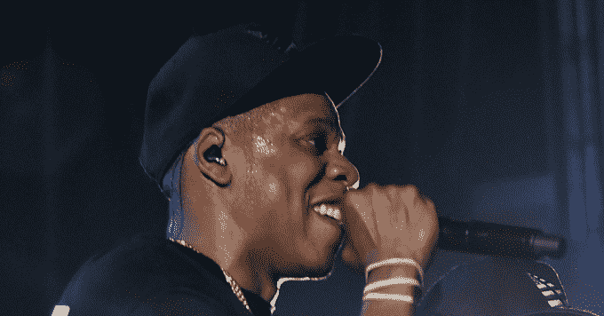

# Jay Z 正在筹划风投基金。以下是他的投资表现

> 原文：<https://web.archive.org/web/https://techcrunch.com/2017/02/21/jay-z-venture-capital/>

# Jay Z 正在筹划风投基金。以下是他的投资情况

Jay Z 在 2011 年投资了优步，如今它的价值已经翻了 200 倍。据知名科技记者丹·普里马克(Dan Primack)的出版物 [Axios](https://web.archive.org/web/20230323192238/https://www.axios.com/jay-z-is-launching-a-vc-fund-2276155599.html) 称，现在他开始认真投资初创公司，计划创建自己的风险投资公司。

Jay Z 与长期合作伙伴、Roc Nation 联合创始人 Jay Brown 一起建立了该基金。他们计划将重点放在年轻创业公司的种子投资上。他们将从夏尔巴资本得到一些帮助，夏尔巴资本是由优步的其他早期投资者创建的。据 Axios 报道，Jay Z 的基金将拥有自己的品牌，但 Sherpa 的员工不会领导其投资。

现在，Jay Z 正在寻找一个全职的风险合伙人来帮助领导他的基金，因为他有其他的工作……比如成为世界上最著名的说唱歌手之一。他还持有 Rocawear 服装和几个酒类品牌的股份，并拥有音乐流媒体服务 Tidal。

这位娱乐和商业大亨在各行各业的成功和他的知名度可能会帮助他获得最具竞争力和最有利可图的创业投资交易。

让我们来看看 Jay Z 和 Roc Nation 过去的投资以及他们此后的表现:

*   [Stance](https://web.archive.org/web/20230323192238/https://www.crunchbase.com/organization/stance#/entity)——松鸦队的 Roc Nation 投资了高档袜子公司 Stance 的 2011 年首轮融资 600 万美元。它已经从硅谷顶级投资者那里筹集了总计 1.16 亿美元的资金，这表明它做得很好。
*   [优步](https://web.archive.org/web/20230323192238/https://www.crunchbase.com/organization/uber)–Jay Z 投资了其 2011 年的 B 轮融资，当时该公司的预投资价值仅为 3 亿美元。现在它被认为价值 625 亿美元，为碧昂斯的丈夫带来了巨大的回报
*   [Viddy/Supernova](https://web.archive.org/web/20230323192238/https://www.crunchbase.com/organization/wearesupernova#/entity)——2012 年，在 Instagram 成为视频 Instagram 之前，Roc Nation 投资了热门的“视频 Instagram”应用 Viddy。创业公司[失败了](https://web.archive.org/web/20230323192238/https://techcrunch.com/2014/11/04/viddy-once-touted-as-the-instagram-for-video-will-shut-down-on-december-15/)，更名为 Supernova，然后[被卖了](https://web.archive.org/web/20230323192238/https://thenextweb.com/insider/2014/01/15/fullscreen-acquires-supernova-newly-rebranded-viddy-video-sharing-service/#.tnw_hUycLgEq)这很可能是全屏的大甩卖，所以他们很可能没有任何回报。
*   [BlackJet](https://web.archive.org/web/20230323192238/https://www.crunchbase.com/organization/blackjet#/entity)——2012 年，在[公司破产并与 Jays 的钱一起烧掉](https://web.archive.org/web/20230323192238/http://www.vanityfair.com/news/2016/05/blackjet-private-jet-start-up-shutting-down)之前，中华民国支持私人飞机初创公司 black jet。
*   [jet smarter](https://web.archive.org/web/20230323192238/https://www.crunchbase.com/organization/jetsmarter)——Jay Z 没有被 BlackJet 的失败吓倒，他亲自投资了 jet smarter 2014 年 520 万美元的 A 轮融资和 2016 年 1.05 亿美元的 c 轮融资。这家[“私人飞机的优步”](https://web.archive.org/web/20230323192238/https://techcrunch.com/2016/12/12/jay-z-backed-jetsmarter-raises-105-million-to-become-uber-for-private-jets/)初创公司希望人们以后为免费的豪华航班支付巨额预付会员费。
*   中华民国最近的投资之一是高端法国扬声器制造商 Devialet。现在判断它 2016 年在初创公司€1 亿 C 系列中的股份是否会成功还为时过早，但 Devialet 扬声器获得了好评，并在苹果商店出售。

总的来说，Jay Z 和 Roc Nation 已经成功挑选了一些有前途的初创公司，它们已经筹集了大量资金。这使他在理论上成为一名成功的风投，但他需要一些大型 IPO 或收购来锁定他的收益。

大部分风险资本收益来自一小群发展壮大的初创公司。如果 Jay Z 即将成立的基金能够利用他的品牌专长、推广影响力以及创始人与明星结交的愿望，它或许能够从这些未来的大片中分得一杯羹。