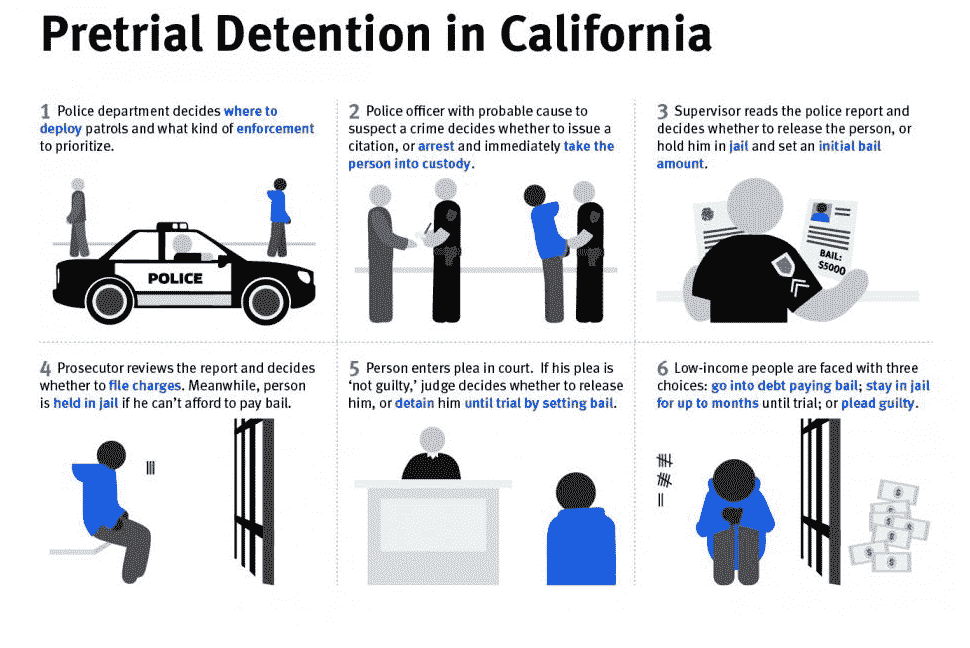

# Jay-Z 的 Roc Nation 和首轮资本向保释改革初创公司 Promise TechCrunch 投资 300 万美元

> 原文：<https://web.archive.org/web/https://techcrunch.com/2018/03/19/jay-zs-roc-nation-and-first-round-capital-invest-3-million-in-bail-reform-startup-promise/>

根据维拉司法研究所的数据，全国 62%的囚犯付不起保释金。许多被监禁的人被关在监狱里，因为他们被指控犯有轻罪或更低的罪行。从人权角度和经济角度来看，这都是一个重要的统计数字。根据审前司法研究所(T3)的统计，[每天要花费大约 3800 万美元来关押这些基本上非暴力的人。](https://web.archive.org/web/20221205214437/https://university.pretrial.org/HigherLogic/System/DownloadDocumentFile.ashx?DocumentFileKey=4c666992-0b1b-632a-13cb-b4ddc66fadcd)

这就是 [Promise](https://web.archive.org/web/20221205214437/http://joinpromise.com/) 的用武之地，这是一家去监狱化的初创公司，刚刚在首轮资本(First Round Capital)领投的一轮融资中筹集了 300 多万美元，Jay-Z 的 Roc Nation、8VC 和 Kapor Capital 也参与其中。去年父亲节，Jay-Z 写了一篇关于保释行业和审前监禁的专栏文章。他指出，每年有 90 亿美元被浪费在关押未被定罪的人身上。

Jay-Z 在一份声明中说:“我们对刑事司法系统的不公正越来越感到震惊。”。“现行政策浪费了金钱、时间和生命。现在是创新和进步的技术为棘手问题提供可持续解决方案的时候了。由联合创始人兼首席执行官淮德拉·埃利斯-拉姆金斯领导的 Promise 团队正在开发一款应用，可以帮助数百万人实现“人人享有自由和正义”

Promise 是 Y Combinator 目前一批创业公司中的一员，它为县和地方政府提供了一种替代方案，可以让那些仅仅因为无力支付保释金而将低风险人群关进监狱。

对于每个参与者，Promise 为各县提供了一个全面的接收程序，然后为每个参与者制定了一个针对他们的护理计划。然后，Promise 将通过帮助参与者确保他们知道何时应该出庭来监督和支持他们，并提醒他们需要履行的义务，如药物测试或药物滥用治疗。该应用程序还帮助参与者获得工作培训、住房、咨询和推荐。

埃利斯-拉姆金斯告诉 TechCrunch 说:“人们会因为看着一张纸读错了而进监狱，或者因为付不起学费而进监狱，因为他们要支付孩子的抚养费。”。

这些人中有许多是棕色或黑色的。去年，当参议员卡玛拉·哈里斯和兰德·保罗提出保释改革法案《审前诚信和安全法》时，他们在一篇专栏文章中写道，黑人和拉丁裔人更有可能在审判前被拘留，而不太可能支付保释金。[参议员 Harris 和 Paul 指出](https://web.archive.org/web/20221205214437/https://www.nytimes.com/2017/07/20/opinion/kamala-harris-and-rand-paul-lets-reform-bail.html?_r=0)黑人和拉丁裔男性支付的保释金分别比白人男性高 35%和 19%。

埃利斯-拉姆金斯说:“如果我们因为人们贫穷而把他们关进监狱，不管他们是黑人还是棕色人种，那我们就是用错了钱。”。

资料来源:人权观察/Grace Choi

她说，Ellis-Lamkins 和她的团队正在利用技术尝试创建一个对每个人都更好的系统。他们可以使用 Promise 来监控法院命令的遵守情况，并通过应用程序和 GPS 监控设备(如果需要)更好地监视人们，而不是仅仅因为他们付不起保释金而支付监禁费用。县、法院、案件管理人员和其他利益相关者也可以访问个人的进度报告，以监控合规情况。

Promise 本周已经在一个县开展工作，并正在与另外三个县进行谈判。埃利斯-拉姆金斯说，Promise 没有向县监狱支付每人每天 190 美元，而是向一些县收取每人每天 17 美元。在某些情况下，Promise 的人均收费甚至更低。

“我们的系统是建立在减少累犯的基础上的，”埃利斯-拉姆金斯说。“我们的理想结果是，这个人找到工作，不再犯罪，不再继续留在系统中。”