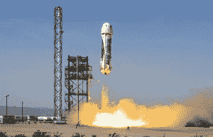

# 杰夫·贝索斯宣布蓝色起源的第一个轨道火箭，新格伦

> 原文：<https://web.archive.org/web/https://techcrunch.com/2016/09/12/jeff-bezos-announces-blue-origins-first-orbital-rocket-the-new-glenn/>

今天早上，杰夫·贝索斯透露了下一个蓝色起源火箭的计划，新格伦。

与只能上下亚轨道发射的 New Shepard 火箭不同，New Glenn 将是该公司第一款能够将有效载荷和人类送入地球轨道的火箭。

与 New Shepard 类似，New Glenn 设计有一个可回收的助推器，并打算重复使用，标志着航天工业的一个令人兴奋的发展。目前没有可重复使用的重型火箭可以运行(尽管 SpaceX 的猎鹰重型火箭预计将在今年晚些时候进行首次飞行)。

新格伦的出现备受期待。早在 6 月，蓝色起源公司在卡纳维拉尔角的一个新设施破土动工，专门开发轨道火箭。这个场地大约是 SpaceX 在加利福尼亚州的火箭设施大小的 75%,将足以容纳新格伦的制造、加工、集成和测试。

蓝色起源轨道火箭设施的艺术家再现/图片由蓝色起源提供

**动力去轨道**

新格伦将使用七个燃烧液化天然气和液态氧的 BE-4 发动机。火箭的第二级将使用单一真空优化的 BE-4 发动机。

使用相同的助推器，New Glenn 也可以配置为三级火箭，能够将有效载荷带到比低地球轨道更远的地方。第三级将使用一台真空优化的 BE-3 发动机，燃烧液态氢和液态氧。

虽然 BE-3 发动机目前用于新谢泼德火箭，但自 2011 年以来，蓝色起源一直在与联合发射联盟( [ULA](https://web.archive.org/web/20230406184616/http://www.ulalaunch.com/) )的[合作](https://web.archive.org/web/20230406184616/https://techcrunch.com/2016/06/06/blue-origin-continues-successful-record-setting-year-with-another-nasa-contract/)建造新的高性能 BE-4 发动机。除了蓝色起源的新格伦火箭，BE-4 还将用于 ULA 目前正在开发的可重复使用的[火神](https://web.archive.org/web/20230406184616/http://www.ulalaunch.com/ula-unveils-americas-new-rocket-vulcan.aspx)火箭，预计将于 2019 年飞行。

BE-4 发动机的燃烧测试/图片由蓝色起源提供

**亚轨道- >轨道- >月球？**

今天的公告揭示了蓝色起源的火箭命名策略的有趣见解，以及潜在的蓝色起源的未来。

相同的新谢泼德飞行器在试飞中第四次成功发射/图片由蓝色起源提供

他们的 New Shepard 亚轨道火箭以第一个到达太空的美国人艾伦·谢泼德的名字命名，该火箭在能够进行商业/载人飞行之前仍在进行必要的测试。谢泼德在 1961 年的亚轨道飞行中实现了这一里程碑。

> “建造、飞行、着陆和重新飞行 New Shepard 教会了我们很多关于如何设计实用的、可操作的可重复使用性。新格伦融合了所有这些知识。”蓝色起源创始人杰夫·贝索斯

新格伦是以第一个完成绕地球飞行的美国人约翰·格里恩的名字命名的。

在给订阅者的一封电子邮件中，贝佐斯表示，下一枚火箭将被命名为新阿姆斯特朗，并补充说“但那是未来的故事。”作为第一个踏上月球的人，一枚以艾伦·谢泼德命名的火箭表明了一个可能的重点，那就是能够到达月球目的地的人类级火箭。

然而，如果是这样的话，还需要很多年。新格伦本身在几年内都不太可能进行首航。

> “我们计划在 2010 年之前，从佛罗里达州卡纳维拉尔角具有历史意义的 36 号发射台首次发射新格伦。”蓝色起源创始人杰夫·贝索斯

与其他火箭相比，新格伦怎么样？

比较火箭的一个好方法是它们在各种轨道上的有效载荷能力(例如，火箭可以携带多少东西到低地球轨道、中地球轨道、地球静止轨道等等)?).这个计算取决于许多因素，包括火箭的质量，我们还不知道。但贝佐斯确实提供了新格伦的推力能力，这是一个很好的指标，表明新格伦最终会有多能干。

两级 New Glenn 火箭的推力为 385 万磅，将比目前运行的最强大的火箭更强大——由 ULA 提供的 Delta IV Heavy，其起飞推力为[210 万磅](https://web.archive.org/web/20230406184616/http://www.spacelaunchreport.com/delta4.html)。

然而，SpaceX 的 Falcon Heavy 一旦投入运行，将拥有超过 500 万磅的发射推力，超越这一能力。猎鹰重型计划于今年年底进行首次飞行。

即便如此，一旦蓝色起源让新格伦起飞，他们将成为世界上最强大的火箭之一的供应商。事实上，他们在设计中包含了可重用性，这是革命性的。SpaceX、蓝色起源和 ULA 都计划在 2020 年前发射可重复使用的重型火箭，这标志着航天工业令人兴奋的变化。

**时代在变**

竞争和可重复使用火箭的结合有望进一步降低发射价格，使研究人员和宇航员更能负担得起进入太空的费用。

> “我们的愿景是数百万人在太空生活和工作，新格伦是非常重要的一步。”蓝色起源创始人杰夫·贝索斯

事实上，世界上第五富有的人和其他企业家一样，把他们的目光——并把他们的财富押在——寻找新的方法来使太空探索变得负担得起，这已经在这个行业引起了轩然大波。