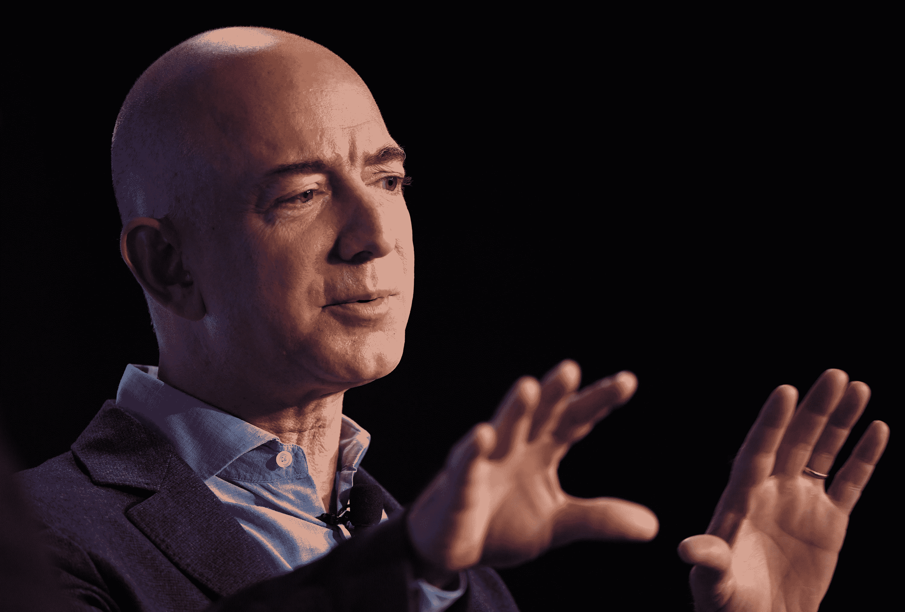

# 杰夫·贝索斯详述他的月球殖民地野心 

> 原文：<https://web.archive.org/web/https://techcrunch.com/2018/05/27/jeff-bezos-details-his-moon-colony-ambitions/>

杰夫·贝索斯对月球有着宏伟的计划，如果他能到达那里的话。只要稍加努力，我们可信赖的卫星就可以成为建立航天工业的平台——虽然与美国宇航局、欧洲航天局和其他机构的合作是最好的，但如果有必要，蓝色起源将独自完成这项工作。

在洛杉矶举行的太空发展会议上，贝佐斯与无与伦比的艾伦·博伊尔谈论了让月球成为重工业中心的想法，他认为这将有助于保护地球上的资源。

“在不太遥远的未来——我说的是几十年，也许 100 年，”他说，“我们现在在太空中做的许多事情将变得更加容易，因为我们将拥有如此多的能源。我们将不得不离开这个星球。我们要离开它，它会让这个星球变得更好。”

他解释说，地球仍然需要提供很多东西——无法从月球获得的矿物和资源——但在其他方面，月球制造基地是显而易见的。

太阳能电池 24/7 都有阳光，地表下有水，还有大量可爱的风化层可供建造(只是不要吸入灰尘)。“这几乎就像有人为我们设置了这一点，”他说。

贝佐斯已经提议蓝色起源和美国宇航局建立公私合作伙伴关系，创建一个月球着陆器，以测试月球制造和居住的可能性。它将能够向月球表面运送五吨的有效载荷，足以在那里完成一些重要的工作。

当然，这仍然是高度推测性的，该公司生产的所有火箭仍然是严格的亚轨道。较小规模的新谢泼德号的轨道继任者新格伦号(New Glenn)计划在 21 世纪 20 年代飞行，但显然贝佐斯认为没有理由等到那时才开始研究它最终可能带给月球的东西。

到时候，他希望月球居住和工业将是一种共享的特权，各国在“月球村”一起工作，结合他们的优势，而不是互相测试。

与此同时，他用自己的钱资助蓝色起源，以实现这些崇高的抱负。他说，他会继续下去，直到有人捡起球或者他破产——他和艾伦都认为后者似乎不太可能。