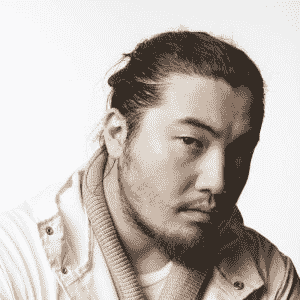

# Jidenna 和当地居民将在 Disrupt NY 闭幕音乐会上表演 

> 原文：<https://web.archive.org/web/https://techcrunch.com/2017/05/02/jidenna-and-the-local-natives-to-put-on-a-show-at-disrupt-ny-closing-concert/>

# 吉登纳和当地居民将在纽约闭幕音乐会上表演

法瑞尔和梦魔的主音吉他手迈克·艾因齐格并不是唯一在 Disrupt NY 上提高音量的人。

在 Disrupt 的最后一天(5 月 17 日，星期三)，我们将在传奇的韦伯斯特音乐厅举行一场音乐会，代替您的标准会后派对。但是谁来表演呢？

[吉登纳](https://web.archive.org/web/20220930171920/https://www.jidenna.com/)和[本地人](https://web.archive.org/web/20220930171920/http://thelocalnatives.com/)！

这将是在为期三天的激动人心的 Disrupt 后放松的绝佳时机，闭幕式音乐会将对所有 Disrupt NY 的与会者免费开放。由于音乐会最好与朋友分享，我们将为与会者提供购买+1 张门票的机会，以便带着他们的朋友一起参加。

如果出于某种原因，你对这些人不太熟悉，这里有一个小测试:

## 吉登纳

【YouTube https://www.youtube.com/watch?v=K0Eeju2aiGY]

## 当地土著人

【YouTube https://www.youtube.com/watch?v=ao7CzNioSq8]

## 哑光效果

我们将以著名的纽约 DJ[Matt FX](https://web.archive.org/web/20220930171920/http://instagram.com/mattfx)开场，Matt FX 是热门喜剧《远大城市》的音乐总监。

看到这些了不起的艺术家在舞台上表演，我们兴奋不已，迫不及待地想发泄一下，和这些不可思议的音乐家一起唱歌跳舞。

我们希望你能像我们一样兴奋，用一场糟糕的音乐会来关闭扰乱纽约。

如果你仍然需要扰乱纽约的门票，它将于 5 月 15 日至 5 月 17 日举行，你可以在这里领取门票。