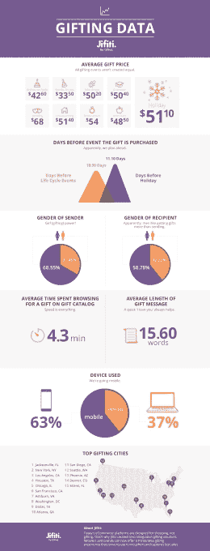

# Jifiti 的新 Messenger chatbot API 将为你找到一份礼物，即使你已经没有主意了

> 原文：<https://web.archive.org/web/http://techcrunch.com/2016/05/17/jifitis-new-messenger-chatbot-api-will-find-you-a-gift-even-when-youre-out-of-ideas/>

试图重塑数字送礼的初创公司 Jifiti 今天早上宣布，他们的[新聊天机器人 API](https://web.archive.org/web/20230327185127/http://gifts.jifiti.com/solutions/gifts-bot-api/) 获得了 Facebook Messenger 的批准。这对这家俄亥俄州哥伦布市的初创公司来说是一件大事，它已经与从宜家到 Evite 的许多公司建立了关系。自从[上个月在 F8](https://web.archive.org/web/20230327185127/https://techcrunch.com/2016/04/12/agents-on-messenger/)宣布聊天机器人的意图以来，这条新的途径可以让 Jifiti 接触到在脸书生态系统中排队的品牌。

你可能还记得脸书在公告中概述了它的意图，即通过提供一种可扩展的、充满人工智能的方式，让用户获得他们需要的一对一信息——通过对话——而不需要一对一的人类员工参与对话的每一个方面，来扰乱人们的沟通方式。它计划用于电子商务，支持，个人援助和其他任务。

我们从 2013 年(我一直认为这是一个巧妙的营销手段)推出“产品传送”以来就一直在关注的 Jifiti，通过 2014 年转向[白标礼品注册，现在他们能够通过这个 API 直接与 Facebook Messenger 聊天机器人(或任何聊天机器人)集成他们的送礼流程。](https://web.archive.org/web/20230327185127/https://techcrunch.com/2014/01/16/gifting-startup-jifiti-adds-another-1-million-launches-white-labeled-registry-app-for-ikea-portland/)

**核心技术回顾**
吉菲蒂的核心技术“通过消除通常的障碍来优化送礼，”CMO 和联合创始人绍尔·魏斯班德说。这些障碍——尤其是在网上，纺织品零售——包括礼物的正确尺寸和运输信息。当维斯班德和我讨论这个问题时，他问我“你知道你最好的朋友的衬衫尺寸和他们的完整地址吗，包括邮编？”我承认答案肯定是“不”

吉菲提是如何解决这个问题的，就是通过创造两种体验:一种送礼物的体验和一种收礼物的体验。

当消费者发送礼物时，他们会在一家与 Jifiti 合作的在线商家点击“礼物”按钮。这个礼物按钮集成到商家网站或应用程序中，只需几行代码。当按下按钮时，一个新的覆盖窗口打开，其中有一个小表单，可以输入收件人的电子邮件地址和注释，以及项目的计划信息和付款。这就是事情变得有点棘手的地方。该项目并不是实际购买的，而是该项目的价值在幕后生成为礼品卡。所有这些都被打包成一封电子邮件发送给收件人。

**收件人**
礼品收件人在其收件箱中收到之前生成的电子邮件。当他们打开它时，会有一个拆箱动画，然后是一个网页或应用程序页面的链接，其中显示了为他们选择的礼物。此时，收件人可以选择他们想要的正确尺寸，然后输入他们想要发货的地址。或者，如果他们不想要那件东西，他们可以用礼物附带的礼品卡的价值来购买其他东西。

从战略上讲，韦斯班德和他的团队声称已经发现了一些行为，这些行为使这种天赋最成功地发挥作用。基于他对我的描述，我不确定我不同意。该小组发现，当有一个触发器——事件或其他——提醒送礼者送礼物时，送礼效果最好。这似乎是显而易见的，但该团队再次找到了简化流程的机会，使发送更容易。由于这种认识，该公司专注于基于触发的平台，如活动和礼品注册体验…因此他们与 Evite、24me 和 IKEA Registry 等建立了合作伙伴关系。

他们与这些玩家的日历和基于事件的网站和应用程序的合作和集成已经允许通过前面描述的程序触发礼物推荐，以便在想到某个项目时立即赠送该项目。现在，通过他们的聊天机器人 API，任何已经开发自己的聊天机器人的品牌都可以很容易地集成 Jifiti 过程。

**大家都赢了**
在这个赠送场景中，商家出售商品，Jifiti 收到绩效支付礼品卡佣金，他们与公司分享该佣金，从而触发用户采取行动(Evite 等)。).发送者有一个快速、简单的体验，接收者得到一份礼物。似乎每个人都赢了。
Jifiti 还有一个针对大型合伙企业的 SaaS 模式。

在不久的将来，当聊天机器人在脸书的支持下似乎准备获得牵引力时，我们将看到这一切如何在聊天机器人体验中展开。

与此同时，Jifiti 正在获取许多关于哪些项目表现良好的信息，如礼物、性别、位置等。(见下面的信息图)肯定有用。

**融资**
大约 6 个月前，Jifiti 完成了由 Liberty Media(有趣的是，它拥有 Evite)牵头的 330 万美元的首轮融资。

