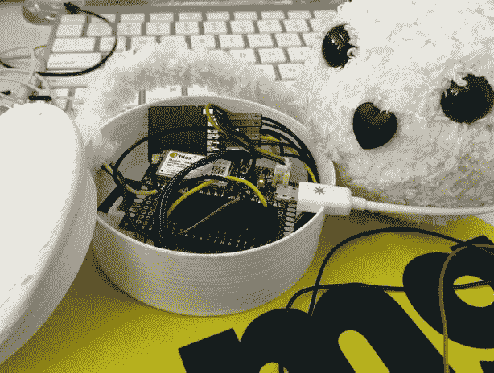
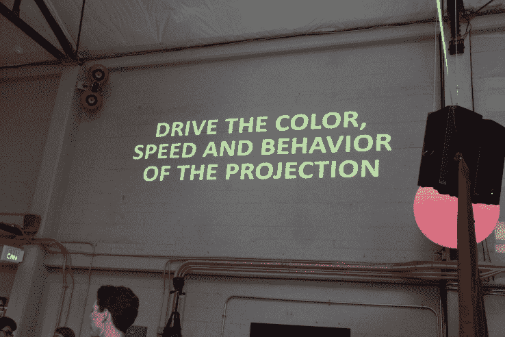

# Jonah Peretti 谈 BuzzFeed 开放实验室 TechCrunch 保持创新

> 原文：<https://web.archive.org/web/https://techcrunch.com/2016/09/23/jonah-peretti-on-staying-innovative-with-buzzfeed-open-lab/>

一家媒体公司制作能读懂你情绪的填充动物玩具是为了什么？很明显，是在预测未来。

商界公认的智慧是，年轻公司的创新是如此自然，他们不需要帮助或特殊项目来培养创新。因此，当像 BuzzFeed 这样的年轻媒体企业启动一个创新“实验室”时，感觉就像大学新生穿着爷爷的高尔夫球裤。

尽管如此，成立于 2006 年的 BuzzFeed 在一年前启动了一个叫做 BuzzFeed 开放实验室的项目；我们采访了 BuzzFeed 的首席执行官兼创始人[乔纳·佩雷蒂](https://web.archive.org/web/20221230091738/https://techcrunch.com/tag/jonah-peretti/)，了解它如何影响整个公司。

Peretti 表示，他对 BuzzFeed 开放实验室的灵感部分来自于他在纽约一家名为 [Eyebeam](https://web.archive.org/web/20221230091738/http://eyebeam.org/) 的技术、媒体和艺术机构工作时的经历。

“当我在 Eyebeam 工作，从事麦克阿瑟基金会资助的项目时，我们在这个没有商业焦点的小仓库里闲逛，不受约束地了解技术和媒体领域正在发生的事情，”Peretti 告诉我。“当然，在 BuzzFeed，我们不需要实验室来创新，但我一直喜欢感觉更像场景而不是商业的东西。”

开放实验室项目刚刚接纳了第二批研究员。它们包括:

*   凯西·邓(Cathy Deng)，她将“探索戳破我们的过滤气泡并邀请声音加入对话的方法”
*   贾米卡·埃尔将“把重新设计的移动硬件——相机、麦克风和硬盘——融入现代服装”
*   洛根·威廉姆斯(Logan Williams)，他将“构建使用机器学习将个人媒体转化为丰富和反思性故事的界面”
*   卡罗琳·辛德斯(Caroline Sinders)，她将“使用机器学习来识别和减轻在线对话中的虐待”
*   Lam Thuy Vo，他将“探索挖掘和利用社会数据讲故事的道德方式”

Peretti 表示，在过去的一年中，实验项目的研究员开发了未来的技术和项目，这些技术和项目将改变 BuzzFeed 在未来几年获取新闻和讲述故事的方式。

*BuzzFeed 开放实验室研究员 Ben Kreimer 驾驶一架新闻采集无人机。*

虽然这可能意味着开放实验室最终有助于 BuzzFeed 的盈利，但不要将其与孵化器或加速器混淆。奖学金、办公场所、设备和指导都是无条件的。

当然，BuzzFeed 开放实验室并不是这家媒体公司为新兴技术寻找新用途的唯一地方。

在最近的例子中，BuzzFeed 在 2015 年 12 月推出了 [Tasty 和 Proper Tasty](https://web.archive.org/web/20221230091738/https://www.buzzfeed.com/tasty) 。Peretti 说，脸书独有的美食视频频道现在每个月都有数十亿的浏览量，已经成为 BuzzFeed 的一大特权。

最近，BuzzFeed 宣布进行各种重组，包括成立由 Ze Frank 领导的娱乐部门 [BuzzFeed 娱乐集团](https://web.archive.org/web/20221230091738/https://www.buzzfeed.com/entertainment)，以及分别支持新闻和娱乐的视频团队。视频曾经是公司内部一个独立的部门。

BuzzFeed 的美味频道在脸书迅速走红。

“这些事情是完美的时刻，”佩雷蒂说。“它们符合人们现在消费视频的方式。作为一家公司，我们专注于流行文化，接触大量受众。”

相反，BuzzFeed 开放实验室的研究人员会把时间花在那些不像脸书、Snapchat、直播和在线视频那样普遍使用的技术上。他们也探索，有时创造尚未成为主流的媒体格式——事实上可能永远不会。

建立实验室的想法也部分受到了他姐姐早期职业生涯的启发。单口喜剧演员、女演员兼作家[切尔西·帕瑞蒂](https://web.archive.org/web/20221230091738/https://techcrunch.com/2016/02/08/comedian-chelsea-peretti-skewers-techs-lack-of-diversity-on-demand-economy-at-crunchies-awards/)最初是一个名为“SHAC 综艺”的喜剧剧团的成员。“她会和人们聚在一起尝试想法，或测试材料，用有限的资源学到很多东西，因为他们有完全的自由去实验，”她的哥哥回忆道。

*2016 年 2 月 8 日，在加州旧金山战争纪念歌剧院，切尔西·帕瑞蒂主持了 TechCrunch 第九届年度嘎吱嘎吱奖。(图片来自史蒂夫·詹宁斯/Getty Images for TechCrunch)*

根据 BuzzFeed 旧金山分社社长[马特·霍南](https://web.archive.org/web/20221230091738/https://www.buzzfeed.com/mathonan)和 BuzzFeed 开放实验室高级研究员[阿曼达·希克曼](https://web.archive.org/web/20221230091738/https://www.buzzfeed.com/amandahickman)的说法，旧金山的研究员经常与公司的编辑人员互动，反之亦然。

新闻专业人员可以帮助研究员思考如何将复杂的技术实际应用到他们可能从未意识到是新闻采集和制作的一部分的问题上。

霍南说，拥有一群内部工程师和开发人员也给了 BuzzFeed 记者一种资源，让他们可以计算出不同发明的技术可行性，或者他们所报道的行业中某项发展的影响。

研究员在展示和讲述中展示他们的工作，这是创意世界对演示日的回应。

最近一批人开发了[新闻采集无人机](https://web.archive.org/web/20221230091738/https://www.buzzfeed.com/ainsleysutherland/making-the-valley-fire-video)、 [360 度视频创作工具](https://web.archive.org/web/20221230091738/https://www.buzzfeed.com/alexkantrowitz/directors-cut-how-we-filmed-the-giants-opening-day-in-360-de?utm_term=.nxkvQprOJ#.dg02VW9Xe)、[虚拟现实内容编辑程序](https://web.archive.org/web/20221230091738/https://www.buzzfeed.com/benkreimer/google-earth-3d-for-vr?utm_term=.rg9mR4yx1#.sjqLEWABz)、[数据分析](https://web.archive.org/web/20221230091738/https://www.buzzfeed.com/westleyargentum/automated-journalism-that-works-with-journalists?utm_term=.mfpNmgPR6#.vdADrmJlq)和[机器人驱动系统](https://web.archive.org/web/20221230091738/https://www.buzzfeed.com/westleyargentum/under-the-hood-of-buzzbot?utm_term=.af4GYP5XD#.nr7Qv9yOK)用于新闻采集和调查，以及[可爱的机器人](https://web.archive.org/web/20221230091738/https://www.buzzfeed.com/christinesunu/non-dystopian-emotional-robots?utm_term=.wmp92BG53#.maQmoA7MG)，当用户手持时，可以帮助用户跟踪他们自己对他们阅读的不同故事或观看的不同视频的生物特征和情感反应。

克里斯汀·苏努的伙伴是一个“情感连接玩具”

“有很多硬件或互动的东西很好，但对人们没有帮助或用处。工程师兼开放实验室研究员 [Christine Sunu 说:“我正在建立奇怪的界面实验，应该会让你的生活更容易，包括情感上，同时也保护你和你的数据。](https://web.archive.org/web/20221230091738/https://www.buzzfeed.com/christinesunu?language=en)

霍南说，如果她想为他们找到一个商业应用，他可以看到 Sunu 的“情感连接玩具”被用作下一代类型的尼尔森人体测量仪。但是到目前为止，她不想商业化，苏努证实。

在 BuzzFeed 开放实验室的首批项目中，最反商业的项目可能是 Saito Group 的[“数据诗歌投影”](https://web.archive.org/web/20221230091738/https://www.buzzfeed.com/saito/tech-class-and-bots)系统。

*Saito Group 在 BuzzFeed Open Lab 的 Show and Tell 上展示了一台诗歌生成投影仪。*

以假名命名的 Saito Group 自动吸收社交媒体帖子，即推文和地理位置数据，然后将它们转化为发现的诗歌，这些诗歌被投影到公共场所的砖墙等表面上，在那里它们可能会与路人产生个人共鸣。

斋藤集团背后的开发者拒绝透露姓名，作为与 TechCrunch 交谈的条件。

“这里有很多公共空间。每个表面都可以用于人们交流，”Saito 说。“我想让人们了解这项(技术)，并能够为此做出贡献，在他们的城市周围张贴作品。”

霍南和希克曼表示，他们从一开始就围绕多样性和包容性开展外联活动，确保超越硅谷技术领域的常见嫌疑人，以推广他们的项目并吸引申请人。

BuzzFeed 首席执行官乔纳·佩雷蒂。

当被问及 BuzzFeed 可能很快会采用哪些未来技术，包括来自开放实验室的技术时，Peretti 说:人工智能、虚拟现实、无人机和机器人都在他的脑海中。

“在媒体变得重要之前，在基础技术方面还有很多工作要做，你可以用这些内容接触到很多人和生活，”Peretti 说。“但如果我们把这些东西理解为一种媒介，当它们扩大规模时，我们就能制作更好的新闻和娱乐。”

Peretti 还说，也许太谦虚了，机器人会比任何作家或创意更容易偷走首席执行官的工作。

“人工智能系统和机器人可以消除一些枯燥的报道工作，”他说。“但机器人很难打电话采访某人，或者写一些有趣或有见地的东西。另一方面，对于机器人来说，决定如何在企业内部分配资本可能相当容易。”