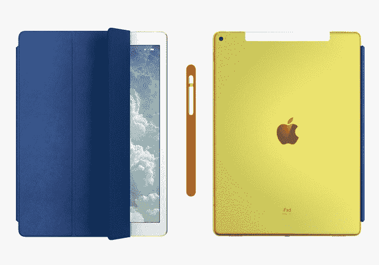

# Jony Ive 为慈善拍卖设计一次性 iPad Pro 和配件 

> 原文：<https://web.archive.org/web/https://techcrunch.com/2016/04/15/jony-ive-designs-one-off-ipad-pro-and-accessories-for-charity-auction/>

# Jony Ive 为慈善拍卖设计一次性 iPad Pro 和配件

想要在技术社区里炫耀一番吗？为什么？问问你自己，这种对关注的渴望是否健康，如果你仍然想要这些权利，可以考虑竞标这款由乔尼·艾夫设计的[独一无二的 iPad Pro 和配件。这是为了一个好的理由，或者至少你可以告诉自己。](https://web.archive.org/web/20221025223309/http://www.phillips.com/detail/APPLE-INC/UK050316/303)

这是伦敦设计博物馆筹款活动的一部分，该博物馆今年将从伦敦塔桥东部泰晤士河上的历史性挖掘处搬到肯辛顿。

iPad 是 Pro 12.9 英寸的，Ive 用一种特殊的黄色染料对它进行了阳极氧化处理。它配有钴蓝色皮革智能外壳，内衬原装超细纤维:麂皮。你也会想要苹果铅笔，它有一个火红色的皮套。

“第 1 版，共 1 版”被激光蚀刻在 iPad 的背面，以防人们不相信你。当然，任何人都可以把它刻在他们的设备上，尽管他们的肯定不会像你的那么黄。

iPad 将于 4 月 28 日拍卖，拍卖商预计出价将达到 10-15，000 英镑(约 15-20，000 美元)。

如果你更喜欢一辆精致的老式自行车或一张迷人的中世纪沙发床，看看目前正在进行的网上拍卖[。](https://web.archive.org/web/20221025223309/http://www.phillips.com/auctions/auction/UK050616)