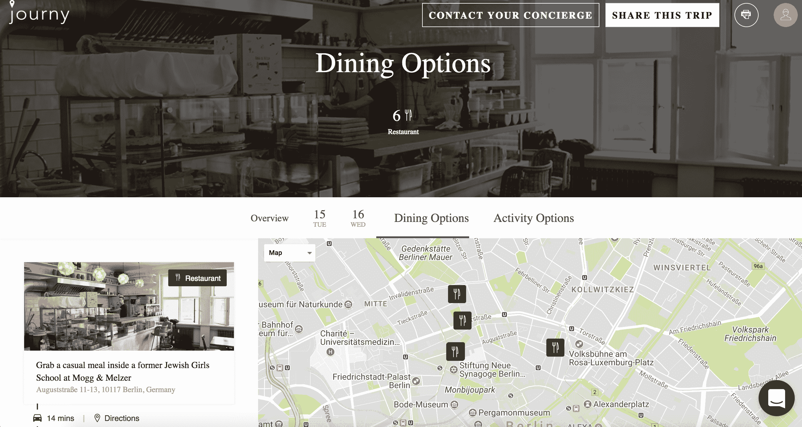
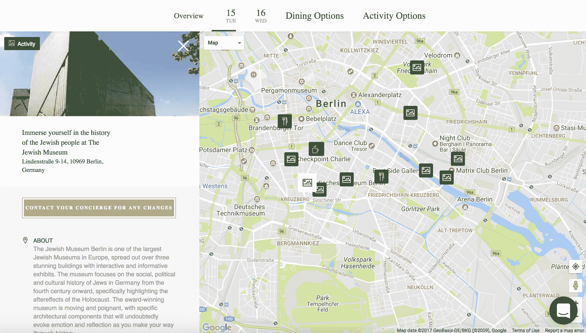

# 我会完全按照这家旅游初创公司告诉我的去做 

> 原文：<https://web.archive.org/web/https://techcrunch.com/2017/07/29/journy-travel-startup-berlin/>

我正在为另一次旅行做准备，但是我没有乘坐睡眠舱巴士，而是乘飞机(像正常人一样)去柏林。我要和我妈妈一起去，她从来没有出过国，所以我想确保这是一次愉快的旅行。这就是由 Leiti Hsu 和 Susan Ho 创办的 [Journy](https://web.archive.org/web/20221209091436/https://www.gojourny.com/) 的用武之地。

Hsu 告诉我，Journy 本质上是一家面向千禧一代的旅游初创公司，旨在提供介于高端旅游服务和自助登机服务之间的功能。

“这是关于服务和推荐以及它们的质量，”Hsu 说。

它是这样工作的。一天 25 美元，Journy 将成为你旅行的私人礼宾，处理从计划到预订餐厅和酒店房间的一切事务。我所要做的就是回答一些关于我的旅行方式的问题(全看和更悠闲的方式)，饮食限制，我的航班什么时候到达，以及其他旅行后勤。没过几天，我的个性化行程就到了我的收件箱。

对于我们在柏林为期两天的约会，Journy 推荐了六家潜在的餐厅，第一天的八项活动和第二天的九项活动。提前，我可以通过 PDF 下载行程或通过 Journy 的移动应用程序访问。

我们的第一天，Journy 让我们在柏林标签上开始喝咖啡和吃早餐。接下来，步行 10 分钟，我们将去查理检查站，Journy 称其为“1989 年前柏林最著名的外国游客过境点”

下一个议程是犹太博物馆，它特别强调了大屠杀的后果。

我们为期两天的日程还包括参观弹出式城市花园、参观柏林墙艺术和在大屠杀纪念馆反思等活动。

旅行是在下个月，所以我要么更新这篇文章，要么写一篇新的，让你们都知道它是如何进行的，如果有什么地方出错了。最坏的情况是他们把我们送到一个封闭的或者非常危险的地方，但是我们会看到的！

我的室友认为这是一个愚蠢的想法，他说:“25 美元，你可以自己制作地图。”说得好，室友。Tou。切。

事实上，我确实为我计划的最后一次大型旅行创建了自己的地图(免费)。但这需要相当大的努力。我向朋友们寻求建议，浏览猫途鹰、LonelyPlanet 和其他随机网站，然后将所有信息组织到我自己定制的谷歌地图上，标出我想去的地方。

所以，是的，亲爱的室友，我可以自己做地图。但正如有些人所说，时间就是金钱。