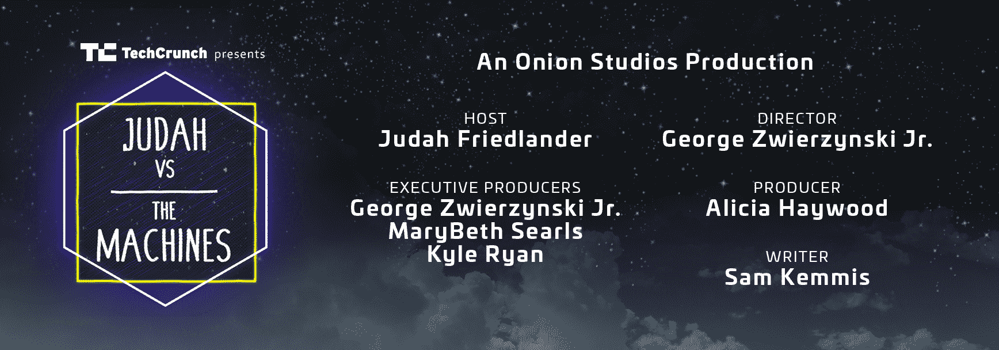

# 犹大与机器 

> 原文：<https://web.archive.org/web/https://techcrunch.com/2017/05/22/judah-vs-the-machines/>

正如贾达·弗雷德兰德自己在[扰乱纽约舞台](https://web.archive.org/web/20221207182010/https://beta.techcrunch.com/2017/05/17/watch-judah-friedlander-explore-the-future-of-ai-in-judah-vs-the-machines/)上取笑的那样，今天我们向世界呈现:犹大对机器。

《犹大与机器》是一部八集的网络系列片，讲述了喜剧演员贾达·弗雷德兰德挑战世界上最复杂的人工智能系统，看看谁才是真正的霸主。

该系列由 The Onion 与 TechCrunch 合作制作，是知识性内容和趣味性的完美结合。

你可以看看下面所有的八集，享受一点狂欢的风景。

## 第一集:犹大 Vs 狗品种识别机器人

犹大访问脸书，一个崭露头角的网站。他学习 AI 如何在平台上工作，以及翻译表情符号(emojii？).他挑战狗的品种识别软件，看看人类是否还是狗最好的朋友。

## 第二集:犹大大战艺术机器人

Judah 遇到了 Alex Reben，他是一位艺术家和机器人专家，创造了一个绘画机器人。他遇到了亚历克斯的一些更奇怪的作品，如故意伤害人类的机器人。在最后的挑战中，他挑战机器人艺术。

## 第三集:犹大 Vs 足球机器人

犹大挑战迈阿密大学的足球机器人 RoboCanes。他了解到机器人可以合作得多好，以及它们用两只脚站立的能力有多差。他向他们发出挑战，挑战人类的未来。

## 第 4 集:犹大与购物应用程序的事情

Judah 遇到了 Operator，这是一个以某种方式使用人工智能技术的应用程序。他拼凑了一些关于公司的事实，比如为什么他们的电话亭没有电话。在与运营商的较量中，他扮演了私人购物者的角色。

## 第五集:犹大 Vs 自动驾驶玩具汽车

犹大挑战自动驾驶玩具车 Anki。他学会了做一个机器人需要什么，以及如果出了问题该怪谁。在最后的决战中，他面对着安奇创造者的嘲笑。

## 第六集:犹大大战酒店送货机器人

Judah 遇到了 Relay，一个把东西送到酒店房间的机器人。他向这个可爱的机器人发起挑战，挑战顾客满意度游戏。他回答了这个问题:一个人和一个机器人能相爱吗？

## 第七集:犹大 Vs 情感识别机器人

Judah 访问 Kairos，这是一家创造人工智能来识别人类情绪状态的公司。他参观了他们只有一个房间的校园，并与他们的算法对抗，看谁能更好地检测情绪。

## 第八集:犹大对乏味的任务机器人

犹大会见布雷特，伯克利机器人消除繁琐的任务。他为布雷特所代表的东西提出了自己的理论。在惊心动魄的结局中，他向机器人挑战一个蹒跚学步的孩子的游戏。

* * *

