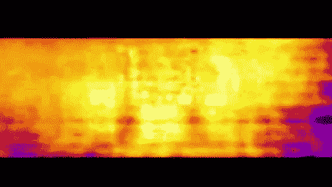

# 使用这个太赫兹相机设置，通过封面判断一本书

> 原文：<https://web.archive.org/web/https://techcrunch.com/2016/09/09/judge-a-book-through-its-cover-with-this-terahertz-camera-setup/>

如果你想偷窥一本书的内部，但你很确定如果你稍微打开封面，它就会碎成粉末，你会怎么做？嗯，没什么:打开一本书是发现里面有什么的关键一步。或者至少在麻省理工学院有人认为不应该是这样之前是这样的。

研究人员结合了几种强大的技术来实现这一点。太赫兹成像通过纸张和盖子，但辐射也被纸张和墨水不同地反射，不像 x 射线那样波长更长。

然后是女性摄影，这是一种捕捉特定类型图像的巧妙方法，间隔只有万亿分之一秒。这使得非常细微的差别被区分出来，例如反射的图像是来自一页还是下一页几分之一毫米之下。

结果是太赫兹女性照相术，研究人员能够让它确定一本书前 20 页的距离，它可以挑出印在前 9 页的单个字母。每页只有一封信，但是，你能看懂封面吗？

“纽约大都会博物馆对此表现出很大的兴趣，因为他们想，例如，看看一些他们甚至不想碰的古书，”该论文的作者之一巴马克·赫什马特在麻省理工学院的新闻稿中说。

还有很多需要改进的地方，也许可以将太赫兹辐射与其他频率结合起来。这已经用可见光和近可见光在所谓的[多光谱成像](https://web.archive.org/web/20230326045552/http://www.nbcnews.com/tech/innovation/multispectral-imaging-new-technology-resurrects-centuries-old-texts-n395406)中完成了，并且发现了埋藏在百年前手稿的墨水层下的秘密。

这项技术也可以用在书籍以外的东西上:例如，一件著名艺术品上的颜料层，或者考古样品中紧密堆积的材料。

都是出自麻省理工的[相机文化组](https://web.archive.org/web/20230326045552/http://cameraculture.media.mit.edu/can-computers-read-through-closed-books/)。在[这个视频](https://web.archive.org/web/20230326045552/https://www.youtube.com/watch?v=pUzSRwXMqOc)或者今天发表在《自然通讯》上的论文中可以找到这个过程的更多技术细节。

(注:我的辩解是，在看到麻省理工的头条之前，我是通过封面的事情想到《法官一书》的。不使用简直太贴切了！)