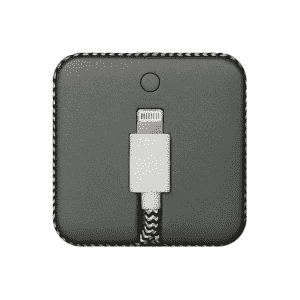

# 跳线是健忘人士的最佳智能手机充电器 

> 原文：<https://web.archive.org/web/https://techcrunch.com/2014/08/31/jump-cable-is-the-right-smartphone-charger-for-forgetful-people/>

# 跳线对于健忘的人来说是合适的智能手机充电器

像许多其他用户一样，我的 iPhone 电池往往会在一天结束前耗尽。一个显而易见的解决方案是使用类似摩尔菲的外壳，但我不喜欢增加手机的尺寸。另一个方法是随身携带一个电池充电器，但不幸的是，我太笨了，不记得有额外的设备。

相信我，我花了 30 多年的时间试图变得不那么健忘，但除了我的手机、各种其他移动设备(除了我的 iPad 之外，我还有一个安卓平板电脑)和笔记本电脑，记住给多一个设备充电的麻烦超出了我已经陷入困境的精神约束。

这就是为什么我抓住机会尝试[土著联盟的跳线](https://web.archive.org/web/20221006184755/http://www.nativeunion.com/us/jcable-l.html)，一个漂亮的电缆/电池组组合。JUMP Cable,[在 2 月份超过了 Kickstarter 的目标](//web.archive.org/web/20221006184755/https://www.kickstarter.com/projects/nativeunion/jump-the-first-charging-solution-that-fits-your-li%E2%80%9D),现在可以以 49.99 美元的价格购买。

这有点昂贵，因为它只能容纳 30%的电荷，但这 30%的电量足以在一天结束时为你的手机额外购买一两个小时，即使你使用耗电的应用程序。

而且由于你可以用跳线充电和同步你的 iPhone，而不是使用它的 lightning 线(其他设备也有 micro-USB 版本)，所以几乎不可能忘记，即使你像我一样可悲地心不在焉。我只要拔掉手机和电线，把它牢牢地包在电池组上，然后把它们都扔进包里。电池组和 19 英寸的电缆总共只有 1.5 盎司重，所以它不会给我每天随身携带的东西增加太多体积。

跳线可在 [Native Union 的网站](//web.archive.org/web/20221006184755/https://www.nativeunion.com/us/jcable-l.html#%E2%80%9D)上订购。