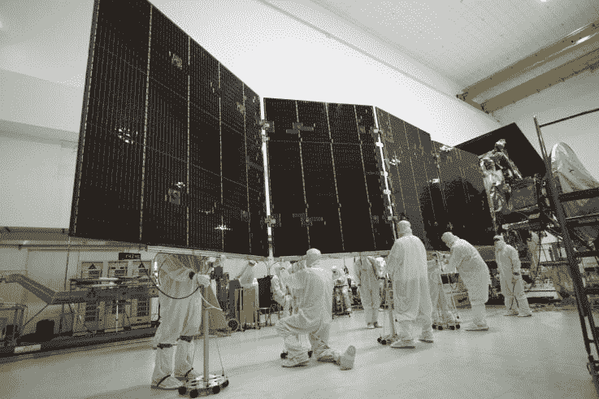
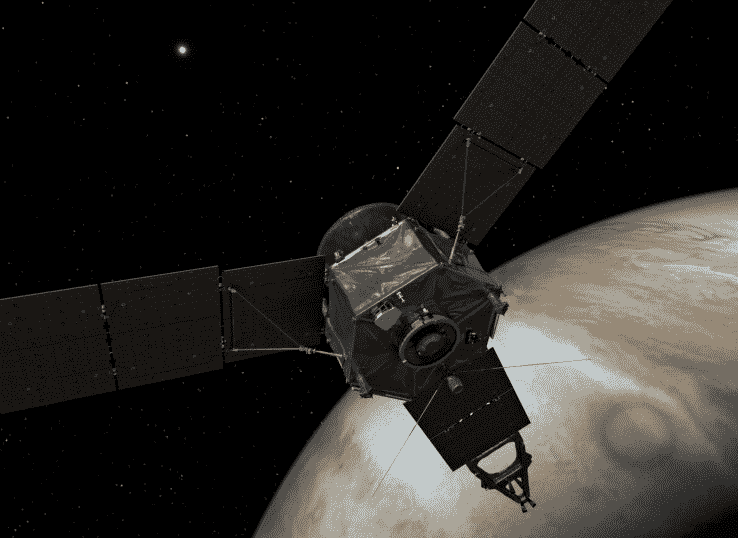

# 朱诺号负责人斯科特·博尔顿谈论美国宇航局木星轨道飞行器的技术

> 原文：<https://web.archive.org/web/https://techcrunch.com/2016/07/05/juno-lead-scott-bolton-talks-up-the-tech-of-nasas-jupiter-orbiter/>

朱诺探测器刚刚完成了期待已久的与木星的会合，开启了为期 20 个月的史无前例的行星科学。在喷气推进实验室的一次简报会上，我们采访了该任务的首席研究员，西南研究所的斯科特·博尔顿——他非常乐意谈论飞船上所有很酷的新设备。

“我们从一开始就试图创造最高效的设计，”博尔顿说(“工程团队喜欢简洁的线条，”他补充道)。“就 Juno 而言，因为我们进入了如此极端的环境，所以许多设计都需要重新测试和思考。”

当然，木星是巨大的，环绕它的力量也是巨大的。朱诺号将会遇到极高水平的辐射和强大的磁场，这意味着所有的仪器都需要非常安全的防护。但是把它们都装进“电子储藏室”的有限空间里并不是一件容易的事情。

【T2

“这需要大量的工作。我不能告诉你花了多长时间，”他说。“我们的工程师和科学家团队都试图解决这个难题:我们如何将这些盒子放入其中，我们如何扭曲它们，我们如何转动它们？当我们把盒子放进去时，我们意识到我们必须把电缆放进去。”

它全部由太阳能驱动，今年 1 月，朱诺号超过了罗塞塔号的记录，成为历史上最远的太阳能飞船。

"我们选择了整个星球上最好的东西."博尔顿说。"这些太阳能电池板非常高效，而且非常大."确切地说，261 平方英尺——对于地面太阳能发电厂来说不算多，但对于必须发射到太空的飞行器来说几乎太大了。

Astrotech 的工人们收起了为朱诺号提供动力的一块巨大的太阳能电池板。

由于 Juno 是 Bolton 的宝贝，他期待着来自每台设备的数据，但他会特别关注其中一台设备。

“我特别喜欢我们称之为微波接收器或微波辐射计的东西。这些将是在木星上第一次看到云层下面的东西，”他说。“这是一种全新的乐器。我们从未飞过这样的东西。”

微波辐射计占据了金库的大部分表面区域，由六个调谐到特定频率的巨大天线组成。每一个都将穿透到这个气体巨人的不同层，当朱诺在每个轨道上旋转时，这六个将一起提供木星著名的漩涡表面下的内聚力。

艺术家对木星轨道上的朱诺的概念。

“我们真的不知道会发生什么，”博尔顿说。“我知道会有很多发现，所以我很兴奋。它将为公众提供他们从未见过的东西，这是木星大气层真实面貌的三维图像。”

在朱诺号为期 20 个月的任务中，我们将继续关注它的进展。可见光相机拍摄的第一批图像，将在轨道插入后不久获得从未见过的木星北极视图，应该会在到达后几天内显示出来。