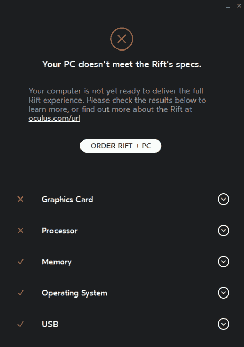
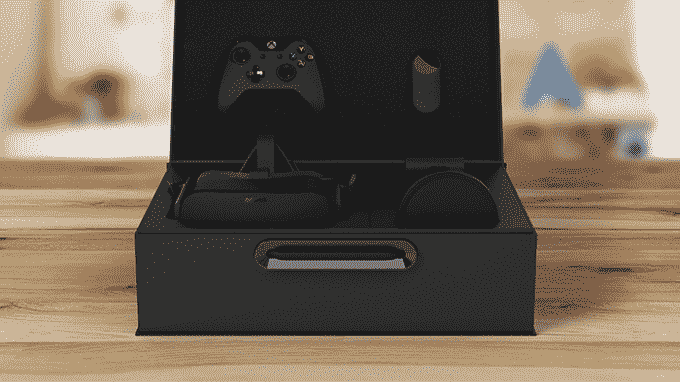

# Oculus Rift 需要多好的电脑？

> 原文：<https://web.archive.org/web/https://techcrunch.com/2016/01/06/just-how-good-of-a-pc-does-an-oculus-rift-need/>

# Oculus Rift 需要多好的电脑？

Oculus Rift 现在可以预购，价格为 599 美元，但对于它到达你家门口后你还需要插入什么东西并开始工作，还是有些困惑。

是的，你需要一台电脑。是的，那台电脑需要相当大的负载。

在他们今天的[预购帖子](https://web.archive.org/web/20221209073628/https://www.oculus.com/en-us/blog/oculus-rift-pre-orders-now-open-first-shipments-march-28/)中，该公司分享了一个“[兼容性工具](https://web.archive.org/web/20221209073628/http://ocul.us/compat-tool)的链接，它会告诉你你的电脑是否能够运行新的 Rift。游戏玩家可能是排队等待 Rift 的早期用户，他们可能已经做好了准备。

以下是 Oculus 对“全 Rift 体验”的建议:

> 显卡:英伟达 GTX 970 / AMD R9 290 同等或以上
> 处理器:英特尔 i5-4590 同等或以上
> 内存:8GB+ RAM
> 输出:兼容 HDMI 1.3 视频输出
> 输入:3 个 USB 3.0 端口加 1 个 USB 2.0 端口
> 操作系统:Windows 7 SP1 64 位或更新

尝试在您当前的设置上使用该工具。如果您不符合这些建议，[您将会看到类似这样的内容](https://web.archive.org/web/20221209073628/http://vrfocus.com/archives/27520/oculus-compatiblity-tool/):

如果你目前没有电脑，可以选择获得 Rift 的完整套件和一台可以流畅处理它的电脑，你可以在 2 月份预购。费用为 1499 美元。由于第一波交付将在三月开始，你有时间把你现在的装备安装好，或者，嘿…自己造一个，这很有趣！

所以，是的，这对一些人来说是一个惊喜，但是大多数人提前知道这是一个需求。为什么有些人会感到惊讶？这是一项新技术，有相当多的宣传，但有很多细节。

现在你明白为什么 Oculus 会与三星合作开发 [$99 Gear VR](https://web.archive.org/web/20221209073628/https://beta.techcrunch.com/2015/11/20/samsung-gear-vr/) 。它让人们更快地获得虚拟现实体验，你只需要一部手机来运行它。而且是移动的。