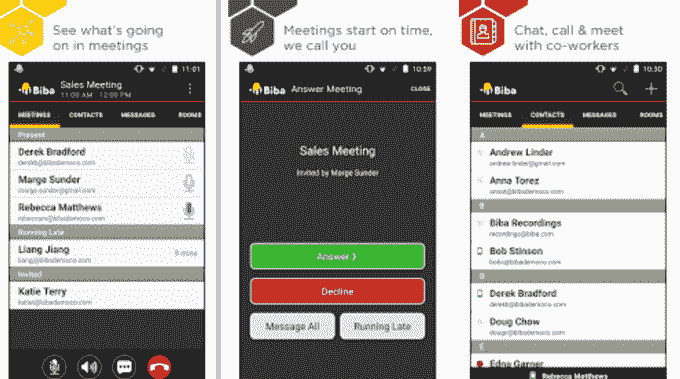

# 亚马逊收购专利，来自 Biba 的员工，据报道计划新的视频聊天服务

> 原文：<https://web.archive.org/web/https://techcrunch.com/2016/11/23/justin-biba-amazon-video/>

亚马逊对 Twitch 和 T2 Elemental Technologies 的收购似乎只是该公司通过收购深入视频服务这一更大战略的两部分。去年，市场和云计算巨头还悄悄收购了旧金山一家名为[的初创公司 Biba Systems](https://web.archive.org/web/20230313195344/http://biba.com/) ，该公司开发并运营面向商业用户的视频消息应用。消息人士称，亚马逊一直在开发自己的视频消息服务，计划在本月晚些时候的 re:Invent AWS 会议上推出。

上周，亚马逊可能收购 Biba Systems 的消息首次浮出水面，当时 [GeekWire](https://web.archive.org/web/20230313195344/http://www.geekwire.com/2016/amazon-stealthily-bought-work-communication-company-biba-systems-last-year/) 发现了一些特拉华州的文件，其中提到了 2015 年 9 月与一家名为“Justin Acquisition”的实体的合并。贾斯汀收购文件中没有直接提到亚马逊，但文件中包括了亚马逊当时雇佣的一名律师助理的名字。

亚马逊从未回应我们(或者 GeekWire)对这个故事的置评请求。所以我们决定自己挖掘一下。我们发现了 Biba 和亚马逊之间的一些直接联系，表明 Biba 的技术和员工现在都是亚马逊的一部分。

我们发现 Biba 已经申请并获得了两项专利，一项与[视频会议](https://web.archive.org/web/20230313195344/https://patents.google.com/patent/US20160014373A1)有关，另一项与[音频流](https://web.archive.org/web/20230313195344/https://patents.google.com/patent/US20160105473A1)有关。这两项专利都在最近两个月内将其所有权转让给了亚马逊技术公司。

此外，我们已经能够追踪当前 Biba 员工的有效亚马逊工作电子邮件地址。(我们不在这里公布这些。)

## 为‘贾斯汀·比巴’让路？

目前还不完全清楚亚马逊可能如何以及在哪里使用 Biba 的技术，但我们的消息来源称，亚马逊最近一直在向特定人群展示视频会议产品的演示。

“他们将在感恩节后的 re:Invent 活动上发布它，”一个人说。

这个视频产品(如果下周真的发布的话)是否是用 Biba 制作的还不清楚。但是，巧合的是，我们注意到 Biba——它在 2015 年 9 月之前在 Twitter 上保持沉默，并有自己的营销努力——在今年 8 月和 9 月突然悄悄地更新了其在 T2 的 Android 应用和在 T4 的 iOS 应用。

亚马逊通过 AWS 扩展其提供的应用和软件是有一定逻辑的。

如今，AWS 已经在其基于 can 的基础设施上销售了一些产品。它们包括[工作邮件](https://web.archive.org/web/20230313195344/https://aws.amazon.com/workmail)，这是一种基于云计算的管理电子邮件和日历服务；以及 [WorkSpaces](https://web.archive.org/web/20230313195344/https://aws.amazon.com/workspaces/) ，这是一项桌面虚拟化服务，可与 VMware、Parallels、微软等公司的产品竞争。

将工作场所协作和会议产品加入其中，将是亚马逊现有自有品牌云服务的明显扩展。Biba 目前提供的功能包括视频和音频电话会议，包括日程安排和管理；联系人和状态管理；信息服务；屏幕共享；和管理功能。

在之前，人们就想知道亚马逊是否会更深入企业软件；现在看来，有可能。这一举措可能会使其在与微软等公司的竞争中更具竞争力，微软用 Azure 和自己广泛的企业软件与 AWS 竞争。它更新了自己的视频会议产品——Skype，使其更有利于商业运作。

然而，无论如何，目前看来，无论亚马逊在自己的软件方面带来什么，都是为了补充而不是蚕食 AWS 上的服务，该公司一直在[将 AWS 打造为第三方商业软件提供商的广阔市场，](https://web.archive.org/web/20230313195344/https://www.bloomberg.com/gadfly/articles/2016-11-17/amazon-spreads-its-marketplace-magic-to-cloud-business)相当于亚马逊的消费者电子商务市场。

亚马逊可能会在其他领域使用 Biba 的一些技术。正如我们上面提到的，亚马逊通过一个名为 Justin Acquisition 的实体运营其 M&A，GeekWire 猜测这可能是指亚马逊的另一项收购，视频平台 Twitch。(其创始人还创立了视频服务 Justin.tv，后[关闭](https://web.archive.org/web/20230313195344/https://techcrunch.com/2014/08/05/justin-tv-shuts-down-to-let-the-company-focus-on-twitch/)专注于 Twitch。)

今天，Twitch 的 4500 万用户观众中的绝大多数是由游戏玩家组成的，他们直播自己或观看别人玩游戏并对他们进行评论。但是也有其他的努力将它扩展到其他领域，比如 T2 食品和 T4 艺术。亚马逊可以将 Biba 的功能集成到 Twitch 中，反之亦然，要么添加更多的交互元素，要么扩展 Twitch 作为 B2B 平台的功能。

最后但同样重要的是，亚马逊也有机会将 Biba 用于内部目的。

环顾亚马逊的招聘栏，我们发现只有一个地方提到了 Biba:在一个关于 AWS 支持的培训专家的[广告中，帮助 AWS 客户解决关于 AWS 产品的问题，Biba 与 Webex 和 Adobe Connect 一起被称为申请人需要在过去使用过的软件平台之一。亚马逊可以在 Biba 的平台上建立自己专有的内部支持网络；潜在地，它可以随后在 AWS 上提供这种服务。](https://web.archive.org/web/20230313195344/https://www.amazon.jobs/en/jobs/442759)

根据 CrunchBase 的数据，Biba 已经筹集了超过 1500 万美元的资金，投资者包括 Benchmark、Trinity 和 InterWest Partners。