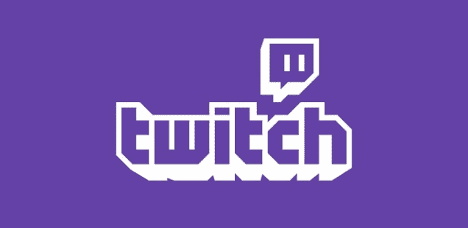

# Justin.tv 关闭，让公司专注于 Twitch 

> 原文：<https://web.archive.org/web/https://techcrunch.com/2014/08/05/justin-tv-shuts-down-to-let-the-company-focus-on-twitch/>

# Justin.tv 关闭，让公司专注于 Twitch

这似乎是不可避免的，但这一天终于到来了: [Justin.tv](https://web.archive.org/web/20230406063652/http://www.crunchbase.com/organization/justintv) ，诞生了游戏广播服务 Twitch(并很快被其掩盖)的流媒体服务，已经关闭了大门。

从现在开始，他们的注意力完全集中在特维奇和 T4 身上。

一度，Twitch 只是 Justin.tv 上的一个视频类别，旨在让 Justin.tv 用户播放视频游戏。

最终意识到这一类别比所有其他类别的观众总和还要多，他们在 2011 年将 Twitch 变成了自己的服务。到 2014 年，Twitch 发展得如此之大，以至于整个公司都改名为“Twitch Interactive”。

5 月，有消息称谷歌/YouTube 正寻求以高达 10 亿美元的价格收购 Twitch。截至 7 月下旬，这些会谈据说要么已经完成，要么接近尾声。到目前为止，没有一家相关公司发布任何官方声明。

虽然该网站已经关闭，但如果用户想保留他们的用户名，他们可以在一个月内将他们的 Justin.tv 帐户转移到 Twitch。

**该公司在官方声明中说:**

> Justin.tv 开创了互联网视频直播的先河，并催生了有史以来最大的视频平台之一:Twitch。Justin.tv 于 2014 年 2 月正式更名为 Twitch Interactive Inc .，Twitch 现在是公司资源的焦点。不幸的是，这意味着我们需要关闭 Justin.tv。我们感谢所有的广播公司和观众 7 年来的现场视频记忆。