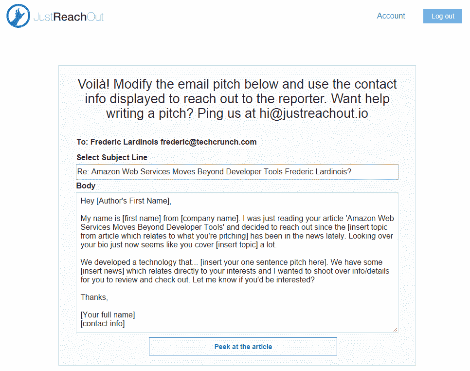

# JustReachOut 帮助初创公司撰写更好的电子邮件推介 

> 原文：<https://web.archive.org/web/https://techcrunch.com/2014/07/25/justreachout-helps-startups-write-better-email-pitches/>

如果我们在 TechCrunch 知道一件事，那就是做公关对创业公司来说很难。我们每天都会在我们的综合提示热线上看到一些糟糕的推介，我们也会收到很多单独发送给我们的推介，它们并不适合我们。我们总是告诉创业公司，找出谁是给定主题的最佳作家，但如果你必须在多个出版物上这么做(假设你不想给我们独家)，这很快就变成了一件苦差事。

最近，一家新兴的黑客咨询公司[推出了一项服务，通过将其网络服务与一些基本的咨询服务相结合，使公关变得更加容易，也更加实惠。](https://web.archive.org/web/20221007103004/http://www.criminallyprolific.com/)

上周， [pressfarm](https://web.archive.org/web/20221007103004/https://press.farm/) 推出了一项服务，让公关公司以每月 9 美元的价格获得主要科技出版物作者的电子邮件，引起了一点轰动。如果你只是想与我们联系，你也可以使用我们的列表[这里](https://web.archive.org/web/20221007103004/https://beta.techcrunch.com/2014/07/14/please-dont-spam-us/)为自己节省一些钱。

然而，拥有一封电子邮件只是这个过程的一部分。你怎么知道某人报道了什么？这就是[刚伸出](https://web.archive.org/web/20221007103004/http://www.crunchbase.com/organization/justreachout)的用武之地。它采用了这一理念，但对其进行了提炼，并在此基础上增加了一些基本的咨询服务。

这项服务背后的想法是，大多数初创公司在早期可能可以通过简单地与报道他们领域的记者建立关系来绕过常规的公关渠道。

所以你在 JustReachOut 上做的第一件事——在你看了一个关于[创业公关基础](https://web.archive.org/web/20221007103004/https://www.udemy.com/how-to-build-relationships-with-journalists/)的强制性视频之后——就是寻找那些写了关于你的创业相关话题的文章的记者(想想 AWS、无人机、[脸书](https://web.archive.org/web/20221007103004/http://www.crunchbase.com/organization/facebook)、手机游戏等等)。).然后，该服务将查找这些内容，并返回一个关于该主题的近期文章列表及其作者的姓名。

在那里，你点击作者的名字，你会看到一个已经预先填写了标准推介的电子邮件表单。你可以这么做，但公司不鼓励你这么做，因为你也可以联系他们，他们会和你一起构思一个更好的推销方案(我建议你这么做，因为你真的想尽可能个性化这类邮件)。

[德米特里·德拉吉列夫](https://web.archive.org/web/20221007103004/http://www.crunchbase.com/person/dmitry-dragilev)，负责[犯罪多产的](https://web.archive.org/web/20221007103004/http://www.crunchbase.com/organization/criminally-prolific)，已经做了整整七年的公关工作——并且在那几年里经常成功地向我们推销。(毕竟，他让我们写了这个，所以他一定知道这个过程是如何运作的。)正如我本周早些时候与他交谈时他强调的那样，该产品的重点真的不仅仅是获取电子邮件地址，而是与他通电话，了解更多关于如何正确开展创业公关的信息。

“当你点击‘联系’后，这个工具会立即向你显示一份电子邮件草稿和电子邮件地址，我可以指导你写好你的电子邮件推介，”Dragilev 指出。“我这样做是为了帮助初创公司思考如何在他们真正关心的事情上与媒体建立关系。”他最不希望的事情就是人们使用这个工具，然后垃圾邮件作者(这很受欢迎)。

Dragilev 告诉我，该工具对你可以发送的电子邮件数量进行了一些限制，以确保初创公司不会向太多作者过度推销故事。该服务在后台使用 [Sell Hack](https://web.archive.org/web/20221007103004/http://sellhack.com/) 来查找其电子邮件地址。这有时会失败，但该工具会在无法验证地址时通知您。

JustReachOut 目前每月 25 美元，但夏季过后，价格将上涨至每月 99 美元(如果你在此之前注册，你将保持每月 25 美元)。考虑到这还附带一些实践咨询，这看起来是一个非常合理的价格——尤其是与一家提供全方位服务的公关公司的价格相比。