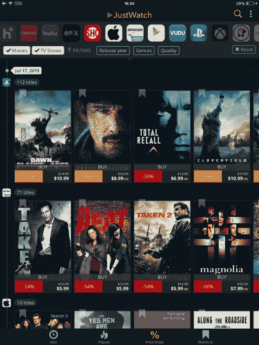

# JustWatch 将其脐带钳搜索引擎带到了 iOS 和 Android 平台

> 原文：<https://web.archive.org/web/https://techcrunch.com/2015/07/21/justwatch-brings-its-search-engine-for-cord-cutters-to-ios-and-android/>

今年早些时候，[推出的初创公司](https://web.archive.org/web/20230324220839/https://techcrunch.com/2015/02/05/justwatch-debuts-a-new-search-engine-for-cord-cutters/#.s2agxy:AbyJ)just watch 提供了一个搜索引擎，帮助插队者找到在哪里观看他们喜欢的节目和电影，现在该公司正在向移动领域扩张。该公司已经发布了 iOS 和 Android 应用程序，可以帮助你找到在哪里观看电影和节目，以及在各种服务中发现新的和受欢迎的内容，包括网飞，亚马逊，HBO NOW，Showtime，Hulu，iTunes 和许多其他服务。

虽然今天有很多应用程序和网站提供类似于 JustWatch 的解决方案，如[粉丝电视](https://web.archive.org/web/20230324220839/https://techcrunch.com/2015/03/25/fan-tvs-new-app-is-a-must-have-for-cord-cutters/)、 [Yidio](https://web.archive.org/web/20230324220839/http://www.yidio.com/) 、 [Instantwatcher](https://web.archive.org/web/20230324220839/http://instantwatcher.com/) 、 [CanIStreamIt](https://web.archive.org/web/20230324220839/http://www.canistream.it/) 等，但 JustWatch 一直通过关注美国和国际观众来区分自己。继今年 2 月在美国推出之后，该公司将其搜索引擎扩展到支持德国、巴西、澳大利亚和新西兰。该公司告诉我们，在不久的将来，JustWatch 将扩展到加拿大和英国。

在网上，这项服务就像一个搜索引擎，你可以输入一个标题，找到你可以在哪里观看或购买它，以及哪项服务目前价格最优惠。该网站还提供定期更新，提醒您最喜爱的服务上有新内容出现。例如，对于那些主要只使用一两个流媒体服务的人来说，这尤其有帮助，他们会觉得自己已经看完了所有符合自己兴趣的好东西。

新的移动应用 out 现在提供了类似的功能集，还将突出显示跨服务用户的热门节目和电影。在推出时，JustWatch 正在跟踪网飞、亚马逊 Prime 即时视频、HBO NOW、Showtime、Hulu、Crackle、iTunes、Vudu、Xbox、PlayStation、Epix 以及 realeyz、Mubi 和 Fandor 等精选利基产品。

[gallery ids="1185579，1185578，1185577，1185576"]

如上所述，有很多应用程序可以帮助你跟踪流媒体和下载的情况，但我发现 JustWatch 的简化界面和搜索过滤器的选择非常有用。

例如，您可以确定在哪里可以找到一个节目的各个季节，这很方便，因为当前的节目通常只有一些季节或剧集可以在流媒体服务上获得，而最近的季节可能只能通过付费下载获得。

您还可以通过流媒体或购买、最佳价格、高清或标清格式来过滤节目和电影，并且可以深入查看单个电视节目集，以查看单个标题的相同信息。在应用程序主搜索框的“过滤器”选项中，你还可以根据电影或电视、流派、发行年份和质量(高清或标清)进行过滤。

此外，JustWatch 允许你将收藏夹添加到通用[观察列表](https://web.archive.org/web/20230324220839/https://www.justwatch.com/us/watchlist)中，从这里你可以点击提供商立即开始流媒体播放。这在网上和手机上都有效。

与此同时，新应用的降价功能可以让你跟踪销售情况。在一个类似时间轴的界面中，该应用程序将显示可供租赁或购买的电影和节目、新旧价格以及折扣百分比。从这里，你可以点击任何标题，直接进入服务并购买视频。

不幸的是，我确实在 JustWatch 的内容数据库中发现了一些小故障。例如，AMC 的节目《人类》(Humans)现在很流行，实际上可以在 iTunes 和亚马逊即时视频(不是黄金即时视频)上购买。然而，JustWatch 未能抓住这一点，只指出 Vudu 和 PlayStation 是可以观看的地方。亚马逊链接的缺失可能与亚马逊 feed 相关的问题有关。

JustWatch 首席执行官 David Croyé解释说，出于过滤目的，他们将亚马逊 Prime 即时视频和亚马逊即时视频分成了两家提供商，但该馈送的数据质量是全球最差的之一，他们经常遇到麻烦。然而，还不清楚为什么 JustWatch 会失去 iTunes 链接——croyé基本上把这归因于一个 bug。

此外，由于 JustWatch 尚未扩展到包括一些更小众的流媒体服务，你可能会错过其他交易和相关信息。另一个例子是，哥伦比亚广播公司的热门节目“生活大爆炸”在亚马逊即时视频上出售，并可通过哥伦比亚广播公司的脐带切割服务 CBS All Access 获得。但 JustWatch 只会指向 iTunes、Vudu 和 PlayStation。

换句话说，这款应用是寻找内容的良好开端，但在这个时候它不一定是完美的解决方案。但话说回来，根据对 JustWatch 的竞争对手的测试，它们都还没有。

Croyé表示，该公司的商业模式不会对其服务收费，而是将重点放在电影工作室的广告活动上，这些活动将针对 JustWatch 用户。

“第一批广告活动已经预订并开始运行，在 YouTube 和脸书的预告片观看表现上显示出巨大的提升，因为我们的目标定位已经非常有效，并切断了许多与兴趣和人口统计目标相关的正常浪费报道，”Croyé说。

JustWatch 移动应用程序可以在 [Google Play](https://web.archive.org/web/20230324220839/https://play.google.com/store/apps/details?id=com.justwatch.justwatch) 和 [iTunes 应用商店免费下载。(在测试期间，该公司曾考虑让它付费下载，但现在决定保持免费。)](https://web.archive.org/web/20230324220839/https://itunes.apple.com/us/app/justwatch-movies-tv-shows/id979227482?mt=8)