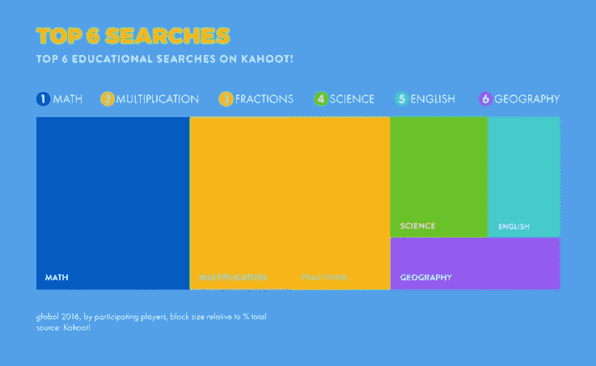

# 游戏/学习平台 Kahoot！点击 1B 玩家

> 原文：<https://web.archive.org/web/https://techcrunch.com/2017/03/06/kahoot-is-a-player-unicorn/>

# 游戏/学习平台 Kahoot！击中 1B 球员

为了让学习再次变得伟大，Kahoot！如今，该公司创下了一些很少有公司可以吹嘘的统计数据:该公司庆祝其平台在过去四年中每月活跃用户达到 4000 万，玩家总数达到 10 亿。

很多学生都在用 Kahoot！将硬科学主题的学习游戏化。

“我们在卡豪特的月亮上！该公司首席执行官埃里克·哈勒尔(Erik Harrell)表示:“我们的使命是让学习变得更棒、更有趣，这是来自教育工作者和学生群体的激情和动力。“我们的最高目标是帮助学习者在课堂内外实现他们最深的潜力，并为当今的学习者创造最相关的全球学习品牌。”

公司[去年 9 月又筹集了 1000 万美元](https://web.archive.org/web/20230315013324/https://medium.com/inside-kahoot/kahoot-closes-10m-financing-round-to-help-improve-learning-for-all-9a6a8121309f#.d5rsgdjaj)来推动增长。它宣布将投入巨资为品牌和发行商开发额外的游戏格式、移动应用程序和合作伙伴功能。

“自去年这个时候以来，我们已经看到了 60%的增长，”Harrell 说，并透露其绝大多数玩家(67%)都在美国，其中教师增长强劲。“美国有超过 200 万名 K-12 教师注册了我们的服务。超过三分之一的美国 K-12 级学生每月都会使用我们的产品。”

神圣市场渗透，蝙蝠侠。