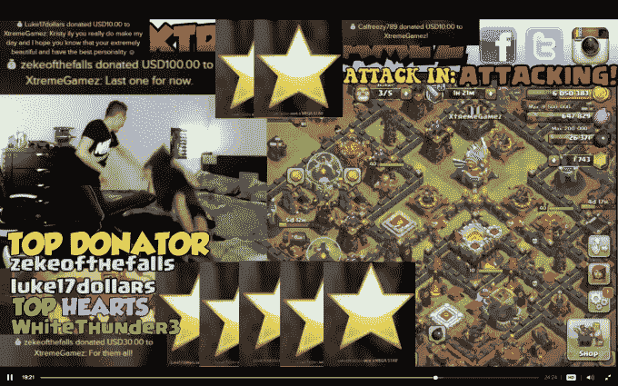

# Kamcord 获得时代华纳领导的 1000 万美元，像媒体业务一样处理直播流 

> 原文：<https://web.archive.org/web/https://techcrunch.com/2016/04/25/kamcord-bags-10m-led-by-time-warner-to-popularize-live-streaming-in-a-different-way/>

今天对 Y Combinator 毕业生来说是一个重要的日子，这家总部位于旧金山的初创公司宣布了由时代华纳领投的 1000 万美元的 C 轮融资，并将其流媒体业务从手机游戏扩展到任何应用程序。

[Kamcord 上一次筹集资金是在 2014 年 12 月](https://web.archive.org/web/20230120235840/https://techcrunch.com/2014/12/11/kamcord-raises-15m-as-it-ramps-up-its-expansion-in-asia/)，当时它从中国互联网巨头腾讯、价值十亿美元的日本游戏公司 GungHo 和其他公司获得了 1500 万美元。Kamcord 联合创始人 Adi Rathnam 告诉 TechCrunch，当时代华纳接触这家初创公司时，整轮融资仍在银行中，时机是正确的，因为它刚刚开始再次融资的早期谈判。

除了时代华纳，现有的支持者腾讯、TransLink Capital、XG Ventures、Plug & Play Ventures 和 Wargaming 也参与了这轮融资，对这家成立四年的公司的估值超过 1 亿美元。

Rathnam 说:“(目前)形势严峻，但有一点人们谈论得不多，那就是大型风险投资公司拥有大量资金，并且只投资于不需要资金的公司。”。

他补充说，Kamcord 尤其热衷于与时代华纳集团董事总经理[林熹瞳](https://web.archive.org/web/20230120235840/http://www.timewarner.com/company/management/executives-by-business/time-warner-investments/rachel-lam)合作，因为她在 2014 年以 5 亿美元出售给迪士尼的 YouTube 网络 Maker Studios[中发挥了重要作用，并且了解 YouTube 明星的需求，Kamcord 以移动为重点的流媒体服务瞄准了这些明星。](https://web.archive.org/web/20230120235840/https://techcrunch.com/2014/03/24/disney-maker-studios/)

此外，他对时代华纳能够增加的价值印象深刻。

与承诺协同效应但需要时间兑现的其他战略投资者不同，他表示，Kamcord 已经在时代华纳“与运营部门就合作方式进行早期对话”。这就引出了该公司今天新闻的第二部分——Kamcord 推出了一项名为“app casting”的新功能，允许从智能手机上的任何应用进行直播。

## 直播不是社交网络

到目前为止，Kamcord 一直专注于手机游戏，尤其是像《部落冲突》这样非常受欢迎的游戏。如今，它的 100 万用户可以在手机上的任何地方开始广播——无论是脸书，新闻应用程序还是网络浏览器——与来自独立摄像头的直播流混合，如果是移动设备，则是他们的前置摄像头。

人们很容易将其与脸书或 Twitter 旗下的 Periscope 相提并论，后者正试图推广移动直播。但 Ratham 表示，Kamcord 采取了一种非常不同的方法，原因有很多。

“这些公司都在犯同样的错误，”他说。“把生活想象成一个社交网络。

“直播真的很难做。我该说什么？“我怎样才能变得有趣，”它需要像媒体企业一样被对待。我们将让创作者通过应用选角制作最引人注目的内容。"

Ratham 认为，直播的挑战可以通过提供应用程序作为提示来抵消。它为广播提供了一些背景，是一种道具。

例如，在时代华纳的案例中，他设想 Kamcord 可以“与(其)出版物或体育联盟合作，帮助在我们的青少年观众面前建立一个品牌。”这可能是一个体育分析师实时回顾一个剪辑，或者定期在移动设备上提供特定的直播内容。

正在进行的一些项目包括 Y Combinator 总裁萨姆·奥尔特曼(Sam Altman)在手机上阅读科技新闻的直播，以及一位受欢迎的约会博主直播她对 Tinder 的使用。

## 补充现有平台

Kamcord 非常重视将现有的广播公司带到移动设备上，而不是像其他人一样“授权”世界上的任何人进行直播。

Rathnam 说:“只有一小部分人有足够的娱乐性来吸引观众几分钟或几小时，不是每个人都会创造内容，但我们相信(消费)可以成为大众市场。”。

Meerkat 正处于脱离直播的过程中，它的服务吸引了像 T2 U2 T3 和 T4 麦当娜 T5 这样的名人，但仍然失败了，Kamcord 的联合创始人认为这就是问题所在。

“名人很棒，很有趣；他们可以给你一天的优惠。但是，就麦当娜而言，她可能偶尔会直播，但不会定期回来。第二天她开车(到一个直播应用)的观众会发生什么？

“( YouTube 或 Twitch 上的)实时流媒体一周可以播放很多次。他们知道这有多难。你不能盯着一个摄像头，同时又很有趣，但我们认为应用选角可以让你变得有趣，”他解释道。

今年 2 月， [Kamcord 推出了在线直播货币化](https://web.archive.org/web/20230120235840/https://techcrunch.com/2016/02/18/kamcord-now-lets-broadcasters-make-money-on-its-mobile-game-streaming-app/),观众可以通过应用内购买的方式进行购买。Rathnam 表示，随着购买量以每月 40%的速度增长，这将“快速接近”200 万美元的年度经常性收入。这也不仅仅是为了那些拥有大量观众的人。澳大利亚的两个十几岁的双胞胎男孩在他们的卧室里直播游戏，他们有望从在 Kamcord 上购买虚拟物品的粉丝那里赚到“远远超过六位数”的钱。然而，他们的账户 XtremeGamez 只有 1 万名粉丝。

最终，这一举措的成败将取决于 Kamcord 能够吸引到其平台上的内容。到目前为止，由于 Twitch 远离移动领域，专注于硬核游戏，YouTube 仍然以视频仓库而闻名，Kamcord 确实提供了一些不同的东西，一些专门为移动设备打造的东西。

streamers 的卖点很简单:Kamcord 不想取代 YouTube 或 Twitch 相反，它希望提供一种更好的方式，在手机上与观众进行实时互动——这也是可以赚钱的。

“你见过 YouTube 评论区吗？”Rathnam 说，这对于任何一家广播公司来说都可能是一句话。