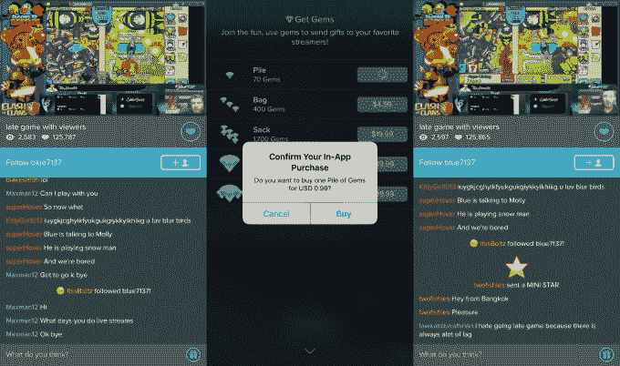

# Kamcord 现在允许广播公司通过其手机游戏流媒体应用程序 赚钱

> 原文：<https://web.archive.org/web/https://techcrunch.com/2016/02/18/kamcord-now-lets-broadcasters-make-money-on-its-mobile-game-streaming-app/>

Y Combinator 初创公司 Kamcord 希望像流媒体服务 Twitch 在游戏机和 PC 游戏上所做的那样，在手机上做些什么？在允许最著名的广播公司通过其服务赚钱后，kamcord 推出了一项重要的更新。

Twitch 每月向 T2 用户发送的视频甚至比 YouTube 还多，已经成长为一个庞然大物，被亚马逊以不到 10 亿美元的价格收购。这家电子商务公司必须击败来自谷歌的竞争，谷歌也在努力开发自己的游戏流媒体服务。虽然两家公司都专注于台式电脑和游戏机游戏玩家，但 Kamcord 正专注于移动领域，而且仅限于移动领域。

到目前为止，前景看好——Kamcord 已经筹集了超过 1500 万美元，拥有“数百万”用户，其中普通(活跃)用户每天观看 20 分钟的视频流。现在，这家初创公司正在准备六个月内的第三次重要产品发布，这将最终打开收入水龙头。

## 主要更新

今年夏天， [Kamcord 在其应用程序中添加了流媒体直播](https://web.archive.org/web/20230328151155/https://techcrunch.com/2015/12/17/kamcord-now-allows-all-android-users-to-live-stream-games-from-their-mobile/)，然后在 12 月，它推出了一项重大更新，允许所有使用安卓设备的用户直播他们的游戏。这一更新在 iOS 上不可用，在过去六周内，Kamcord 平台上的流媒体用户数量增加了 10 倍，现在下一阶段是帮助这些广播公司——他们负责为这项服务带来用户和眼球——赚钱。

这将是虚拟商品的形式，粉丝可以购买并在播放时发送给广播公司的数字产品。当被发送时，它们在评论区中分解下一个，并帮助购买该商品的用户从其他观看者中脱颖而出。

然而，并不是所有的用户都能赚钱。Kamcord 创建了一个合作伙伴计划，只有包含在其中的广播公司才能赚钱。这家初创公司没有透露与合作伙伴的收入分成，但关键是，这将是它首次将其服务货币化。

Kamcord 的联合创始人 Adi Rathnam 告诉 TechCrunch，该公司故意将时间花在赚钱上，它的灵感来自于在中国、韩国和亚洲其他地区取得成功的虚拟商品商业模式。

Rathnam 说 Kamcord 用户花费大量时间试图引起他们最喜欢的广播公司的注意，但必须与其他人的噪音作斗争。排名第一的 Kamcord 合作伙伴 Galadon 拥有超过 120，000 名关注者，每个直播都有数万名观众。他的粉丝在评论流中尽力抓住他的注意力，但支付 0.2 美元以上购买像明星这样的虚拟商品有助于脱颖而出。(最上面的项目，一个超级明星，价格 80 美元，占据了整个聊天窗口。)还有一个通过 PayPal 向合作伙伴捐款的选项。

> ChiefPat 网站上的观众数量甚至让评论变得困难

“我们花了很多时间思考其背后的潜在心理学，”Rathnam 说。“这就像给泰勒·斯威夫特买了一张 VIP 通行证，(只是为了)有机会和她自拍。这是一个(Kamcord 用户)脱颖而出并与此人互动的机会。”

Rathnam 认为，各种因素的结合使得流媒体偶像比传统名人更受年轻人的欢迎，即所谓的 Gen-S: generation screen。他解释说，可访问性、互动和共同点——许多人仍然和父母住在一起，就像 Kamcord 的许多用户一样——推动了这种狂热。

对于广播公司本身来说，增加盈利意味着一个谋生的机会，或者至少是从做他们喜欢的事情——在手机上玩游戏——中赚点零花钱。目前，Kamcord 是唯一在智能手机上提供这项服务的服务。

“Twitch 倾向于桌面上的核心游戏……而且它(对于移动设备来说)太难了,”Rathnam 说。"这就像用 LinkedIn 上传你的度假照片一样."

至于 YouTube，Rathnam 说，他交谈过的流媒体感觉它们在 YouTube 的优先列表中“排名靠后”，YouTube 还包括音乐家，喜剧演员，艺术家和其他娱乐明星。

这对 Kamcord 来说是个好消息，因为它不仅可以提供独特的东西，而且知道去哪里寻找潜在的新广播合作伙伴:在 Twitch 或 YouTube 上。如果你能带来成熟的内容制作者并让他们满意，那么他们也会带来他们的观众。

## 脱颖而出

嗯，33 岁的我有两个孩子，我不是普通的 Kamcord 用户，所以我冒险尝试了一下，查看了一个直播流，并向一个广播合作伙伴发送了一份虚拟礼物。

这种体验非常巧妙，是一种快速的应用内购买，我配备了 70 颗宝石(0.99 美元)。我一开始很低，抛出了一个迷你星(15 颗宝石)，但反馈是即时的。诚然，我坐的这条小溪——蓝色 7137 号(T1)——没有加拉顿或 T2 酋长帕特(T3)那么繁忙，但我立刻被叫出了名字，并得到了感谢。这对广播公司来说似乎是一件大事，这是一个信号，表明我(或其他任何人)准备超越聊天，拿出一些钱来表示感谢。

## 充满希望的开端

虚拟商品已经在 Kamcord 上在世界大部分地区上线一周了。在此期间，该公司的合作伙伴从最初的 100 个增加到 175 个。Rathnam 表示，该计划是“尽快”达到 1000 名合作伙伴，并且新的合作伙伴已经获得了数万名粉丝。

“我们认为(这个模型)可能需要在美国做一些工作，但是我们被我们在美国看到的东西震惊了..他解释说:“人们经常大谈世界范围内的文化差异，但许多潜在的人类情感是相同的——(人们)愿意不遗余力地与偶像互动。”他补充说，货币化已经走上了每年 100 万美元的轨道。

最近的更新为该服务添加了直播、广播和虚拟商品，这是一个很大的变化，Kamcord 计划在 2016 年进行更稳定和渐进的变化。Rathnam 表示，重点是加强广播公司合作伙伴与粉丝之间的互动，增加合作伙伴的数量，与游戏制造商密切合作，并雇佣后端工程师来扩展服务。

**更新:**文章已经更正，反映了 Galadon 不再和他的母亲住在一起的事实。对于任何沟通失误，我们深表歉意。