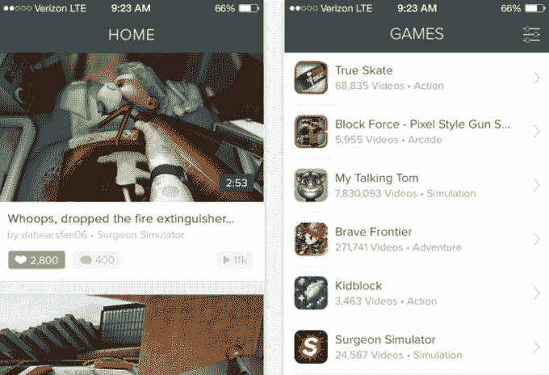

# Kamcord 用户已经分享了 2500 万个手机游戏剪辑

> 原文：<https://web.archive.org/web/https://techcrunch.com/2014/10/30/kamcord-says-its-users-have-shared-25-million-mobile-game-clips/>

# Kamcord 用户已经分享了 2500 万个手机游戏片段

创业公司 Kamcord 为游戏开发者提供一个 SDK，让用户记录和分享他们的游戏片段，在过去几个月里，该公司取得了一些里程碑式的成就，表明 Y Combinator alum 正在成为移动平台上 Twitch 的非流媒体版。

这家拥有 23 名员工的公司表示，iOS 和 Android 上的手机游戏玩家已经分享了 2500 万个利用其 SDK 的游戏片段。这些视频在与分享视频相同的游戏中被观看，在 Kamcord 的[独立应用](https://web.archive.org/web/20230319074708/https://itunes.apple.com/us/app/kamcord-lets-play-vids-for/id852813679?mt=8)中，以及在 Kamcord 的网站上，绝大多数观看来自 iOS 用户。Kamcord 的联合创始人 Adi Rathnam 将该公司的进展与亚马逊收购的 Twitch 进行了比较，指出在过去的 30 天里，有 130 万人上传了这些视频，超过了 Twitch 在 2 月份吹嘘的 100 万人。

为了保持势头，Kamcord 修改了其屏幕记录 SDK，以支持 Metal graphics framework，这是苹果公司为开发人员提供的新的低级工具包，旨在从自去年的 iPhones 和 iPads 以来用于苹果设备的 A7 和 A8 芯片中挤出最好的图形。

在不影响图形质量或帧速率的情况下录制游戏很难(问问任何试图在 2000 年代早期/中期使用 FRAPS 在像今天的智能手机一样强大的计算机上录制游戏的人)，Kamcord 以前的解决方案以与 Metal 不兼容的方式接入了 OpenGL ES 渲染管道。考虑到像虚幻引擎 4 和 Unity 这样的开发工具包正在更新他们的渲染引擎，以便在新的苹果设备上利用金属，Rathnam 告诉我，团队认为迅速支持该框架是显而易见的。

在商业方面，Kamcord 与日本游戏开发商的成功合作(其[特色游戏](https://web.archive.org/web/20230319074708/https://itunes.apple.com/ca/app/terra-battle/id888628623?mt=8&ign-mpt=uo%3D4)部分展示了世嘉的几款游戏以及 [Terra Battle](https://web.archive.org/web/20230319074708/https://itunes.apple.com/ca/app/terra-battle/id888628623?mt=8&ign-mpt=uo%3D4) ，这是由《最终幻想》系列创作者创立的游戏开发商 [Mistwalker](https://web.archive.org/web/20230319074708/http://www.mistwalkercorp.com/en/) 的最新游戏)使得该公司在日本开设了第一个海外办事处。这可能是 Kamcord 未来增长的关键——移动设备在日本游戏玩家中占主导地位，与制作热门游戏的工作室建立紧密的关系极大地增加了他们在[益智游戏和](https://web.archive.org/web/20230319074708/https://itunes.apple.com/us/app/puzzle-dragons-english/id563474464?mt=8)之类的游戏之间点击分享按钮的几率。