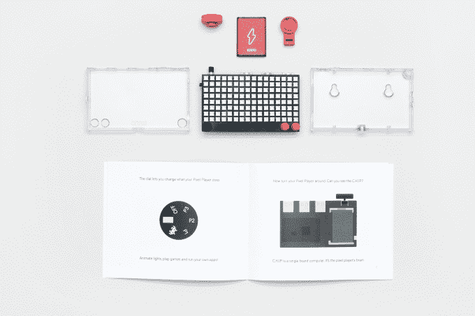

# Kano 超越 Pi，为孩子们提供自己编写代码的设备套件

> 原文：<https://web.archive.org/web/https://techcrunch.com/2016/09/27/kano-moves-beyond-pi-with-code-your-own-device-kits-for-kids/>

自 Kano 在 2015 年纽约 TC Disrupt 大会上宣布 1500 万美元的 A 轮投资，并宣扬其建立创意计算品牌的雄心以来，已经过去了 16 个月。

10 个月前，在风投资金的支持下，它开始着手下一个重大产品展示。

今天，它准备展示它一直在做的事情，推出了一个 [Kickstarter 活动](https://web.archive.org/web/20230314070523/https://www.kickstarter.com/projects/alexklein/1675708788?token=65de0a77)，用于一个自己动手连接的摄像头，一个自己制作的扬声器套件和一个可编程 LED 阵列。

这些新套件——它们统称为“Kano 2”——标志着这家总部位于伦敦的初创公司的一个更主流的轨迹，在一定程度上淡化了围绕 Raspberry Pi(为其在[的第一款产品](https://web.archive.org/web/20230314070523/https://techcrunch.com/2014/09/27/kano-ships/)提供动力的 DIY 电脑)的技术爱好者/制造商社区，转而支持通过一套为数字原住民设计的联网设备来扩大其吸引力，这些设备可以接入他们已经习惯使用的电脑。

每个套件都由一个新的 Kano 单板计算机驱动，它被命名为 Kano Brain，而一个新的基于 Kano Code HTML-5 的软件工具在网络浏览器中运行，允许孩子们在将各个部件组装起来后，对每个连接的设备进行编程。因此，这是一种易于使用的可编程硬件，并不试图取代主流计算平台，而是旨在利用为轻松构建有趣内容而设计的创意外设的诱惑，挖掘他们更大的用户群。

Kano 将其新产品分别称为像素套件、相机套件和扬声器套件。它们在 Kickstarter 上的定价为每台 99 美元(或三款产品的早鸟定价为 249 美元)，此后的 RRP 将为 129 美元。Pixel 套件的预定发货日期是 1 月，相机套件的预定发货日期是明年 5 月(下图为套件形式)，扬声器套件的预定发货日期是 7 月。

虽然许多 Kickstarter 硬件项目可能会受到长时间的延迟，甚至完全脱轨，但 Kano 的众筹警告要少得多，因为它已经建立了自己的中国供应链，并成功交付了一个预先众筹(最初的 Kano kits [发运](https://web.archive.org/web/20230314070523/https://techcrunch.com/2014/09/27/kano-ships/)仅略有延迟)。它为 Kano 2 活动设定的目标是 50 万美元——考虑到 2013 年最初的 Kickstarter 获得了 140 万美元的收入，这个目标并不高。预计它将再次轻松超过这一目标。

很明显，它回到 Kickstarter 主要是为了社区，而不是因为它没有任何自己的资源来资助新产品。

联合创始人亚历克斯·克莱恩告诉 TechCrunch，自 2014 年 9 月[开始发货以来，它已经卖出了 10 万套原始卡诺套件。在活跃使用方面，大约有 80，000 个工具包已被激活，三分之一的用户在激活工具包四个月后仍会每周检查一次——保留率 Klein 描述为“对于这种性质的产品来说相当不错”。](https://web.archive.org/web/20230314070523/https://techcrunch.com/2014/09/27/kano-ships/)

然而，显然 Kano 现在需要制造不同性质的产品——感觉上不那么复杂和技术化，更加通用和切实有用，最终争取主流吸引力。可以肯定地说，树莓派上的另一个操作系统包装看起来不像是一个风投支持的初创公司需要扩大销售的设备。

除此之外，Kano 电脑套件 300 美元的总价(如果你包括随后推出的[屏幕套件附件](https://web.archive.org/web/20230314070523/https://techcrunch.com/2015/12/22/kano-releases-screen-kit-for-the-holiday-season/))使得主要平台的价格远远超出了许多潜在用户的承受能力。

显然，Kano 现在的目标是吸引主流网络用户，它承诺将有趣的技术去神秘化，并为 DIY 应用程序制作而设计。它将有望获得数百万而不是数十万的销量，尽管克莱恩不会给出他希望的任何实际数字。

他认为，就年龄范围而言，新套件的最佳人群仍可能是 7 至 14 岁的儿童，尽管他描述了他的成年朋友也发现了硬件的创造性用途，例如音乐家在创作音乐时使用像素板提供音频的视觉表现。然而，就展示和包装而言，这些工具包显然是针对儿童的。

“现在，卡诺作为一家计算机公司的核心理念是成为一家主流世界的创意计算公司，让人们能够接触到东伦敦和硅谷更有特权的钟罩之外的人，”他说。“我们知道，自从我们做了第一个 Kickstarter 以来，有一个新兴的行业，价格昂贵，让我们称之为‘科技玩具’——教你的孩子编程。

> 这是为了扩大吸引力。扩大我们的影响。

“在西方世界，你是一名职业家长，你担心你的孩子被落下——你给他们一些能让他们学会编码的东西！所以 300 美元的全套[Kano]电脑是一个极好的选择。(但)这些新套件和新软件——因为它完全基于浏览器——是为了扩大吸引力。延伸我们的触角。”

他指出，Kano 目前约有三分之一的用户没有购买任何硬件——他们要么使用其免费软件，如其在线平台 Kano World，或其基于浏览器的 Make Art 应用程序，要么在现有的 Raspberry Pi 上安装其 Kano OS。

“这给了我们一种感觉，即 21 世纪的计算品牌需要以多种价格点访问——一直到零美元，需要在现有硬件上运行，并且需要有零花钱购买的物理选项，”他补充道。

“这里的策略是让人们对这个他们可以免费(通过卡诺软件)访问的创意编码世界感到兴奋，让他们构建一个天气应用程序、一座《我的世界》城堡、一棵生成性盆景树，然后让他们启动(几乎像是一次应用内硬件购买)这些付费的漂亮的高级硬件，让他们把他们在屏幕上做的事情带入物理世界。”

那么，您到底可以用这些新的卡诺套件做什么？

下面是每一个的简要介绍…

**像素套件**

像素是由 128 个可编程多色发光二极管加上一个可编程操纵杆组成的网格。克莱恩说，这是三款新设备中他最喜欢的一款，他展示了用户如何在拖放式卡诺代码界面中插入代码块，通过像素的显示在现实世界中获得即时的视觉反馈。他说，这“就像一个定制的、可编程的调色板”。

“我们真的把它想象成一扇通往互联网的窗户——你可以滚动推文，你可以滚动 RSS 订阅，你可以可视化声音，它让我们听起来不可见的数据变得可见，它以生动的颜色赋予它们生命，并让你控制它，所以你可以制作一个游戏，例如，它的参数由外面的天气控制，或者梅西是否进球或 Twitter 上某个词的提及密度控制，”他补充道。

**相机套件**

【T2

该相机套件，正如它的名字一样，是一个自己动手制作的相机。它有一个 500 万像素的镜头和一个可编程的多色闪光灯。还有一个模式转盘，包括三个自定义插槽，用户可以将自己制作的应用程序(同样内置于 Kano 代码中)加载到相机上，如照片过滤器或 GIF 制作工具。盒子里的红外激光绊网传感器也可以插入相机，以支持触发拍摄场景。

“对于第一代人来说，用图像交流和用文字交流一样受欢迎，如果不是更受欢迎的话，”克莱恩说，解释了制造一台不仅可以连接而且支持 DIY 应用程序的相机背后的想法。

“我们想知道下一代可编程相机的外观和感觉会是什么样的？这满足了下一代人与图像交流的需求，但让他们对这一过程有了更多的自主权……你用它创建的图像——或 gif 或视频——不仅仅是你的摄影构图的功能，也是你如何巧妙构图的代码。”

**扬声器套件**

【T2

这个套件将是最后一个发货的，因此 Klein 在这个早期阶段最不关注它，它是一个自己构建的蓝牙扬声器，兼作可编程合成器。盒子里还将包括一个手势传感器，使用户能够通过移动来发出声音。

“你可以做一些事情，比如构建和编写你自己的特雷门琴，通过来回滑动来改变曲目，”他补充道。

期待孩子们制作自己的屁应用程序。还有很多可怕的噪音。

**互联、可破解、可互操作、可盈利？**

虽然每个即将推出的套件都可以作为一个独立的玩具/学习工具，配有详细说明组件和功能的小册子以及一系列供用户娱乐的项目，但这些设备也可以协同工作，以支持更复杂的场景和更多的 DIY 可能性。

克莱恩还表示，Kano 也打算与最初的 Kano 计算机套件进行整合——至少目前来说，这仍然是该公司的主要收入来源——他指出，随着初创公司 inking deals 在美国的 ToysRUs 和 Barnes & Noble 及时购买其计算机套件，零售可用性将很快扩大。

Klein 表示，通过构建自己的低成本 1.2GHz 单板微处理器来摆脱新套件的 Pi 是出于价格、平台集成和灵活性的考虑，他指出，每个设备都有自己的网络服务器，以便用户可以通过相同的 wi-fi 网络连接到它，并通过 Kano Code web 应用程序发送命令。

因此，通过构建和控制硬件的关键部分，it 可以更好地控制用户体验，并消除额外的复杂性。因此，vision 是一个有趣的、可破解的设备家族，当你希望它们相互交谈时，不会引起任何技术人员的头痛。

“关键是让人们看到他们作为一个系统一起工作，”他补充道，并讨论了在 Kickstarter 上同时发布三款新产品的理由。“我是索诺斯的粉丝。你得到一个，你喜欢它，你想得到另一个-它们都是相互无线连接的，你可以从一个可以在任何设备上运行的应用程序控制它们……这是这次发布的一个元素。”

“我们仍然会有我们的核心计算机套件…它仍然有一个树莓派，所以我们认为，对于你可能会称为视觉，视频流，3D 游戏，没有比树莓派更好的低成本，单板大脑。我认为这是完全合适的，事实上，这是任何人都可以制造的个人电脑中最强大的元素之一，”他补充道。

这篇文章最初说相机套装的发货日期是四月。卡诺现在说将会是五月