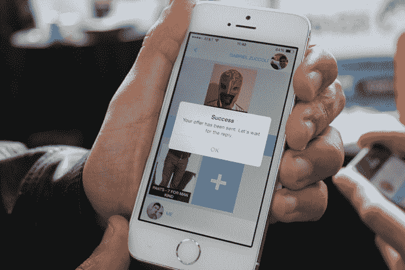

# Kanzee 让与朋友分享衣服变得轻而易举

> 原文：<https://web.archive.org/web/https://techcrunch.com/2014/09/08/kanzee-makes-sharing-clothes-with-friends-a-breeze/>

Kanzee 是一个社交网络和配套的应用程序，允许人们互相分享和交换衣服。这是一个简单的概念，这也是我喜欢它的原因。它还解决了许多时尚人士(不包括我自己)遇到的一个问题——如何在不购买的情况下为特定活动购买新的服装或装备。

大约六个月前，创始人菲利普·祖科利·雷森德(首席执行官)和加布里埃尔·祖科利·雷森德(CMO)在巴西构思了这个想法和公司。他们的应用程序的 iOS 版本计划在两周内发布。他们已经前往 [TechCrunch Disrupt](https://web.archive.org/web/20230307062237/https://techcrunch.com/events/disrupt-sf-2014/) 在发布前展示他们的新概念。

它是如何工作的？像任何社交网络一样，朋友们使用该应用组织成小组。一旦他们被分组，他们可以拍摄并上传他们想要的衣服照片，以便与朋友交换。一旦完成，他们可以在两种模式下使用应用程序:搜索模式或“大声喊出来”模式。

搜索模式就像它听起来的那样:你搜索所有朋友的可用衣服，如果你看到你喜欢的东西，你就请求它，然后从你自己的库中选择一件你想与之交换的衣服。它在拆分视图中显示两个项目。后来，你们互相交换这些实物。

大喊模式让用户广播他们需要某样东西，比如一件衣服。其他参与者会得到这个信息，并可能做出回应。

我问创始人，目标是不是让用户省钱。这是一个副作用，但不是主要目的。Gabriel Zuccoli Rezende 告诉我，实际上只是从可靠的来源找到你喜欢的衣服，并有一个更大的衣柜。我想得越多，这些项目中就包含了推荐。我是说，你的朋友买了这些东西，所以他们一定很喜欢。现在你也可以使用它们了。这是个好主意。

此外，还有一个可持续发展的角度。毕竟，时尚是短暂的。为什么要买一件你可能只在一个场合穿的全新礼服？相反，可以用你朋友已经穿过的(但对你来说是新的)。这样看的话，有可能不那么浪费。

至于盈利战略，创始人心中有明确的想法，他们不愿意在这一点上讨论。现在，最初的重点是扩大使用它的人的网络。他们有一个 5 万英镑的投资者，并计划筹集更多资金来扩大这个概念。他们计划推出英文版的应用程序，但最终的策略是国际版本化。

我以前见过一些类似的其他概念，如[共享壁橱](https://web.archive.org/web/20230307062237/http://www.sharecloset.net/index.html)和[壁橱交换](https://web.archive.org/web/20230307062237/http://www.ecouterre.com/closet-swap-iphone-app-encourages-you-to-trade-clothes-with-friends/)和 [Kloset Karma](https://web.archive.org/web/20230307062237/https://itunes.apple.com/us/app/kloset-karma/id670271881?mt=8) ，但市场上可能还有更多空间。