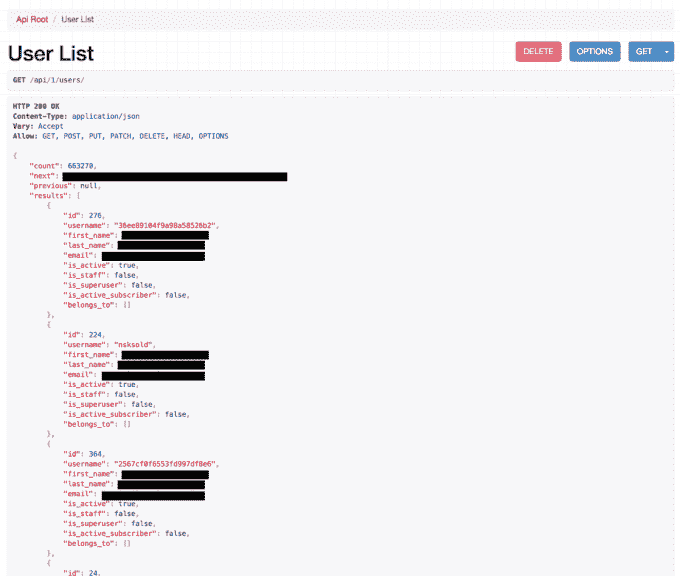

# 卡戴珊网站安全问题暴露了 50 多万订户的姓名、电子邮件、支付信息安全 

> 原文：<https://web.archive.org/web/https://techcrunch.com/2015/09/16/kardashian-website-security-issue-exposes-names-emails-of-over-half-a-million-subscribers-payment-info-safe/>

卡戴珊和詹纳的移动应用程序在上市的第一天就有数十万次下载，现在占据了应用程序商店的主导地位，与此同时，名人姐妹还发布了新的网站，旨在帮助他们更好地与粉丝联系，同时提供他们生活中更个性化的外观。

然而，一个有事业心的年轻开发人员在这些网站上挖掘了一下，立即发现了一个问题。由于配置错误，他能够访问注册凯莉·詹娜网站的 60 多万用户的全名和电子邮件地址，并从其他网站获取类似的用户数据。

此外，开发人员说他有能力创建和销毁用户、照片、视频等，尽管我们知道他实际上并没有采取这些行动。

19 岁的开发商阿拉克·史密斯已经对名人生意产生了兴趣。作为[社区](https://web.archive.org/web/20221216115202/https://itunes.apple.com/us/app/communly/id988695437?ls=1&mt=8)的联合创始人，他一直在开发一款移动应用，让用户可以与和自己兴趣相投的人联系，例如，包括跟踪最喜爱的名人的新信息。

在博客网站 [Medium](https://web.archive.org/web/20221216115202/https://medium.com/@alaxic) 上，史密斯解释了他是如何从凯莉·詹娜网站获取用户数据的。他还指出，他的探索最初是出于对新网站背后动力的好奇，而不是一些恶意的黑客行为，甚至是更专注于揭示安全漏洞的尝试。

史密斯写道:

> 我承认我下载了凯莉的应用程序只是为了检查一下。我还查看了网站，就像大多数开发人员一样，我决定四处看看是什么在驱动这个网站。在我开始稍微深入挖掘之后，我发现了一个名为 d Kylie . min . 75 C4 ceae 105 ad 8689 f 88270895 e 77 CB 0 _ gz . js 的 JavaScript 文件。只是为了好玩，我决定缩小这个文件，看看他们从用户那里收集了什么样的数据以及他们可能跟踪的其他指标。我看到了对一个 API 的几次调用，这当然是有意义的。我将其中一个端点弹出到浏览器中，得到了一个与我预料的一样的错误。

他说，史密斯随后用自己的用户名和密码登录网站，并被引导到一个网页，上面有 663，270 名注册该网站的人的名字、姓氏和电子邮件地址。

根据这一发现，Smith 意识到他可以在其他姐妹的每个网站上执行相同的 API 调用，并返回相同的数据。除了能够访问这些用户数据，史密斯说他发现他还能够创建和破坏用户、照片和视频。

本质上，他发现的是一个开放的、不安全的 API。

由于这显然是一个安全方面的主要问题，而且鉴于这些网站的高调性质，这是一个令人惊讶的发现，开发者立即在 Medium 上发表了关于这个问题的博客，他提出了一个问题:“用户不仅应该信任他们的个人信息，还应该信任这些应用程序的支付信息吗？”

如果你一直生活在岩石下，他指的是金·卡戴珊·韦斯特、卡戴珊·卡戴珊、肯达尔·詹娜和凯莉·詹娜本周早些时候发布的新网站和应用程序，向提供支付信息的付费用户提供独家内容。就像一个私人的、仅限会员的社交媒体平台一样，每个姐妹的网站和应用程序都提供了一个独特的视角来了解她们自己的兴趣，内容包括日记条目、直播视频、美容教程、锻炼技巧等。

虽然暴露你的姓名和电子邮件是一回事(或者更尴尬的是，你实际上是在为这类内容付费！)，如果网站缺乏强大的安全性，可能会将用户的个人和隐私信息置于风险之中。

我们联系了网站和应用背后的公司 [Whalerock Industries](https://web.archive.org/web/20221216115202/http://www.whalerockindustries.com/) ，以确认数据泄露和补丁的细节。

我们现在了解到，史密斯现在正在与该公司合作，因为他已经删除了他最初的博客帖子，并拒绝与媒体交谈。

Whalerock 的一位发言人证实，用户数据短暂可用，但问题很快得到解决，他说:

> 在发布后不久，我们被警告有一个开放的 Api。它很快就关闭了。我们的日志显示，这篇博文的作者只能访问有限的一组姓名和电子邮件地址。我们的日志进一步表明，没有其他人可以访问，也没有任何类型的密码或支付数据被暴露。我们最优先考虑的是客户数据的安全性。

值得一提的是，与姐妹俩的新技术财产相关的大部分支付都是通过应用商店处理的，而不是通过网络。我们还证实，Whalerock 一直在与第三方电子商务提供商合作处理在线支付。这意味着他们从来没有在自己的服务器上托管过支付信息——这个团队现在可能要感谢他们的幸运星了。

安全漏洞本身只开放了几个小时，因为 Whalerock 的团队在大型发射期间昼夜不停地工作。史密斯在发表博文的同时联系了他们，开发人员立即采取了行动。

我们还了解到，该公司仍在验证哪些数据遭到破坏，以及哪些数据(如果有的话)实际上是由史密斯本人保存或存档的。

但从事情的声音来看，这位年轻的开发人员可能没有意识到当他危及今年最热门的名人技术发布会的安全时，他将自己卷入了什么，也没有意识到向世界公开这样的事情有多危险，不管他这样做是否没有恶意。