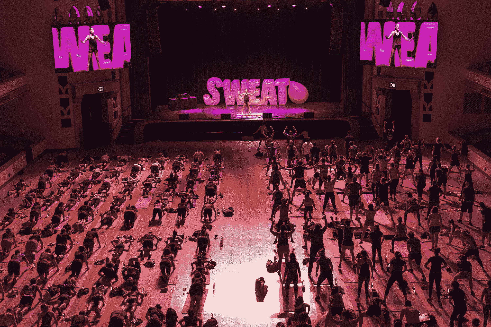
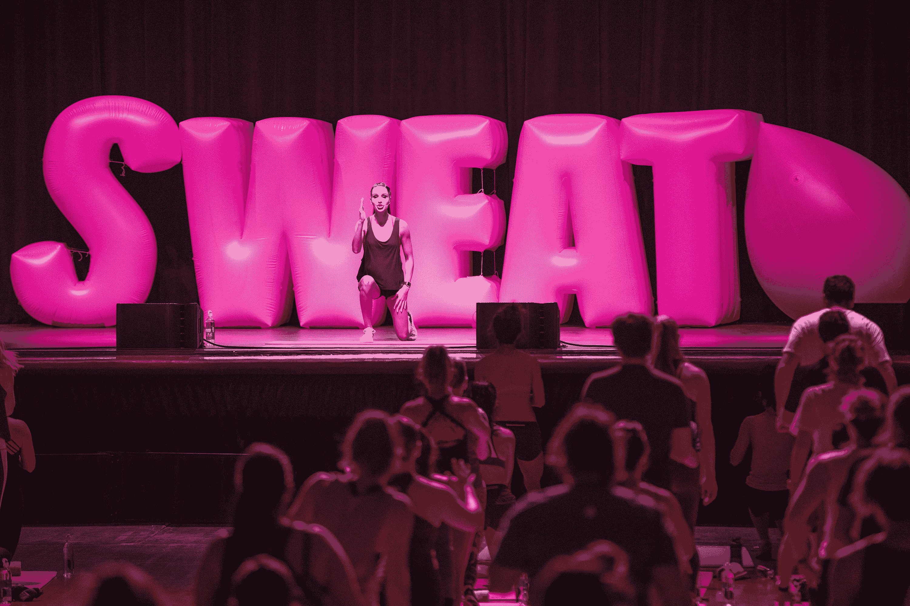
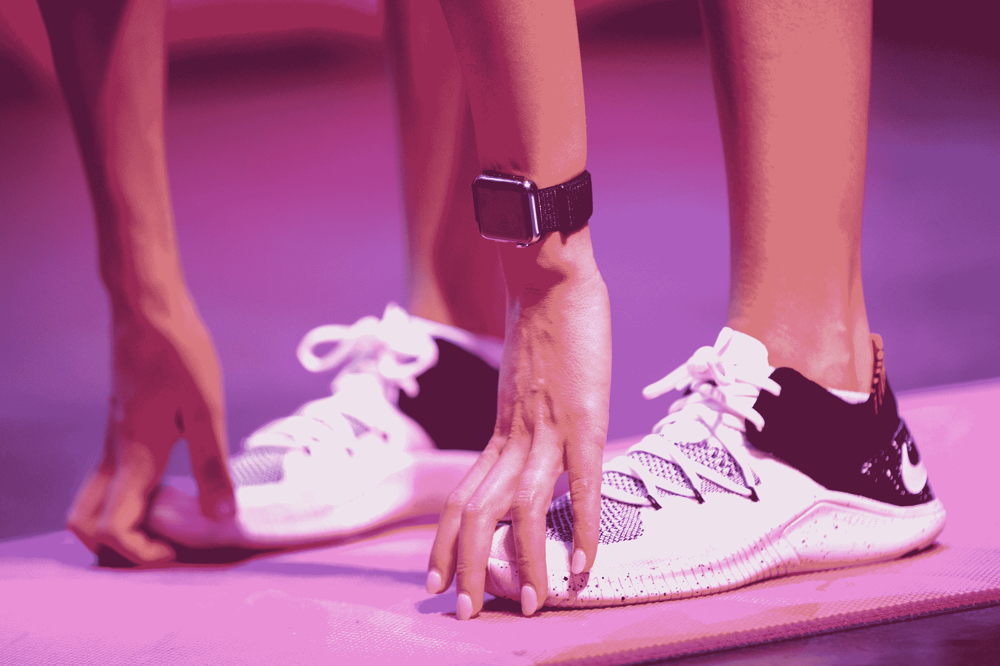
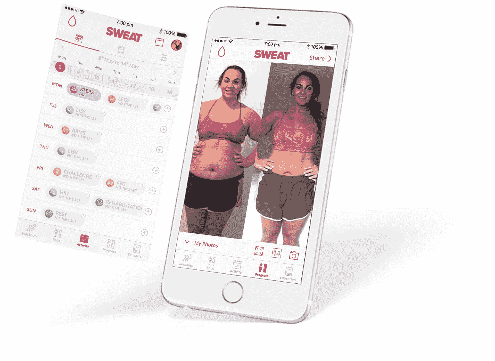

# Kayla Itsines 的 Sweat 应用程序今年将收入 7700 万美元 

> 原文：<https://web.archive.org/web/https://techcrunch.com/2018/06/06/kayla-itsines-sweat-app-will-rake-in-77-million-this-year/>

早些年，健身大师们会通过 VHS 录像带以及后来的 DVD 来推销他们的健身计划。如今，它是一个应用程序业务。在本周于圣何塞举行的苹果全球开发者大会上，该公司邀请了健身应用行业的超级明星之一， [Kayla Itsines](https://web.archive.org/web/20230217084148/https://www.kaylaitsines.com/) ，BBG(比基尼身材指南)和[汗液应用](https://web.archive.org/web/20230217084148/https://itunes.apple.com/us/app/sweat-kayla-itsines-fitness/id1049234587?mt=8)的联合创始人——今年将为大约 200 名与会者带来 7700 万美元的收入——带领他们进行晨练。

对于苹果来说，Kayla 的品牌不仅代表了一个良好的应用商店成功故事，还传播了一个信息，即它自己的产品，如 iPhone 和 Apple Watch，如何通过他们的平台获得更好的健康。

## 从电子书到应用程序

凯拉的健身公司是由两位私人教练——她自己和商业伙伴鸢·皮尔斯在几年前创办的。两人都在使用包括 Instagram 在内的社交媒体，为他们自己的 PT 课程和训练营带来商机。

但是，Itsines 的网上个人资料真的起飞了，很快，世界各地的人都想知道他们如何像她一样训练，并获得同样的结果。

与凯拉·伊辛斯一起进行 WWDC 训练

因此，从 2014 年初开始，培训师们将她的课程材料打包成电子书在网上出售。在接下来的一年左右，随着他们发行更多的电子书和更广泛的内容系列，业务增长了。

但是凯拉和鸢想要接触更多的人，所以他们转向了应用程序商店。

“这是我们的客户所在的地方，”鸢在 WWDC 健身活动的后台与 TechCrunch 对话时谈到公司推出移动应用的决定。

“我们主要拥有千禧一代消费者——25 至 35 岁是我们的主要市场，”他继续说道。“作为一名私人教练，你必须亲自到场，实时训练人们。现在，很明显，你不能对世界上的每个人都这样做，一本电子书也做不到。但苹果允许我们这么做，”他说。"苹果的生态系统是一个显而易见的东西."

与凯拉·伊辛斯一起进行 WWDC 训练

该团队在 2015 年 11 月推出了 Sweat 应用程序，但它在去年年初进行了一次大规模更新——几乎是完全重新推出——内容量是原来的三到四倍。

如今，Sweat 应用程序是女性健身项目的一站式商店，不仅提供 Kayla 自己的内容，还提供其他教练的项目，例如瑜伽、怀孕和健身房锻炼等领域。

用户每月支付 19.99 美元使用 Sweat 应用程序，这比健身房便宜，或者他们可以选择年度会员以节省 50%。

然而，并非所有的 Sweat 用户都转向该应用程序而不是健身房——can 也可以成为那些希望在健身房环境中获得私人教练帮助，但不想支付数百美元费用的人的伴侣。

由于团队 Kayla 的社交媒体知识和团队的营销能力，他们似乎已经建立了一个乐于付费的社区。

鸢告诉 TechCrunch，这些天来，在 3000 万次应用程序下载总量中，每月有“超过 100 万”人使用该应用程序。尽管该公司目前 70 人的团队主要位于澳大利亚，但美国是该公司最大的市场。

“自从重新推出[汗水应用]以来，我们经历了一个非常大的增长——去年我们增长了大约 86%，这对我们来说是相当大的一年。今年，我们有望达到约 1 亿美元的收入，这是澳元，”鸢澄清道。

以美元计算，这大约是 7675 万美元——对于一个从未获得外部资本的健身应用来说，这并不坏。

“当我们第一次开始做电子书时，我有一些自己的训练营特许经营权，凯拉有一个自己经营的小工作室……我最初投入了自己的大部分资金，”鸢解释道。“这是我们两个人职业生涯中的一个重大转折点，因为我们可以——你知道，澳大利亚梦，买自己的房子——或者我们可以投资 10 万美元，希望能有所收获。”

与凯拉·伊辛斯一起进行 WWDC 训练

## 下一步是什么:苹果电视、AR 和……资金？

Sweat 应用程序的部分吸引力——当然，除了其承诺的结果——是它使用新技术来保持人们的参与。

目前的应用程序利用 Apple Watch 的视觉界面来提供视频提示，并在 iOS 应用程序中添加了音频提示，这样训练员就可以在你锻炼时与你交谈——就像面对面的训练员一样。(该功能很快就会出现在手表上，所以不需要视频的更高级的用户可以通过耳机或 AirPods 来听，听听接下来要做什么。)

Sweat 还包括通过 Apple Music 播放的自己的精选音乐播放列表，未来，Sweat 计划将扩展到 Apple TV。

鸢表示，他们也计划用增强现实做些什么，但不能提供更多细节。

“我还不太确定(我们正在用 AR 做什么)，我想我们有点好奇，”他承认道。“这几乎是我们责任和义务的一部分。他说:“我们是女性健身市场的领导者，如果我们想继续保持这一地位，我们希望拥有最好的技术。”。

虽然汗水不需要外部投资，但该团队并没有完全排除这个想法。

“我不认为这是个坏主意。鸢说:“我认为，很明显，对于处于任何阶段的所有企业来说——无论是真正早期的风险投资，还是企业生命周期后期的不同类型的融资——老实说，我认为它总是有目的的。”。

“现在我们是 中的循环 中的 尝试优化体验，为用户获得最佳结果——无论是内容还是功能还是其他。他说:“有一个融资伙伴——不一定只是为了资本，也为了资源和网络——会非常方便。”。

