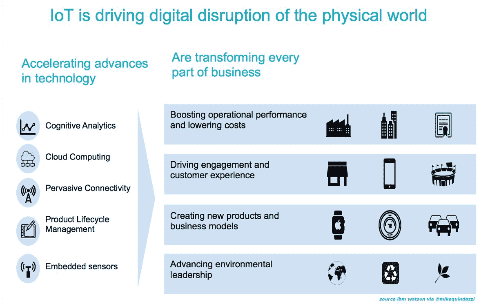
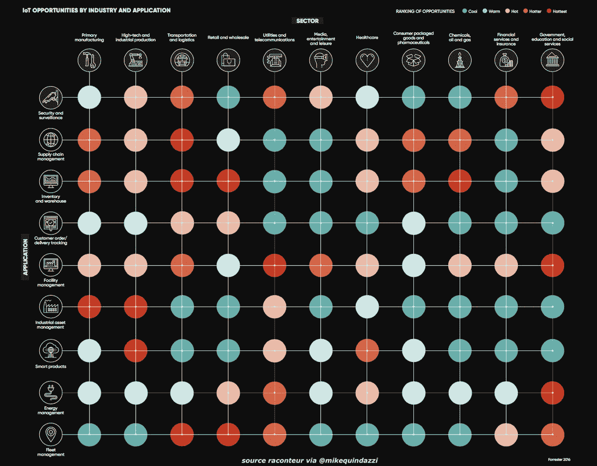
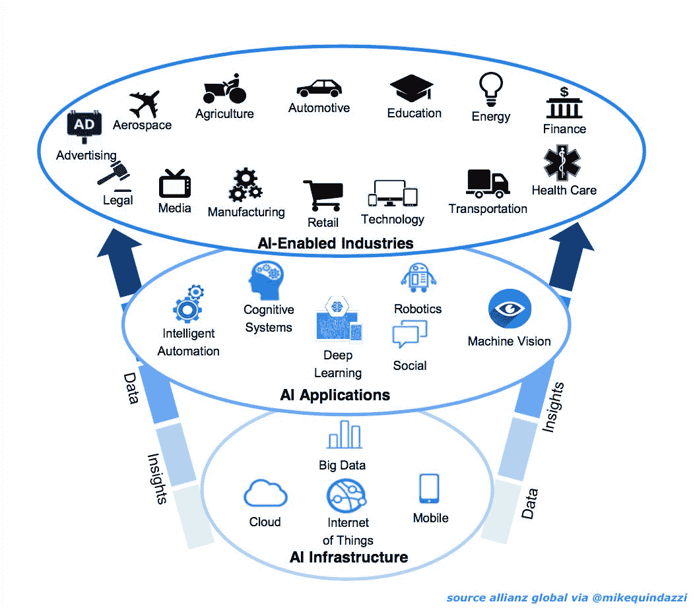

# 保持冷静和自动化，释放垂直物联网中的机遇 

> 原文：<https://web.archive.org/web/https://techcrunch.com/2017/09/28/keep-calm-and-automate-to-unlock-the-opportunity-in-the-vertical-internet-of-things/>

内特·威廉姆斯撰稿人

More posts by this contributor

自从 1999 年物联网(IoT)一词诞生以来，这个行业有过炒作、恐慌、成功，现在甚至还有 twitter 恶搞账户(@ InternetOfShit)。

尽管物联网的大规模广告活动已经成为主流(最近看到过 IBM Watson、Ring 或 GE Digital 的广告吗？)，最近的[新闻](https://web.archive.org/web/20221207132938/http://reuters.com/article/us-ge-digital-outlook-insight-idUSKCN1B80CB)称通用电气降低了其 Predix 物联网平台的增长预期，这引发了以下问题。

工业物联网的现状如何？机会在哪里？什么会成为赢家？

作为过去十年物联网领域的一名企业家，我帮助寻找适合像 [Greenwave Systems](https://web.archive.org/web/20221207132938/https://greenwavesystems.com/) 和 [August Home](https://web.archive.org/web/20221207132938/http://august.com/) 这样的公司的产品/市场，我相信工业物联网领域存在重大机遇，虽然不太明显，但对消费物联网有很大的帮助。

利用消费物联网的基线和智能电网和远程信息处理技术的广泛采用，新的“垂直物联网”初创公司——那些通过提供针对其独特需求的产品来攻击特定垂直行业的公司——将推动我们行业的下一波发展。

## 工业物联网进展如何？

案例研究已经开始量化工业物联网部署的早期影响。得益于智能照明，巴塞罗那市每年节省 3700 万美元。好时使用物联网传感器和微软 Azure 算法进行机器学习，以提高 Twizzler 糖果生产线的生产效率。尺寸每变化 1%(即从 2.02 盎司。到 2.00 盎司。)在一个 14，000 磅的储存罐中形成 Twizzlers，节省了 500，000 美元。

[OSI Soft](https://web.archive.org/web/20221207132938/https://www.osisoft.com/) 是一款领先的企业基础设施系统，用于连接基于传感器的数据、系统和人员，帮助第二大黄金生产商 Barrick 仅在一家工厂就通过优化生产氧气消耗节省了 100 多万澳元。

像通用电气、IBM 和威瑞森这样的大公司，以及像 T2、绿波和视觉机器这样的初创公司已经开始合作加速整体采用。战略合作伙伴关系、大型营销活动和早期成功带来了一些高增长预测:

*   麦肯锡公司(McKinsey & Co .)估计，2025 年物联网系统的潜在经济影响高达每年 11.1 万亿美元。大约 70%的价值来自 B2B 应用。

*   通用电气认为，到 2030 年，物联网将为全球 GDP 增长增加 10 至 15 万亿美元，相当于中国目前的整个经济。

*   英特尔预测，到 2020 年，联网设备将达到 2000 亿台，地球上每个人将拥有近 25 台联网设备。

*   IBM 认为，理解智能设备中嵌入的数据正在创造一个巨大的市场机会，预计到 2020 年将达到 1.7 万亿美元。

尽管有这些令人信服的统计数据，但目前的方法仍存在问题。例如，IBM 认为几乎 90%通过物联网捕获的数据从未被处理。

麦肯锡还发现，目前只有 1%的传感器数据来自一个拥有 30，000 多个传感器的石油钻井平台。

这是为什么呢？

消费者物联网将继续作为一个垂直机会向前发展(将在单独的帖子中讨论)，但企业将需要更好的工具、更新的方法来提取行业见解，并能够从物联网支持的信息中受益。

## 成功的其他因素

攻击“现有者”的接缝——在目标客户不希望更大的系统集成和咨询支出的情况下，新的“接缝创业公司”已经出现。Seam 初创公司专注于特定的行业和/或细分市场机会，因此他们可以填补当前产品中的空白。

随着这些专业化的 seam 创业公司开始扩大规模，他们可以与大型平台进行更深入的合作，并获得战略投资，但最终可能会选择直接与这些平台竞争。在最近的 LinkedIn 帖子中，通用电气首席执行官约翰·弗兰纳里重申了他对通用电气 Predix 平台的承诺，但讨论了他们的行业重点将如何围绕更窄的垂直行业:

> “我们的战略重点是我们的垂直市场。我们将利用我们在能源、石油和天然气、航空、医疗保健、铁路和采矿方面的优势，并利用我们的核心资产和设备来提供最佳价值和执行。我们将扩大和加强我们的合作伙伴关系，以创建一个强大的 Predix 生态系统。”通用电气首席执行官约翰·弗兰纳里

**专注于软件的**–随着物理硬件面临价格压力，更多无处不在的连接选项可供选择，新公司将以软件为重点。基于这些连接/收集解决方案，利用人工智能和机器学习处理&分析的新软件产品将提供影响这些行业的见解。

企业内部也存在应用软件的机会。硬件真的成为商品了吗？绝对不行！如果执行正确，硬件将围绕软件创建一条护城河，并加强垂直化物联网初创公司的差异化。

**SaaS /平台即服务(PaaS)商业模式**–考虑到许多大公司在从物理流程过渡到数字流程时面临的风险，SaaS 商业模式是理想的选择。目标客户可能缺乏资本预算来购买、维护和保护新的物联网产品，而 SaaS 提供的财务优势(运营费用与资本费用)使其在当今企业中如此普遍。此外，寻找基于结果的业务模式，在这种模式下，可以通过节省开支、增加收入或提高正常运行时间来衡量项目的有效性。

**重复执行者**——根据考夫曼基金会的数据，在前一次创业中成功的企业家有 30%的机会在下一次创业中成功。初次创业者只有 18%的成功机会。经历过将通信网络技术应用于行业的重复创业者受益于物联网经验和通讯录。seam 初创公司的机会窗口狭窄，需要激光聚焦和快速执行。

## 接下来是什么？

未来 6 -18 个月对我们的行业至关重要。工业物联网能否利用智能城市、互联家庭和量化工厂的成功来满足这些崇高的分析师预测？我们作为一个行业会陷入炒作周期的低谷吗？

物联网技术的绝对必然性是毋庸置疑的，但机会的实现需要无数有时相互竞争的利益相关者之间的协作；从业者、企业家、监管者和投资者。我们相信，垂直化的物联网初创公司将在唤醒企业和实现工业物联网承诺方面发挥重要作用。

你有什么想法？你认为哪些行业最有可能拥抱垂直化的物联网？有哪些物联网方法让您的客户感到满意或帮助您提高了速度？谁是早期的领导者？我们很乐意继续对话，请发推文至@KPCB@内威廉姆斯。