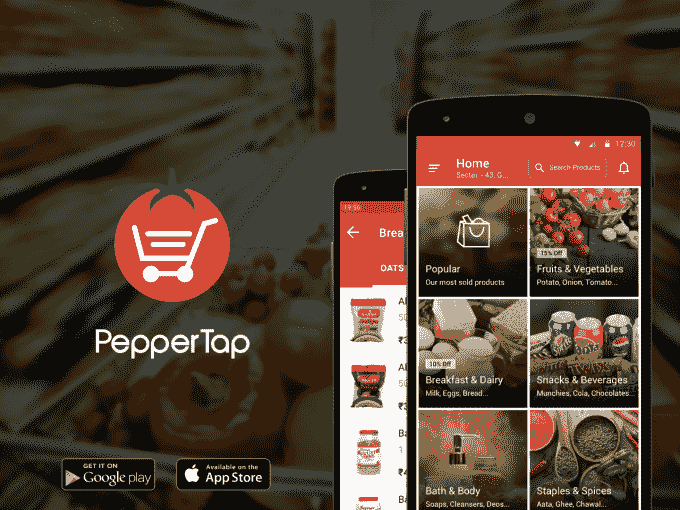

# PepperTap 获得 3600 万美元，将其杂货配送服务扩展至印度 75 个城市 

> 原文：<https://web.archive.org/web/https://techcrunch.com/2015/09/29/keep-tapping-on-dem-peppers/>

印度成立九个月的杂货递送服务公司 PepperTap ，在宣布融资 3600 万美元后，结束了今年的第三轮投资。

这笔资金由亚马逊在印度的竞争对手 Snapdeal 牵头，阿里巴巴支持该公司，现有投资者红杉印度(Sequoia India)和 SAIF 合伙人以及新的支持者 Ru-net、JAFCO 和 BeeNext 也参与了投资。似乎这还不够，PepperTap，[在 3 月](https://web.archive.org/web/20230214185103/https://techcrunch.com/2015/03/10/peppertap/)获得了 120 万美元，然后[在 4 月](https://web.archive.org/web/20230214185103/https://techcrunch.com/2015/04/14/peppertap-seriesa/)又获得了 1000 万美元，正在讨论将这一轮再增加 2000 万美元。

PepperTap 首席执行官兼联合创始人 Navneet Singh 在接受 TechCrunch 采访时表示，该公司并没有故意将这一轮分成两轮，但在完成 3600 万美元 B 轮融资的最后阶段，它收到了新投资者的强烈兴趣。辛格补充说，额外的兴趣来自印度以外的风投。

## 扩展到印度的 75 个城市

像 Instacart 和其他公司一样，PepperTap 为顾客提供按需杂货。它与现有的商店(提供供应)合作，在两个小时内将订单发送给客户，尽管辛格透露，在未来六到九个月内，这一时间将减半至一小时。在印度，竞争很激烈，有 Accel 支持的 ZopNow、资金雄厚的 Grofers 和 Big Basket、LocalBanya 等更知名的公司参与竞争。

今年对 PepperTap 来说是疯狂的一年。今年 4 月，当 PepperTap 获得红杉投资时，它只在一个城市运营:古尔冈。现在，它已经遍布印度的 17 个城市，并计划在明年三月底之前达到 75 个。辛格说，该公司在 1 月份每天处理 30-40 份订单，但这个数字现在是 15，000-17，000 份——而在最近的周末高峰，由印刷报纸广告推动，需求在一天内达到 4 万份订单。辛格告诉我们，他预计到 2016 年 3 月，GMV(每年的总销售额)将达到 2.5 亿美元，而 PepperTap 的 3000 名员工可能会在同期翻一番。

## 来自 Snapdeal 的投资

除了高速增长，这轮融资特别有趣，因为它是由印度电子商务公司 Snapdeal 牵头的，该公司最近从阿里巴巴、软银和富士康获得了 5 亿美元。

这是否表明 Snapdeal 将通过直接收购 PepperTap 进军食品杂货领域？

辛格不这么认为，他说这种关系目前只是战略性和金融性的。(他还指出，他非常了解 Snapdeal，因为他之前的物流初创公司 Nuvoex 曾与该公司合作，去年还差点完成了一项类似的投资。)

“我们希望有一个合作伙伴来帮助我们更快地扩大规模，”辛格说，并解释说，该公司将利用 Snapdeal 的巨大客户群来帮助获得新客户，并避免在用户获取方面过度“烧钱”。

他在谈到 Snapdeal 时补充道:“他们在供应链方面做了很多工作，在过去几年里取得了巨大进步。”。

## 印度风格

虽然 PepperTap 的模式可能类似于美国、欧洲和中国的企业，但辛格认为，印度市场和消费者完全不同，这需要一种新的方法。他说，例如，法规禁止商品加价，因此 PepperTap 的目标是达到相当大的规模，并使用不同的商业模式来赚钱。它的配送方式很有趣，因为它将城市分成区域，然后用一个商店为每个区域服务，从而帮助其零售合作伙伴快速实现规模化。

它还选择性地选择合作伙伴，与那些需要上网但没有资源的人合作。

“我们不是电子杂货商，我们是合作伙伴，使这些商店能够竞争，”辛格说。“商店现在面临着人们上网的挑战，(许多)商店没有资金来建立自己的基础设施……他们的客户将转移到网上，所以我们试图帮助这些人与更大的男孩竞争。”

如果 PepperTap 可以扩展到 75 个城市，这将使它成为一个强大的网络，但 Singh 对进入每周商店以外的新垂直市场不感兴趣。因此，鲜肉等领域可能会进入，但电子产品和其他更华丽的产品不在路线图中。

除了运营费用，PepperTap 计划将这笔新资金投资于开发其技术。辛格表示，Android 占订单的 85%，iOS 占 10%，其余为移动网络。当被问及是否会追随印度只使用应用程序的趋势，取消移动网络业务时，辛格承认公司考虑过这个问题，但目前没有任何计划。

PepperTap 在六个月内筹集了三轮资金，但我们不应该指望这种快速的资本重装会继续下去。

“我们有足够的资本继续下去，但融资是一个相当持续的过程，”他表示，尽管“合适”投资者的兴趣可能引发新一轮融资。