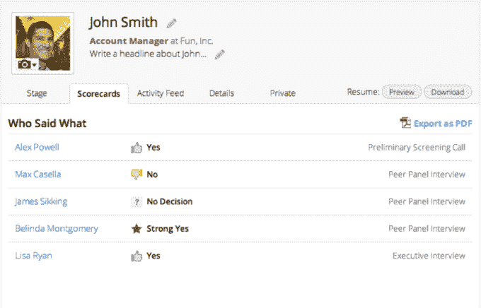
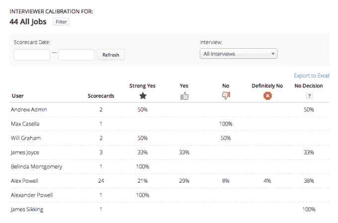

# 招聘软件巨头温室吞掉 3500 万美元 C 系列

> 原文：<https://web.archive.org/web/https://techcrunch.com/2015/08/24/keeping-resources-human/>

“我们不想成为只会唱歌会跳舞的人力资源系统。[温室](https://web.archive.org/web/20230404093952/http://www.greenhouse.io/)的首席执行官丹尼尔·柴特说:“我不知道如何在薪水册上表现出色。”。但他的创业公司正在努力做的是招聘软件。它现在有超过 800 个客户，包括 Slack 和 Pinterest，几乎是它在 3 月份宣布其[1390 万美元 B 轮](https://web.archive.org/web/20230404093952/https://techcrunch.com/2015/03/11/i-have-people-skills/)时的 450 个客户的两倍。

这一进展，加上国际扩张和出售给更大公司的梦想，为 Greenhouse 赢得了另一轮约 6000 万美元的资金。由 Thrive Capital 牵头的 3500 万美元 C 轮投资将为海外增长提供温室燃料，并为更大的客户完善其软件。它还不是独角兽，但以这种速度很快就会是了。

温室产品有助于公司的招聘和雇佣工作。它在一个招聘仪表板中汇编了求职者的来源，如职位公告板和推荐人，公司可以在其中 A/B 测试职位列表，并提醒员工有空缺职位要填补。然后，在面试过程中，它帮助招聘者协调、组织所提的问题和得到的答案，这样他们就很容易比较。这一切使得从空桌子到强雇佣变得更快更便宜。

Greenhouse 的收入将在 2015 年翻两番，随着员工涌入这艘火箭船，员工人数也在不断增加。但是 Chait 最关心的是保持他的人力资源公司的人性化。

温室首席执行官丹尼尔·柴特

“我们努力表现得像真正的人，”他告诉我。“很多人都有这样一种倾向，当你出现在工作场所时，你会摆出一副工作者的姿态，而把真实的自己留在家里。我认为这对任何人都不公平。如果你雇佣优秀的员工，你应该让他们做自己。”

当整个公司围着几张桌子时，保持个性是很容易的，但现在 Greenhouse 有 125 名员工。“你有一种文化，但它非常含蓄，基于创始团队。随着你的成长，为了维持这种文化，你必须让它更加明确，谈论它，并以此为基础进行招聘。”

Chait 告诉我，薪资、招聘和其他人力资源工具过去都是在“一家厂商提供的一个巨大的整体系统中销售的。”想想甲骨文的全方位工具 Taleo。“我想向客户证明，通过使用专门的软件做更少的事情，你可以在这方面做得好 10 倍”。

至少 Chait 暂时不用担心资金问题，因为 C 轮融资带来的资金超过了前几轮融资的总和。他说他选择 Thrive Capital 是因为“他们非常聪明，非常实干，非常投入。他们不是坐在办公室角落里看电子表格的银行家。”

Greenhouse 目前只有 10%的海外业务，因此部分资金将用于更多的国际销售办公室和员工。它还将用于开发更好的基础设施和合规性，以便 Greenhouse 的软件能够服务于更大规模的客户。还有几个秘密的 R&D 项目也在进行中。

与此同时，Greenhouse 希望在美化界面的同时保持对功能的关注。当被问及移动优先招聘的启动杠杆时，Chait 承认其平台“比我们的更好看，很漂亮。”但他强调，招聘和安排面试本来就很复杂，并警告不要过于简化。

“当你开始创业时，你会让自己相信这是一个巨大的机会，但你只能想象未来的许多步骤，”Chait 带着一丝对宁静日子的怀念说道。“在这一点上，我们正在努力解决一系列切实的问题。想象力已经存在了。”当其他人载歌载舞的时候，是[温室](https://web.archive.org/web/20230404093952/http://www.greenhouse.io/)执行的时候了。