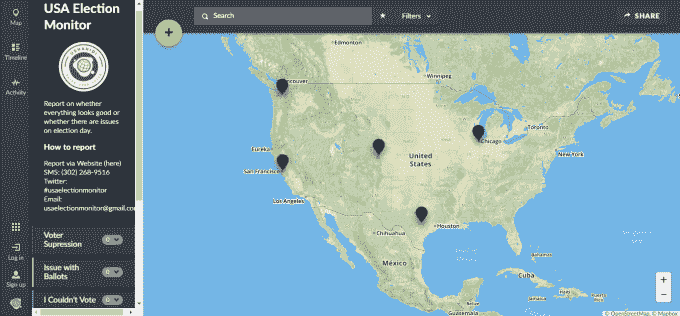
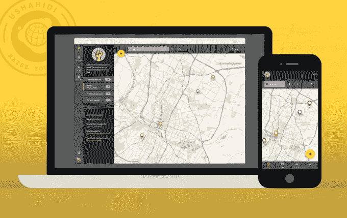

# 肯尼亚初创公司 Ushahidi 发起了一项众包活动来监测美国大选

> 原文：<https://web.archive.org/web/https://techcrunch.com/2016/11/02/kenyan-startup-ushahidi-launches-a-crowdsourced-campaign-to-monitor-the-u-s-election/>

肯尼亚软件公司 Ushahidi 发起了一项观察即将到来的美国大选的活动。

这项名为[美国选举监督](https://web.archive.org/web/20230401114854/http://www.usaelectionmonitor.com/)的行动将追踪通过网站、电子邮件、推特和短信报告的投票违规行为，并将账户发布到在线[互动地图](https://web.archive.org/web/20230401114854/https://usaelectionmonitor.ushahidi.io/views/map)。

Ushahidi 的执行董事 Daudi 被告知 TechCrunch:“这是一次公民激励、公民领导的选举部署。”。

虽然 Ushahidi 在 2012 年总统选举中被用于奥巴马竞选团队的民意调查，但 Were 表示，2016 年的竞选中有一些独特的因素值得该公司关注。

“在这次美国选举中，围绕选民压制和其他投票违规行为存在一些前所未有的问题，”Were 说。“Ushahidi 在全世界 40 个国家进行选举监督。我们说:‘为什么不去美国呢？’"

Ushahidi 的交互式美国链接有专门的报道标签，用于排长队、投票问题、压制选民或目睹暴力。“该系统还允许报告积极的经验，没有任何问题，”Were 说。

11 月 8 日是美国人投票选举下一任美国总统、469 个开放的国会席位以及其他州和地方选举的正式日期。

Ushahidi 将从其内罗毕总部并通过其在包括美国在内的 8 个国家的 30 名员工组成的团队管理其 2016 年的美国业务。

美国选举监督组织正在为其核查小组面试志愿者，这些志愿者将收到关于 Ushahidi 筛选、核查和报告选举活动的方法的培训包和简报，这些选举活动是通过当地公民以数字形式提供的。

该公司在这一领域有丰富的经验，可以追溯到它的东非根源。最初[开发](https://web.archive.org/web/20230401114854/http://www2.technologyreview.com/tr50/ushahidi/)是为了应对肯尼亚 2007-08 年的选举暴力，作为一个开源的众包应用程序，它迅速获得了全球的认可，成为世界上任何地方数字化绘制人口统计事件的高效工具。

这款应用的四位原创者——埃里克·赫斯曼、[朱莉安娜·罗蒂奇](https://web.archive.org/web/20230401114854/http://julia.na/)、[奥里·奥科洛](https://web.archive.org/web/20230401114854/https://www.omidyar.com/people/ory-okolloh)和大卫·科比亚——于 2008 年 5 月成立了 Ushahidi 国际 IT 公司。该公司已经得到了硅谷的支持(见 TechCrunch 的 7 月非洲综述),其软件已经在 160 个国家部署了 10 万次。

Ushahidi 将把在肯尼亚、南苏丹和日本等地观察选举所获得的方法和专业知识应用到 2016 年美国选举监督活动中。“我们已经设计了平台和团队来消除主观因素，并在发布前客观地审查每一条数据，”Were 说。

2016 年美国总统大选的合法性因共和党候选人唐纳德·特朗普的一系列不同寻常的声明而受到质疑。首先，投票系统被“操纵”,美国媒体串通起来帮助他的对手希拉里·克林顿。川普支持这一点，他有些不明确地呼吁他的支持者“[监督投票](https://web.archive.org/web/20230401114854/http://www.nytimes.com/2016/10/19/us/politics/donald-trump-voting-election-rigging.html)”，这引发了对美国投票站潜在恐吓甚至暴力的担忧。

那么，如果 Ushahidi 的美国选举监督活动追踪到重大的不稳定事件，会发生什么呢？“我们有一套方法来审查并上报给适当的地方当局，无论是第一反应人员、选举官员还是执法部门，”Were 说。