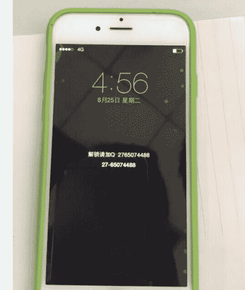

# KeyRaider 恶意软件可能是迄今已知最大的苹果账户盗窃案的元凶，影响了 225，000 名用户 

> 原文：<https://web.archive.org/web/https://techcrunch.com/2015/08/31/keyraider-malware-responsible-for-possibly-largest-known-apple-account-theft-to-date-affecting-225000-users/>

越狱你的 iPhone 有它的缺点。周日，安全专家[帕洛阿尔托网络](https://web.archive.org/web/20230215170544/https://www.crunchbase.com/organization/palo-alto-networks)发布了一份[报告](https://web.archive.org/web/20230215170544/http://researchcenter.paloaltonetworks.com/2015/08/keyraider-ios-malware-steals-over-225000-apple-accounts-to-create-free-app-utopia/)，详细介绍了一种新形式的 iOS 恶意软件，称之为“KeyRaider”，负责窃取超过 225，000 名苹果客户的账户信息。这种恶意软件的目标是那些被黑客攻击的 iOS 设备，因此对数百万没有修改设备软件的苹果账户持有人来说，这并不是一个重大威胁。

对于那些不熟悉这个术语的人来说，越狱是一种在[之前](https://web.archive.org/web/20230215170544/https://en.wikipedia.org/wiki/Cydia)年更常见的活动，因为它允许苹果设备所有者在他们的 iOS 设备上安装未经批准的应用程序和调整。

许多这些越狱应用程序允许用户用主题、小工具、启动器、不同的用户界面等东西来个性化他们的 iPhone。然而，随着苹果开始通过添加官方批准的定制选项，如 Today widgets、动态壁纸、改进的多任务体验、定制键盘等，解决用户越狱手机的一些原因，该活动的受欢迎程度有所下降。

因为越狱 iOS 设备意味着用户绕过内置的安全保护，这可能会让他们遭受这样的恶意软件攻击。比如过去有一种叫做“ [Unflod](https://web.archive.org/web/20230215170544/https://www.sektioneins.de/en/blog/14-04-18-iOS-malware-campaign-unflod-baby-panda.html) 的攻击，拦截加密流量窃取苹果密码。另一个名为 [AppBuyer](https://web.archive.org/web/20230215170544/http://researchcenter.paloaltonetworks.com/2014/09/appbuyer-new-ios-malware-steals-apple-id-password-buy-apps/) 的攻击使用了类似的技术来窃取密码并从应用商店购买应用。

然而，KeyRaider 恶意软件走得更远。

它不仅窃取苹果帐户用户名、密码和设备 GUIDs(设备 id)，还窃取苹果推送通知服务使用的证书和私钥，并阻止受感染的 iPhone 或 iPad 通过密码或 iCloud 服务解锁。

这导致一些用户的 iPhone 在恶意软件传播后被勒索赎金。

对这种最新恶意软件的研究是由帕洛阿尔托网络公司和业余技术小组 [WeipTech](https://web.archive.org/web/20230215170544/http://weibo.com/weiptech) 一起进行的，该小组由总部位于中国的一个名为 [Weiphone](https://web.archive.org/web/20230215170544/http://www.feng.com/) 的大型苹果粉丝网站的用户组成。该组织已经开始调查一些用户的苹果账户被用来进行未经授权的购买和安装应用程序的报道。

八月份，中国科技媒体报道了这次黑客攻击的细节，指出通过访问用户账户信息，攻击者也可以获得个人数据，如电子邮件、信息、文档和照片。

KeyRaider 由中国的第三方 Cydia 库发布，但也影响了中国以外的用户，包括来自法国、俄罗斯、日本、英国、美国、加拿大、德国、澳大利亚、以色列、意大利、西班牙、新加坡和韩国的用户。

然而，帕洛阿尔托网络公司告诉我们，大多数感染发生在中国。

“我们确实发现了与许多其他国家相关的电子邮件地址，但它们只是少数，”帕洛阿尔托网络公司 42 部门的情报主管瑞安·奥尔森告诉我们。

他还表示，帕洛阿尔托不能确定这是迄今为止最大的攻击，因为并不总是能够量化这些黑客攻击的规模和范围。

“通常我们不会发现有多少凭证被盗，”Olson 解释道。“在这种情况下，WeipTech 能够访问被盗凭据的数据库，这给了我们比以前事件更好的计数。”奥尔森还补充说，针对 iOS 的恶意软件并不常见，尽管如上所述，其他数据泄露事件也泄露了信息。

今天的人们可能最熟悉的是[名人照片 iCloud 攻击](https://web.archive.org/web/20230215170544/https://techcrunch.com/2014/09/01/heres-what-we-know-so-far-about-the-celebrity-photo-hack/)，例如泄露私人照片。但是那次攻击的规模比 T2 小得多，最多影响数百人，并且是基于网络钓鱼，而不是恶意软件。

[gallery ids="1202638，1202637，1202636，1202635，1202634，1202633"]

根据 Palo Alto Networks 的说法，KeyRaider 恶意软件已经窃取了超过 225，000 个有效的苹果帐户和数千个证书、私钥和购物收据。窃取的数据被上传到同样存在漏洞的指挥控制服务器。

该攻击使得两个 iOS 越狱调整的用户可以从 App Store 下载应用程序，而无需支付费用。迄今为止，这些调整已经被下载了 20，000 次，这意味着大约有 225，000 名用户滥用了被盗的账户信息。

这种恶意软件在中国更令人担忧，不仅是因为它的传播方式(通过中国的 Cydia 知识库)，还因为中国的许多卖家向客户出售预越狱的 iPhones。

换句话说，KeyRaider 不是一个影响 iOS 大部分用户群的问题。苹果公司在一年前[报告了 8.85 亿 iTunes 账户](https://web.archive.org/web/20230215170544/http://9to5mac.com/2014/09/22/u2-bono-apple-itunes/)，所以 22.5 万受影响的个人在苹果账户持有者中只占很小的比例。但该恶意软件的存在确实表明，随着苹果在中国市场的发展，未来可能会有潜在的问题。

我们联系了苹果公司进行评论，如果有消息，我们会及时更新。