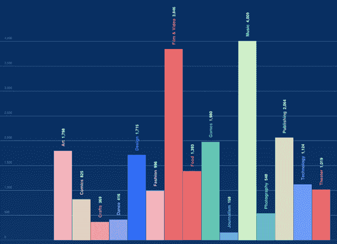

# kickstarter 2014 年记分卡:330 万支持者认捐 5.29 亿美元，2.2 万个资助项目 

> 原文：<https://web.archive.org/web/https://techcrunch.com/2015/01/06/kickstarter-2014-numbers/>

众筹平台 Kickstarter 昨天发布了 2014 年的财务报表,宣称 330 万支持者总共承诺了 5.29 亿美元。(注意:承诺的资金不等于支出的资金，因为除非项目成功融资，否则众筹承诺不一定是具体的。)

**更新:** Kickstarter 已经确认 2014 年的“成功资金”总计为 4.44 亿美元(承诺总额为 5.29 亿美元)。自该平台推出以来，其累计成功投资总额为 12.7 亿美元。一位发言人表示:“花了大约五年时间才达到 10 亿，仅在 2014 年，我们就完成了近一半。”。

科技类吸引了最大的单笔资助(承诺 1.25 亿美元)，部分体现了人们对科幻设备的渴望。然而，科技远非获得资助最多的类别，2014 年仅有 1124 个科技项目获得资助。在 Kickstarter 上获得资助最成功的类别是音乐(4009)、电影和视频(3846)和出版(2064)。

2014 年 Kickstarter 值得注意的一个因素是，该公司去年停止了对项目的预先审查，为所有人的疯狂想法打开了闸门。你可以称之为土豆沙拉时刻。尽管如此，Kickstarter 的发言人热衷于指出，它仍然有[规则](https://web.archive.org/web/20221205171244/https://www.kickstarter.com/rules)关于什么可以和什么不可以在它的平台上推出，即使它现在允许项目制作者立即推出(所以一部分项目最终被取消)。

我们仍然一无所知的一个量化众筹的相关指标当然是有多少成功资助的 Kickstarter 项目已经——或者继续——成功交付*。我们唯一的统计数据是:\_(ツ)_/*

 *回到我们现有的数据:2014 年，只有 22，253 个项目成功获得了 Kickstarter 的资助，这比去年的总数(19，911 个)有所增加，但幅度很小。支持者总数也只有小幅上升(从 300 万增至 330 万)。然而，Kickstarter 表示，2014 年首次有 2202171 人支持一个项目。这是总支持者的大多数，说明了支持者疲劳的程度(如果人们第二年不回来支持项目)——尽管大约三分之一的人去年显然回来了更多。

可以肯定地说，众筹是一个越来越拥挤的领域，多个平台争夺现金和注意力，这意味着对 Kickstarter 来说，开创早年更大规模的增长显然是一个很难实现的技巧。但它仍在继续推进。

Kickstarter 的 2013 年明细记录了总共 300 万众筹者承诺的总额为 4.8 亿美元(只有不到 2 万个项目成功获得资助)。我们还在此报道了它的 [2012 年数据。当时的表现是 224 万支持者承诺 3.2 亿美元，18109 个项目成功获得资助。而在 2011 年，大约有 100 万人支持，认捐的金额接近 1 亿美元。](https://web.archive.org/web/20221205171244/https://beta.techcrunch.com/2013/01/08/kickstarters-big-2012-2-24-million-people-pledged-320-million-18k-total-successfully-crowdfunded-projects/)

2014 年 Kickstarter 平台上的大部分众筹承诺仍然来自美国，5.29 亿美元的承诺总额中有 3.355 亿美元来自大约 220 万美国人的钱包。认捐额第二的是英国，有超过 26 万名支持者提供了 3906 万美元，其次是加拿大，有超过 17 万名支持者提供了 2765 万美元，澳大利亚有不到 9.9 万名支持者提供了 1983 万美元。

周三下午是 2014 年最受人们欢迎的项目承诺时间。获得资助项目最多的月份是 8 月，有 2，311 个项目达到了目标。获得资助最少的月份是 1 月份，这或许并不令人意外，当时只有 1242 个项目上马。

2014 年最受支持的项目包括莱瓦尔·伯顿的 [Reading Rainbow](https://web.archive.org/web/20221205171244/https://beta.techcrunch.com/2014/06/30/reading-rainbow-has-more-backers-than-any-kickstarter-campaign-ever/) reboot(得到了近 106，000 名众筹者的支持)，其次是[可笑地设计出的啤酒冷却器](https://web.archive.org/web/20221205171244/https://beta.techcrunch.com/2014/07/15/the-5-million-cooler/)(约 63，000 名支持者)。在技术方面，[智能手机控制的纸飞机](https://web.archive.org/web/20221205171244/https://beta.techcrunch.com/2013/11/28/paper-plane-3-0/)项目(~21，000 英镑)和[感应睡眠追踪器](https://web.archive.org/web/20221205171244/https://beta.techcrunch.com/2014/07/23/thiel-fellows-elegant-sleep-sensor-the-sense-crushes-kickstarter-with-120k-in-a-few-hours/) (~19，000 英镑)也吸引了相对较多的支持者。*