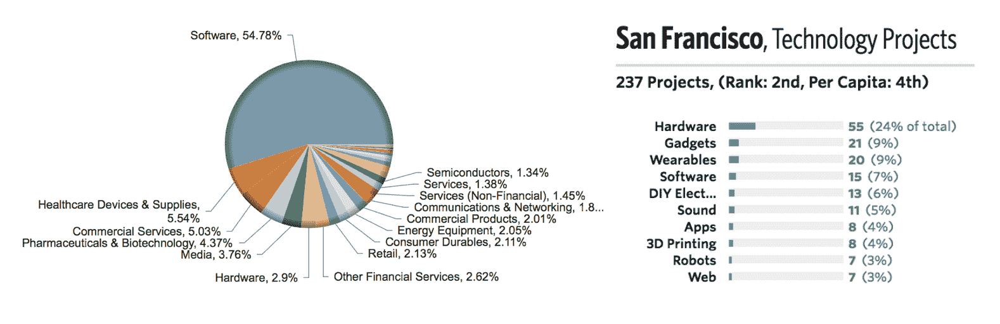
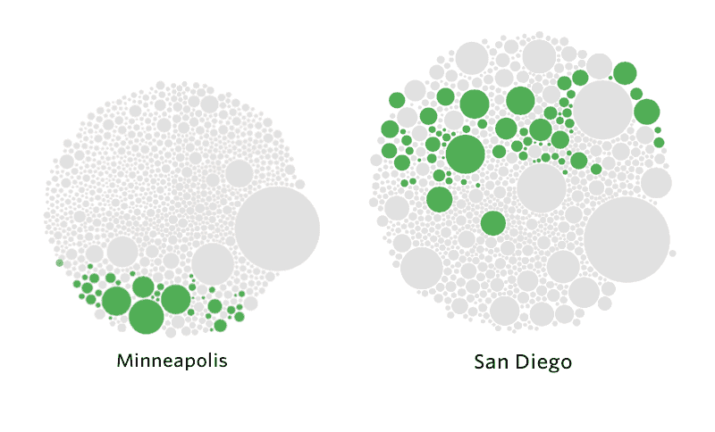

# Kickstarter 打破了关于创新在哪里发生的假设

> 原文：<https://web.archive.org/web/https://techcrunch.com/2016/09/20/kickstarter-is-breaking-down-assumptions-about-where-innovation-can-occur/>

少数仍然认为 Kickstarter 可以取代风险投资的人只需看看 T2 测谎仪的一份新报告就知道众筹与传统的早期金融有多么不同。

虽然人们很容易将像[Pebble 智能手表](https://web.archive.org/web/20230326053838/https://www.kickstarter.com/projects/597507018/pebble-time-awesome-smartwatch-no-compromises?ref=most_funded)这样的产品视为 Kickstarter 这样的众筹网站正在与传统机构金融家和天使投资人竞争的迹象，但现实是绝大多数项目从未出现在沙丘路的视野中。相反，Kickstarter 正在说明，在硅谷之外维持创新所需要的只是正确的激励。

在整个美国，科技产品和服务仅占所有 Kickstarter 项目的 3.7%。相比之下，43%的项目被归类为电影或音乐作品。不仅整个国家的科技在这个平台上的代表性不足，它在创新的摇篮——硅谷——的代表性也不足。该地区并没有像在风险投资领域那样遥遥领先，而是与其他几个城市并驾齐驱。

在全国范围内，大约有 3，273 个科技项目在 Kickstarter 上获得了支持。旧金山本身仅占其中的 7%多一点。相比之下，PitchBook 数据显示，同一地区占全国科技公司的 13%左右。这几乎是影响力的两倍，这还不包括帕洛阿尔托、门洛帕克和山景城等科技堡垒。

左图:根据来自 PitchBook 的数据编辑，右图:来自测谎仪

再往下钻，在旧金山创建的所有项目中，只有超过 0.5%是软件项目。一个相当惊人的对比是，快速查询 Kickstarter 2009 年成立后在旧金山成立的初创公司，保守估计超过 54%的旧金山初创公司将软件作为核心产品。

另一方面，硬件在 Kickstarter 平台上的比例过高。24%的技术项目，或者说旧金山所有项目的近 2%，提供硬件。这与地区风险投资支持的创业公司相对较小的 2.9%的预测形成了对比。

从测谎仪上提取的

因此，如果湾区在软件方面代表性不足，而在硬件方面代表性过高，那么它的整体地位如何？就 Kickstarters 的总数而言，伦敦金融城未能脱颖而出。经过仔细分析这些数据，旧金山可以在 Kickstarter 上申报 237 个科技项目，而纽约可以申报 262 个，而这个城市只有 2%的项目属于科技项目。

像明尼阿波利斯和圣地亚哥这样的城市作为科技中心更加突出，这在传统的风险投资指标中没有反映出来。然而，这两个城市最受支持的项目分别是一个智能水瓶和一副 3D 音频耳机。相比之下，传统的独角兽巨头受到硅谷等地的激励，你会看到优步和 Airbnb。

虽然在 Kickstarter 上完成一轮数十亿美元的增长几乎是不可能的，但该平台的多样性有力地证明了取代创新是多么容易。Kickstarter 大力鼓励硬件项目，这是基于奖励的融资模式的结果。

从历史上看，Indiegogo 是科技项目的主要所在地，Kickstarter 被赋予了艺术家天堂的内涵。软件项目已经在该网站上传播，但只是在该公司于 2014 年放松对技术类别的监管之后。由此产生的影响今天依然存在，而且随着股权众筹的兴起，这种影响只会变得更加令人困惑。不幸的是，帮助平台成长的同质化限制了它实现预期的能力，从而破坏了整个传统的创业生态系统模式。

这些数据确实表明，当一个强大的创意社区接管时，其他城市可以多快地从硅谷收拾残局——这只是为所创造的产品类型提供正确激励的问题。由于人口、资本和教育的密度，网络效应使创新长期集中在少数地区。虽然众筹在颠覆这一点上完全失败了，但它表明，不需要罗伯特·诺伊斯和叛逆八人组就能创建全新的创新生态系统，在这个生态系统中，权力与你的 Twitter 粉丝或有限合伙人无关。