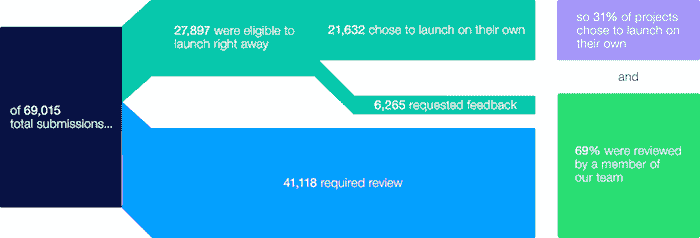

# Kickstarter 揭示了其半自动审核流程的机制 

> 原文：<https://web.archive.org/web/http://techcrunch.com/2015/02/17/kickstarter-sheds-some-light-on-the-mechanics-of-its-semi-automated-review-process/>

# Kickstarter 揭示了其半自动审核流程的机制

Kickstarter[提供了一个视角](https://web.archive.org/web/20230129225952/https://www.kickstarter.com/blog/how-projects-launch-on-kickstarter)看看去年重新配置的审查系统是如何为他们工作的，提供了一些反驳互联网某些角落持有的[观点](https://web.archive.org/web/20230129225952/https://techcrunch.com/2014/06/03/kickstarter-simplifies-its-rules-and-lowers-the-barrier-for-project-acceptance/)的观点，即 Kickstarter 已经完全废除了审查系统，向北方的野人和其他邪恶的角色敞开了大门。事实上，Kickstarter 表示，基于超过 6 个月的数据，新流程仍然会导致绝大多数提交的项目出现在人们的眼前。

该网站称，该系统使用一种算法作为自动审查的第一道防线，旨在选择那些大多千篇一律、无论如何都极有可能获得真人点头的东西。这意味着，自该系统推出以来，在 69，015 份提交的申请中，有 27，897 份被算法批准直接激活，还有 6，265 份在按下绿色大按钮之前实际上向 Kickstarter 请求了人类反馈，这意味着只有 31%的项目在没有人类参与的情况下启动了审批后流程变更。

这使得 69%的项目受益于某种人工干预，Kickstarter 希望用户知道，人性的一面仍然是它所提供的关键部分。Yancey Strickler 的博客文章详细介绍了统计数据池，还谈到了正在使用的算法是如何不断完善的，它的目的首先是释放人类评审者的时间，让他们更多地关注在最需要的时间和地点提供帮助。

雅虎最近的一份调查报告。Tech 的 Dan Tynan 发现，Kickstarter 最抵制旨在潜在欺骗支持者的虚假融资活动，随着如此多的人为干预，这就开始有道理了。但这并没有改变 Kickstarter 经常类似于预购机制的事实，尽管事实很明显它不是。

众筹似乎不太可能成为一种完全消失的时尚，这意味着避免店面不是店面的污名可能是更主流采用的最大障碍。至少，确保人类仍然是等式的一部分似乎是一个很好的中间步骤，有助于为这一新兴的在线伪商务类别设定预期。