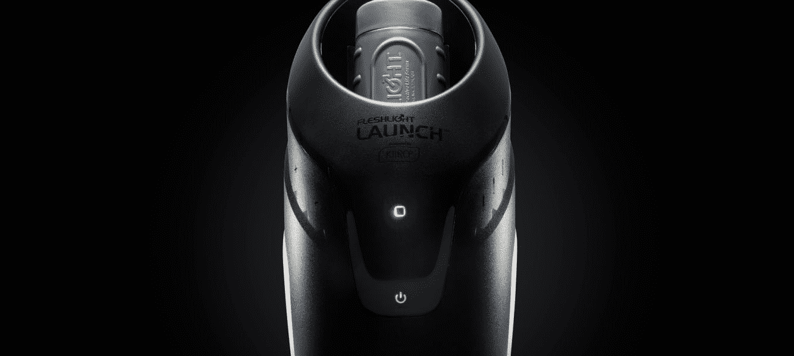
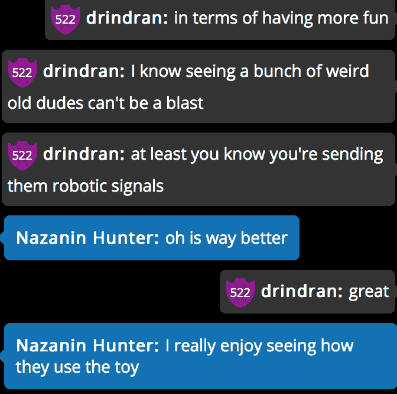

# Kiiroo 发起了一场双向远程通信的冒险

> 原文：<https://web.archive.org/web/https://techcrunch.com/2018/08/17/kiiroo-launches-an-adventure-in-bi-directional-teledildonics/>

将来每个人都要裸体十五分钟。带着这种新奇的想法，我联系了一位名叫[纳扎宁](https://web.archive.org/web/20230130100805/https://twitter.com/nazaninhunter?lang=en)的模特，她将带我穿越双向远程摄像生活的新世界。

我在那里测试一种新设备，叫做 Kiiroo Launch。这个新颖的性爱罐子连接着手电筒——本质上是一个自慰器——可以发送和接收来自远程假阳具的信号。三年前，当我第一次探索 [Kiiroo 系统](https://web.archive.org/web/20230130100805/https://techcrunch.com/2015/11/15/inside-robot/)时，我发现它令人着迷，尽管可以说，它就像与 3D 打印机做爱一样。所以我准备和纳扎宁一起工作。

顺便说一下，这将是 NSFW。

# 你说双向的？

在基于摄像头的电视世界里，模特们通常会戴上某种与倾斜系统相连的振动器。当观众提示他们时，模型的振动器就会振动，为通常的单行道增添了互动的活力。这成为大多数 cam 网站的标准，来自 Lovense 的[Lush](https://web.archive.org/web/20230130100805/https://www.lovense.com/bluetooth-remote-control-vibrator)是当前 cam 世界的流行选择。

Kiiro 所做的是将这种互动水平添加到其产品中。例如，发射可以将感觉发送到其他设备，包括 [OhMiBod](https://web.archive.org/web/20230130100805/http://www.lovelifetoys.com/OhMiBod-Brand) 、We-Vibe 和 Kiiroo Pearl。你可以用提示振动这些东西，或者在某些情况下，从发射器向振动器发送信号，这有点像实时模拟你的运动。

Cam 网站 [Flirt4Free](https://web.archive.org/web/20230130100805/http://flirt4free.com/) 是第一个启用这一功能的网站，也是第一个启用 Kiiroo 的网站之一，允许模特使用机器人性爱罐向观众发送感觉。

我告诉过你这是 NSFW。

# 你说，性罐子？

这一经历在很大程度上是非常愉快的。这次发射是一个非常好的设备——[Engadget 爱死它了](https://web.archive.org/web/20230130100805/https://www.engadget.com/2017/04/13/finally-a-good-digital-masturbator/)——它远远优于我几年前审查的原始 Kiiroo Onyx。发射是一个巨大的东西，里面有一个完全独立的性玩具，它看起来就像一个巨大的黑色鸡蛋袋。

我用一款名为 Feel Connect 的应用程序与模型连接，这款应用程序使用二维码来连接两部手机或设备。在这种情况下，我在私人会议期间直接链接到纳扎宁的房间。Flirt4Free 上的私人会话以信用支付，100 美元可以获得 1050 个信用。每个模特都有自己的定价系统——例如，每分钟 40 分钟——一旦你们私下交谈，调情，互相展示自己的身体。

在这种情况下，我们正在测试一个科学设备，所以纳扎宁和我开始了交配舞蹈，包括交换二维码和准备各种机器人附件。游戏进行得很快，我的信号传到她那里，她的传到我那里，随着采访的继续，我发现自己问的记者问题越来越少。她说她喜欢我传达的感觉，我也喜欢她传达的感觉。最后，它就像一个空荡荡的房间。

“到目前为止，表演者一直使用‘只读’互动设备，这是对广受欢迎的声音提示功能的反应，”Flirt4Free 总裁格雷格·克莱曼说。
“通过兼容的设备，客户现在可以玩他们的设备，让模特的设备做出反应——模特也可以控制他们的设备，从而产生有史以来最真实、最令人兴奋的体验！”

最终，我怀疑我们大多数人的家里都会有这样的东西。鉴于手淫在人类哺乳动物中的流行和我们对技术的终生奉献，我可以想象这只是我们所有人的另一种方式。虽然它并不完美——我的电池在会议期间没电了——但没有什么是真正完美的，我怀疑视频性爱的友情和真诚的朋友情谊会在未来几年内改变一些人。

最终，技术触及一切。事实上，我能够在世界各地发送信息——无论是电子邮件还是振动——是非常令人着迷的。随着技术越来越全面地进入我们的生活，像 Launch 这样的工具将变得司空见惯。诚然，我们为这种快乐的进化付出了很多，但我们也收获了很多。娜扎宁说她也喜欢，挺好的。

我告诉过你这将是 NSFW，不是吗？