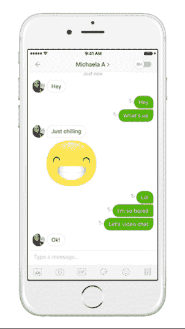

# Kik 在其消息应用程序 中增加了群组视频聊天功能

> 原文：<https://web.archive.org/web/https://techcrunch.com/2016/12/19/kik-group-video-chat/>

在北美青少年中非常受欢迎的聊天应用 Kik 终于在 T2 为其服务增加了视频聊天功能。

Kik 没有像苹果的 FaceTime、Facebook Messenger 或最近推出的 WhatsApp 功能那样直接进行人对人的视频通话，而是为其 3 亿多注册用户增加了一个不太打扰的视频聊天选项，支持最多六人的群组。虽然一些群组视频通话的特点是对着屏幕说话，本质上迫使参与者要么放下手头的工作参与进来，要么离线，但 Kik 表示，它已经精心创建了一个附加层，位于聊天对话之上，所有人都可以访问，即使人们外出或无法打开视频。

“这不像打电话，我们想让它成为聊天的无缝升级，”Kik 首席执行官兼创始人 Ted Livingston 告诉 TechCrunch。"所以聊天变成了一个共享的空白空间."

在这方面，视频流很小，不引人注目地漂浮在文本聊天之上。有趣的是，这个界面故意把用户自己的视频放在一边，这样人们就不会花时间去观察自己的外表。通过这种方式，视频期间可以继续进行文本对话，并可以在视频会话期间共享贴纸、照片或视频等视觉内容，这可以通过轻击右上角的视频图标来激活。

“我们真的希望它感觉像一个真正的面对面的对话，”利文斯顿解释说。

引用一篇皮尤互联网论文发现美国的学生与他们的朋友面对面交流的时间比以往任何时候都少，利文斯顿说他相信 Kik 视频聊天将为年轻用户群提供一种常用的交流方式。

**更新:**哦海，今天也推出了群组视频通话——[我们在这里有更多关于那方面的内容](https://web.archive.org/web/20230322160428/https://techcrunch.com/2016/12/19/messenger-group-video-chat/)。

Kik 表示，视频聊天是其用户群中需求最多的功能。Kik 今年一直专注于聊天机器人——它在 4 月份推出了自己的机器人商店,[声称已经创造了超过 20，000 个机器人](https://web.archive.org/web/20230322160428/https://techcrunch.com/2016/08/03/kik-users-have-exchanged-over-1-8-billion-messages-with-the-platforms-20000-chatbots/)——但现在 Livingston 表示，这家总部位于加拿大的初创公司将“花大量时间致力于核心信息体验。”

目前还不清楚这意味着什么 Kik 首席执行官没有进一步说明——但你可以想象更多的多媒体和支付等功能的引入可能会在 2017 年出现。你可以预计，Kik 明年将开发一款功能更丰富的产品，从微信中获得大量线索。微信是中国的一款应用，开创了我们今天所知的移动通讯的先河。自从微信的母公司腾讯[去年以 10 亿美元的估值](https://web.archive.org/web/20230322160428/https://techcrunch.com/2015/08/18/kik-raises-50m-from-strategic-partner-tencent/)投资 Kik 后，这一点就变得尤为明显。