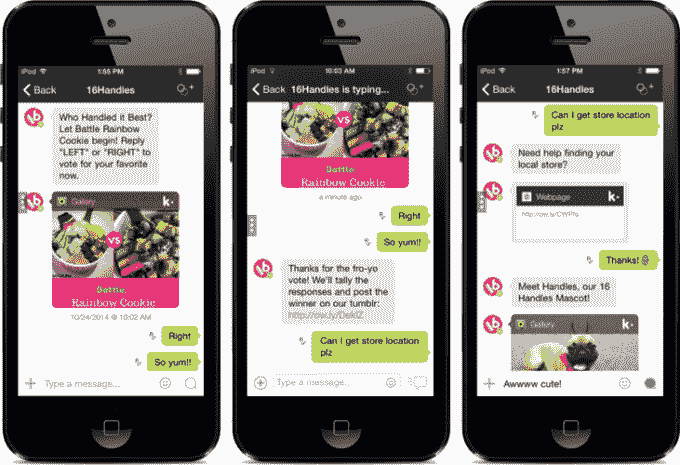
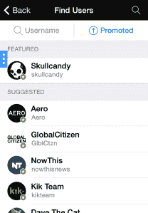

# Kik 推出推广聊天，让品牌出现在它的消息应用上，并最终赚钱

> 原文：<https://web.archive.org/web/https://techcrunch.com/2014/11/06/kik-introduces-promoted-chats-to-let-brands-on-its-messaging-app-and-finally-make-money/>

广告不一定是赚钱的答案。这就是即时通讯应用公司 Kik 的最新功能——[推广聊天功能](https://web.archive.org/web/20230303043745/http://kik.com/kik-launches-promoted-chats-keywords-for-more-personalized-chats/)背后的理念，该功能允许其 1.5 亿多注册用户选择加入，并以 Kik 希望的更吸引人的方式与品牌联系。

Snapchat 作为美国青少年使用的聊天应用程序占据了头条新闻，但[报道](https://web.archive.org/web/20230303043745/http://pando.com/2013/11/29/forget-snapchat-and-whatsapp-for-a-second-kik-is-the-dark-horse-of-the-internet/) [表明](https://web.archive.org/web/20230303043745/http://bgr.com/2013/10/02/whatsapp-engagement-analysis/)Kik 在美国也很受欢迎，尽管该公司在硅谷的知名度很低，仅筹集了 2500 万美元。虽然围绕 Snapchat 广告有很多炒作——这些广告于上个月推出，并由首席执行官 Evan Spiege l 在一次高调的名利场活动中首次披露——Kik Promoted Chats 是在夏天的测试版中悄悄推出的。

新的 Kik 功能很简单。一系列公司在这项服务上开设了官方账户——Kik 表示，最初有 25 个，涉及时尚、零售、非营利等领域——可以用来与选择关注他们的用户进行交流。手动回复大量用户是不可能的，因此 Kik 推出了“关键词”功能，让品牌账户根据关注他们的用户聊天中的“触发”词创建股票回复。

这个想法是品牌有有趣的事情要说和分享，因此，Kik 用户可以选择他们想听的公司的广告，而不是针对每个人的通用广告。或者干脆选择退出。使用正确的信息，Kik 账户可以被用来引导用户获得优惠、促销、新内容或反馈。

以冻酸奶连锁店 [16 把手](https://web.archive.org/web/20230303043745/http://16handles.com/)的这一系列聊天为例。

品牌被鼓励将 Kik 整合到他们现有的社交策略中，并在线下推广他们的手柄，尽管 Kik 也会通过“推广”标签向用户展示他们的账户。它位于主聊天按钮旁边，所以经常被 Kik 用户访问。

运营账号和使用关键词都是免费的。Kik 希望通过推广功能将这项服务货币化，推广功能让品牌利用位置和实时竞价机制设定目标受众，实时竞价机制的运作类似于标准的在线广告门户。

迄今为止，Kik 仅通过出售贴纸赚了(一点点)钱，尽管其最近推出的 [Kik 积分系统](https://web.archive.org/web/20230303043745/http://thenextweb.com/apps/2014/05/09/kik-introduces-virtual-currency-encourage-engagement-potentially-make-money/)——奖励执行特定任务的用户——可能会被调整成赚钱机器。

同样，其基于 HTML5 的 cards 系统(允许任何网站在 Kik 的集成网络浏览器中运行，并可以很容易地与朋友分享)可以进行配置，这样品牌就可以付费让用户看到他们的 Kik 优化网站。

但是，就目前而言，这是该公司做出的最重要的收入举措。

Kik 的产品策略师保罗·格雷在接受 TechCrunch 采访时表示:“这些新功能是 Kik 为用户提供服务并让我们的应用赚钱的下一步发展。”。

格雷补充说，在试验期间，650 万用户与品牌账户聊天，在测试期间，交换了超过 1 亿条消息。

与广告不同——即使做得好，广告也不会令人愉快——Kik 的方法可能对用户有益，这与亚洲顶级聊天应用如何将选择加入营销和促销整合到其平台上没有什么不同。

“当人们与这些账户交谈时，这对用户来说是一种有益的体验，”格雷说。而对于品牌:“Kik 将是脸书和其他社交渠道的补充。Kik 用户(在他们的手机上)获得新消息的原生(推送)通知，这使得他们很有可能阅读——不像在广播社交网络上推送的消息，它们只是有一些被看到的机会。”

这个功能似乎是 Kik 的另一个深思熟虑的补充，Kik 已经做出了一些意想不到的举动——包括[将网络浏览器集成到其聊天应用](https://web.archive.org/web/20230303043745/https://techcrunch.com/2014/02/05/kik-ditches-cards-concept-instead-offers-a-built-in-browser-that-works-with-any-mobile-site/)。格雷表示，这家加拿大初创公司正在与一系列主要品牌洽谈入驻事宜，他认为那些对北美年轻观众感兴趣的品牌是理想的人选。

营销公司[adaptable](https://web.archive.org/web/20230303043745/http://www.adaptly.com/)的总裁肖恩·奥尼尔(Sean O'Neal)通过电子邮件告诉 TechCrunch，当被问及 Kik 推广的聊天在通信组合中的潜力时，

> 像 Kik 这样的移动通讯应用代表了全球受众平台的下一波浪潮。规模很大，大型平台上有数亿用户。但更重要的是，它们提供了一种新的、更亲密的品牌参与形式。品牌与受众一对一互动的能力提供了更有意义的联系。这种形式的“对话式互动”在我们的营销计划中占有独特的位置，是对各种媒体组合机会的补充。

那些怀疑 Kik 在美国重要性的人，或者可能没有听说过这款应用的人，可能会惊讶地听到，一半的注册用户每天都会在这项服务上发送某种形式的内容。Kik 还表示，其 68%的用户位于美国，这意味着大约 40%的 13-25 岁的美国人使用这项服务。

在这个似乎永无止境的猜测脸书正在失去美国年轻人的欢迎的时候，不难看出 Kik 和 Snapchat 对品牌的吸引力，特别是考虑到通讯是今年的热门话题。