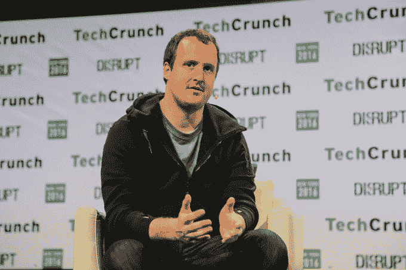
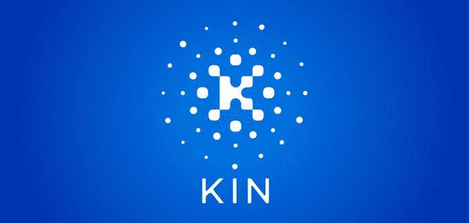

# 聊天应用 Kik 凭借建立在区块链 TechCrunch 上的开发者生态系统挑战脸书

> 原文：<https://web.archive.org/web/https://techcrunch.com/2017/05/25/kik-makes-a-move-into-the-blockchain/>

随着比特币和以太坊等其他加密货币的价值不断上升，人们对 ico—[进行了大量讨论。现在，在 Kik](https://web.archive.org/web/20230107104907/https://techcrunch.com/2017/05/20/btc2k/) [宣布](https://web.archive.org/web/20230107104907/https://medium.com/kinfoundation/announcing-kin-a-cryptocurrency-for-an-open-future-98f1da2f498a)计划通过代币销售推出自己的加密货币后，该行业将看到其第一个“大牌”进入该领域。

消息应用 Kik 在北美的青少年中特别受欢迎。总的来说，这家总部位于加拿大、成立 8 年的公司拥有 3 亿注册用户。Kik 没有公布任何一个月有多少人在活跃，但我们知道在过去的一年里增长已经放缓。

Kik 不仅是进入 ICOs 最常用的服务，也是资金支持最高的公司。迄今为止，它已经筹集了超过 1.2 亿美元，2015 年底的最近一轮融资对其业务的估值为 10 亿美元。

围绕 ico 的大多数兴趣都集中在它是一个允许公司独立于所谓的专业投资者(如风险投资公司)筹集资金的过程，因为任何持有相关加密货币的个人都可以投资。然而，Kik 强调，除了筹集资金，它正转向加密货币，以开发自己的数字商品和服务生态系统。

“更广泛的动机是，独立开发者很难与大公司竞争，”Kik 首席执行官 Ted Livingston 在接受 TechCrunch 采访时表示。

“一方面，你可以看到数字服务，另一方面，它们被更少的公司拥有和控制，因为它们是唯一利用广告大规模赚钱的公司。你试图卖东西，但你试图卖给那些认为一切都应该免费的消费者。

“就算少数公司能突破，巨头们转而复制碾压。我们认为这将导致未来消费者的选择和自由变得更少，而且我们有史以来第一次能够提出一个潜在的解决方案来改变这一切。”

## 挑战脸书

从字里行间来看，很明显 Livingston 指的是脸书——世界上最大的社交网络，运营着 Messenger 和 WhatsApp，这两个地球上最大的聊天应用(基于用户群)与 Kik 和其他公司正面竞争。

复制的提法适用于所有人，因为 Messenger 和 WhatsApp 在其他聊天应用程序之后很久就采用了共同的行业功能，但 Snapchat 尤其如此——它的功能集被脸书、Instagram 和 WhatsApp 复制到了荒谬的地步。

Livingston 和 Kik 的大胆提议是，通过创建一个由加密货币驱动的自己的环境，让开发者不必适应脸书的生态系统——及其对广告的关注。

利文斯顿用一个他认识的开发人员的个人轶事来说明他的观点，尽管他的应用程序迎合了 60 万用户，但他“完全破产了”他说，这是因为“免费文化”,消费者已经习惯了这种广告模式，他断言，这种模式是由脸书延续的。

> Kik 首席执行官泰德·利文斯顿

## 亲属关系

Kik 提出的硬币被称为[Kin](https://web.archive.org/web/20230107104907/https://kin.kik.com/)——这显然是“亲属关系:”或“家庭/社区”的简称——作为一种 ERC20 令牌创建于以太坊之上。Kik 正处于起草计划的早期阶段，计划最早可能在“即将到来的夏季”推出该产品，并将其整合到其应用程序中。Kik 没有说它打算筹集多少资金，但它计划在第一次销售中发行总硬币的 10%。

利文斯顿透露，明年，Kin 将向第三方开发者开放使用，他希望它能找到愿意采用不同方法的受众。

“我们的最终愿景是让 Kik 成为成千上万为 Kin 提供的数字服务之一，”他解释道。“如果我们让所有这些开发者都集成 Kin，那么作为一名消费者，我可以在所有这些地方赚取和消费 Kin，会怎么样？”

这是雄心勃勃的，但也许不是全新的。[三年前，Kik 推出了自己的虚拟货币](https://web.archive.org/web/20230107104907/https://thenextweb.com/apps/2014/05/09/kik-introduces-virtual-currency-encourage-engagement-potentially-make-money/)——Kik Points，首次尝试将其服务货币化。利文斯顿表示，在 2014 年 5 月推出到 2016 年 6 月期间，Kik Points 在交易中的使用量是比特币本身的三倍多——尽管这适用于非批量处理的交易总数，比特币在这方面将遥遥领先。

这个理论要成为一个可行的概念还有很长的路要走。Kik 仍在充实其顾问团队，目前该公司拒绝透露合作伙伴的名字。

## 一种新的生态系统

虽然大多数人都知道代币销售(或 ICO)是用来产生资金的，但人们往往不太了解的是，被出售硬币的持有者获得了生产资料的所有权，或者实际上是分散系统的总产出。Kik 认为，在这一点上，它可以建立一个生态系统，在不借助广告的情况下，从经济上回报开发者。

利文斯顿解释说，他设想，如果 Kin 能够成立，开发者将获得每日的奖励。在 5 亿美元的市值下——这意味着 Kin 币的总数达到了这个数字的累积值——利文斯顿解释说，每天在生态系统内工作的开发者可以获得大约 10 万美元。

Kik 首席执行官解释说:“开发者将根据他们的服务所负责的交易数量，按比例抽取一定比例的日常报酬。”

“这创造了一个奖励引擎，一个美丽的网络效应，每天的奖励越大，越多的服务进入生态系统，这推动了每天的奖励和更多的数字服务。很快，这将成为吸引开发商的一股非常强大的经济力量，”利文斯顿补充道。

在其公告中，Kik 强调了贴纸销售、托管群聊和机器人的潜在货币化。 [Telegram，另一个聊天应用](https://web.archive.org/web/20230107104907/https://techcrunch.com/2017/05/18/telegram-launches-chatbot-payments/)和[脸书都为机器人](https://web.archive.org/web/20230107104907/https://techcrunch.com/2016/09/12/messenger-bot-payments/)提供支付支持，[利文斯顿本人最近表示](https://web.archive.org/web/20230107104907/https://techcrunch.com/2017/04/07/chatbots-payments/)增加支付选项可以帮助机器人发挥潜力。

但是，除了这些情况，这都是非常理论性的。Kik 在 kin.kik.com 发布了一份概述计划的白皮书，这是它迈出的第一步。它还创建了 Kin 基金会，这是一个非营利组织，将负责管理 Kin 及其生态系统。

最后，Livingston 希望此举表明这不是一个噱头，Kik 表示，它将开放其所有客户端和服务器代码的源代码，以显示其对去中心化系统的承诺。

“多年来我一直希望如此，”利文斯顿说。“我们在 2011 年开始思考这个问题，我们可以创造一个全新的数字服务生态系统。”

“我们相信加密货币是科技领域下一个重要的商业模式创新，”联合广场风险投资公司(Union Square Ventures)合伙人、Kik 董事会成员弗雷德·威尔逊(Fred Wilson)通过一份声明补充道。“Kik 将是第一个集成加密货币的主流应用。这可能是区块链行业的一个分水岭。”

在即使是最博学的专家对 ico 和加密货币将如何发展也存在分歧的时候，Kik 更加重视这个领域。时间会证明结果如何。