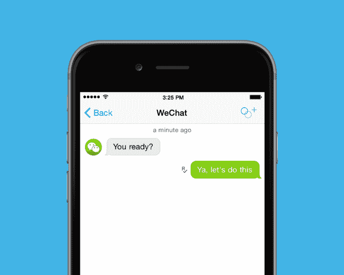
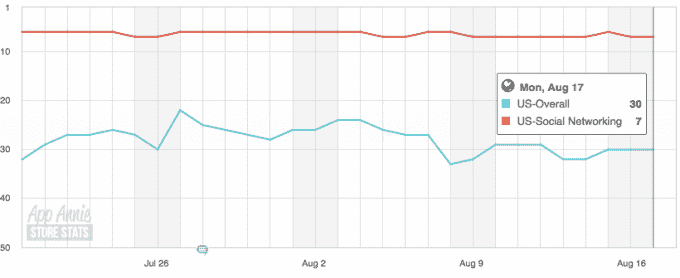

# Kik 从腾讯融资 5000 万美元，成为“西方的微信”

> 原文：<https://web.archive.org/web/https://techcrunch.com/2015/08/18/kik-raises-50m-from-strategic-partner-tencent/>

# Kik 从腾讯融资 5000 万美元，成为“西方的微信”

推出同名即时通讯应用的加拿大公司 Kik 宣布从其合作伙伴之一中国腾讯(也是中国最大的互联网公司)获得价值 5000 万美元的投资。

这笔资金使 Kik 的总价值达到 1.205 亿美元。这笔交易使该公司的估值进入独角兽领域(被大肆宣传的 10 亿美元大关)。)

以下是 Kik 的首席执行官泰德·利文斯顿对这项新投资的评论:

> 今天我们宣布，微信(Weixin)的制造商腾讯向我们的公司 Kik 投资了 5000 万美元。
> 
> 这个过程始于一年前，当时我们的董事会问我们，与一家大公司合作是否会让我们在赢得聊天竞赛中获得优势。一开始我很犹豫。我相信我们可以独自赢得比赛。但是，本着 Kik 考虑所有选择的原则，我最终同意看一看。

利文斯顿说，当他的团队访问中国的腾讯时，他被说服了，称他们是全球强国:

> 今天，世界上只有另外五家公司像我们一样预见未来:腾讯、Line、脸书、Snapchat 和 Telegram。其中一个拥有世界上最大的互联网市场。在这场比赛中，我们非常高兴能与他们合作。

腾讯有自己的热门应用系列，包括微信和 QQ。

4 月份，[我们报道了 Kik 正在寻求战略合作伙伴关系](https://web.archive.org/web/20230107104823/https://techcrunch.com/2015/04/08/kik-strategic-partners/)而不是全面出售公司，这些合作伙伴关系已经结出了投资果实。

公司[在一个玩家来来去去比以往任何时候都更快的空间](https://web.archive.org/web/20230107104823/https://techcrunch.com/2015/08/12/kik-jam/)中保持创新。[也能赚钱](https://web.archive.org/web/20230107104823/https://techcrunch.com/2014/11/06/kik-introduces-promoted-chats-to-let-brands-on-its-messaging-app-and-finally-make-money/)。

Kik 目前在 App Store 的顶级免费应用[中排名第 30，在社交网络中排名第 7(均在美国):](https://web.archive.org/web/20230107104823/https://www.appannie.com/apps/ios/app/kik/rank-history/#vtype=day&countries=US&start=2015-07-20&end=2015-08-18&device=iphone&view=rank&lm=3)

通过与腾讯合作，Kik 可以通过创新和尝试新事物来与脸书等通讯领域的怪兽竞争，直到找到坚持下去的东西……腾讯在这方面做得非常好。利文斯顿说:“我们一致认为，有人会在西方做微信在中国做的事情。唯一的问题是谁。我们都认为可能是 Kik。”