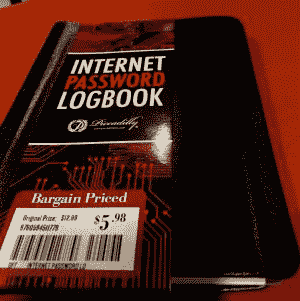

# 取消密码 

> 原文：<https://web.archive.org/web/https://techcrunch.com/2015/09/07/kill-the-password/>

密码是保护我们获取最有价值数据的主要手段，现在已经变得几乎完全无用，甚至不再是黑客和恶作剧制造者的绊脚石。

在现代计算环境中，密码有无数的问题。我们不再登录单一主机。我们在各种平台上使用多种应用程序。这意味着我们不得不记住太多的密码。这导致人们[使用愚蠢的](https://web.archive.org/web/20230129065648/http://www.cnet.com/news/worst-passwords-of-2014-are-just-as-awful-as-you-can-imagine/)比如 *1234* 或者跨多个网站使用相同的密码，甚至不去尝试安全。

想一想你最近一次获得新设备并想登录脸书或其他喜欢的在线服务。如果你像我一样，在不同的网站上使用不同的密码，你可能会忘记自己的密码。你可以像我一直做的那样，点击*忘记密码*，但这将意味着更改所有设备的密码。这是一个可怕的系统。

我经常面临这个问题，我相信我不是唯一一个。我们显然需要更好的方法。

## 密码太多

数据库中的静态密码可能是人们想到的最愚蠢的安全想法。正如我们一次又一次了解到的那样，一旦一个足智多谋的(甚至不是特别聪明的)黑客找到了进入数据库的方法，密码就在那里等着被窃取，这是一个巨大的财宝箱，是黑客的梦遗。

2012 年的一项民意调查发现，41%的人会记住自己的密码，29%的人会把密码写下来，9%的人会把密码存在电脑的一个文件里。这些都不是理想的选择。

另一项 [2012 调查发现](https://web.archive.org/web/20230129065648/http://passwordresearch.com/stats/statistic305.html)平均每个人有 17 个个人密码和 8.5 个工作密码。从那时起，这些数字可能只会增加。如果你真的使用多个密码，那么试图记住超过 25 个密码是一项艰巨的任务。

像 [Ping Identity](https://web.archive.org/web/20230129065648/https://www.pingidentity.com/en.html) 和 [Okta](https://web.archive.org/web/20230129065648/https://www.okta.com/) 这样的企业试图通过单点登录来简化这一点，并取得了不同程度的成功。这对企业来说是有效的，但对消费者并没有真正的帮助。

我们可以使用[密码管理器](https://web.archive.org/web/20230129065648/http://lifehacker.com/5529133/five-best-password-managers)来帮助我们记忆，但是当然，密码管理器是由——你猜对了——一个单独的密码保护的。这意味着如果有人黑了密码管理器，他们就可以访问你的所有密码。这个[实际上发生在今年早些时候的 LastPass](https://web.archive.org/web/20230129065648/http://www.wired.com/2015/06/hack-brief-password-manager-lastpass-got-breached-hard/) 上。

不管你有多少密码，也不管你有多小心，至少有一些密码可能是在过去两年的许多臭名昭著的黑客攻击中被发现的。

## 无所作为的后果

我们已经看到这个故事不断重复。这些漏洞被铭刻在互联网耻辱墙上。从 [Target](https://web.archive.org/web/20230129065648/http://krebsonsecurity.com/2014/01/target-names-emails-phone-numbers-on-up-to-70-million-customers-stolen/) 到 [Sony](https://web.archive.org/web/20230129065648/https://techcrunch.com/2014/12/16/hack-sony-twice-shame-on-sony/?ncid=rss&utm_source=feedburner&utm_medium=feed&utm_campaign=sfgplus&%3Fncid=sfgplus) 到 [Anthem](https://web.archive.org/web/20230129065648/https://techcrunch.com/2015/02/04/health-insurance-provider-anthem-reports-massive-data-breach/) 到[美国人事管理办公室(OPM)](https://web.archive.org/web/20230129065648/https://www.opm.gov/cybersecurity) ，我们已经看到这种大规模的泄密事件一再发生。随着每一次事件的发生，更多的密码涌入黑客黑市。

当然，并非所有这些事件都是由于错误的密码造成的，但对于黑客来说，猜测他们的方法或使用恶意软件来窃取密码并不困难，即使没有从大型黑客那里获得宝藏。一旦他们进入系统，他们就有更复杂的方法来抢劫各种数据存储。

> 负担不应该在我们这些使用者身上。拥有互联网公司的聪明人真的应该开始考虑如何简化安全性，让用户更容易、更容易访问，同时让坏人很难窃取凭据。

General Catalyst 是一家为包括 Ping Identity、Menlo Security 和 ThreatStream 在内的许多安全公司提供资金的公司，该公司的董事总经理史蒂夫·赫罗德认为，问题的一部分是公司没有很好地控制他们数据库中的数据。

“高层必须有人开始清点数据。这是我拥有的数据库。如果听到这个被破坏了会有多糟糕，”Herrod 问道。一旦你知道你拥有什么，你就能更好地保护公司的皇冠上的宝石。他说，问题是保护系统并不总是针对最高优先级的数据。

## 减轻用户的负担

事情是这样的。负担不应该在我们这些使用者身上。拥有互联网公司的聪明人真的应该开始考虑如何简化安全性，让用户更容易、更容易访问，同时让坏人很难窃取凭据。这将是对他们时间的更好利用，而不是试图找出如何为我们提供更好的广告——只是说说而已。

现有的系统往往将责任推给用户，让消费者或员工的日子不好过。当你必须每 30 天更换一次密码，并且不重复你过去用过的任何信息时，使用大小写字母，至少两个数字和一个符号；这对用户来说是一个巨大的努力。它迫使人们记住不自然的密码，并导致他们使用不安全的方法，如将密码写在便利贴上并粘贴到他们的显示器上，或者甚至在像密码日志这样显而易见的东西中。

关键是找到一种方法来保护我们的个人信息，而不会给用户带来不必要的困难，同时使窃取变得困难(理想情况下是不可能的)。这需要不断自动更改密码，或者指纹或眼睛扫描之类的东西。值得注意的是，我总是带着我的手指和眼睛。我不能忘记他们，而且你没有把扫描储存在数据库里。它可以在系统级别进行交互，并且永远不会被任何人访问(除了一些我宁愿不考虑的令人毛骨悚然的场景)。大多数设备上都已经配备了眼睛扫描设备，即摄像头。许多人配备了指纹扫描仪。

当然，没有什么是万无一失的，但是一定有比我们现在做的更好的方法。密码是无效的，它把责任完全放在用户身上，这与系统应该如何工作是完全相反的。即使你对密码很在行——老实说，我认为大多数人都不在行——一旦数据库被攻破也没关系了。你可以拥有世界上最好的密码，一旦有人窃取，他们就拥有了。

因此，我恳求你们所有聪明的工程师和安全极客，集中你们的集体智慧，运用所有的脑力，找到更好的方法。肯定有更好的方法。

为了大家好，是时候取消密码了。