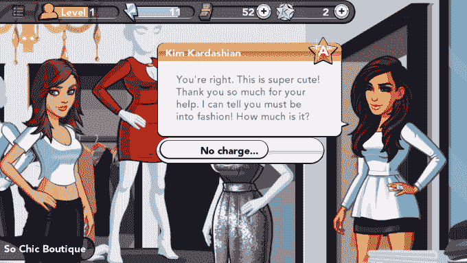
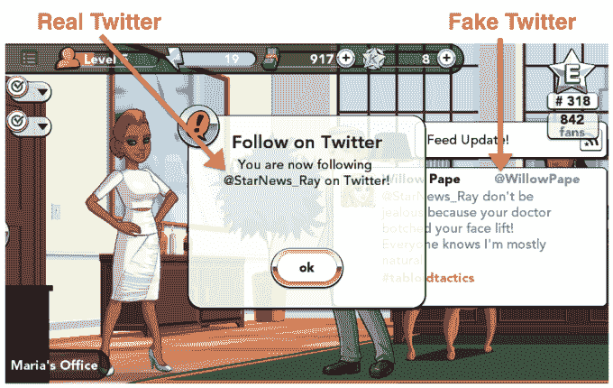
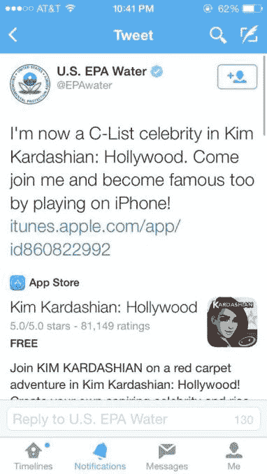

# 金·卡戴珊:好莱坞和病毒式的“哎呀”

> 原文：<https://web.archive.org/web/https://techcrunch.com/2014/08/06/kim-kardashian-hollywood-and-the-viral-oops/>

More posts by this contributor

**编者按:** *Nir Eyal 在[NirAndFar.com](https://web.archive.org/web/20230107195731/http://www.nirandfar.com/)写了心理学、技术和商业的交集。他是《上钩:如何打造习惯养成产品》一书的作者。*

最近，我开始关注一款非常流行的新游戏*金·卡戴珊:好莱坞*。这款游戏在苹果美国应用商店下载量最高的免费游戏排行榜上名列前茅。行业观察人士称，这款应用每年能赚 2 亿美元，并为卡戴珊带来可观的游戏利润。

我的工作是研究是什么让一些产品如此引人注目，在卡戴珊游戏的案例中，我想知道应用程序惊人增长的背后是什么。

我很快发现，它所有安装的一个潜在驱动因素是一个相当狡猾的策略，利用用户错误，可以无意中向玩家的 Twitter 帐户发布消息。

它被称为“[病毒性*哎呀*](https://web.archive.org/web/20230107195731/http://www.nirandfar.com/2013/04/viral-loops-or-viral-oops.html) ”

不同于病毒性循环，病毒性循环是用户在使用产品邀请新成员的正常过程中采取的行动，病毒性循环依赖于用户的行为。

一个典型的病毒循环的例子可以在 Paypal 这样的产品中找到。如果一个用户想向另一个用户汇款，收款人通常会开立一个 Paypal 账户来赎回资金。可以想象，当新用户想自己汇款时，他们会带来更多的新成员，循环继续。

然而，在病毒式哎呀的情况下，用户并没有意识到他们刚刚做了什么。

病毒式的“哎呀”不一定是该公司的欺骗——在未经用户允许的情况下发送信息可能是这种方式——相反，它更像是一种数字花招。就像魔术一样，当追溯步骤以找出刚刚发生的事情时，很明显病毒式的糟糕是如何发生的，用户通常会责怪自己，而不是公司允许这一失误。

在金·卡戴珊:好莱坞的案例中，游戏的开始足够天真。这款应用程序是一款经典的角色扮演游戏，玩家扮演一个崭露头角的好莱坞名人，决心攀登“一线”地位。要达到这一点，玩家必须通过 E、D、C 和 B 名单上较低层次的明星。通过这些关卡需要完成一些任务，比如为杂志摆姿势，去约会，以及尽我所能告诉你的，为金·卡戴珊偷东西。

我的头像为金·卡戴珊的头像入店行窃

完成一项任务需要反复用拇指敲击，这会耗尽能量点。通过等待一段时间或支付真实的美元重新进入游戏来补充能量。这就是数百万美元是如何赚来的，但这不是偷偷摸摸的部分。

病毒式哎呀是这样工作的:这款游戏有一个“feed update”，它偶尔会弹出来提供新闻和八卦，就像 Twitter 账户一样。游戏中的虚构人物，比如帕丽斯·希尔顿·洛佩(Paris Hilton lookalike @ willow pape ),会用充满标签的 140 个字符的连发来更新他们的订阅——就像在 Twitter 上一样。屏幕上不断出现“粉丝”的数量，进一步给人一种游戏有自己的 Twitter 版本的印象。

当游戏要求我通过@StarNews_Ray 这个名字跟踪一个名叫 Ray Powers 的新闻记者时，这样做感觉就像是游戏的一部分。很自然，我认为游戏中的 Twitter 不是真实世界中的 Twitter。怎么可能呢？

在下面的截图中，我的头像显示了@WillowPape 和@StarNews_Ray 之间的推文，他们都是游戏中的虚构人物，对吗？不完全是。

你能看出区别吗？

我不知道的是，当我在游戏中关注@StarNews_Ray 时，我的真实世界 Twitter 账户也开始关注@StarNews_Ray，显然我不是唯一一个。假冒的@StarNews_Ray 的真实世界 Twitter 账户已经积累了超过 40 万名粉丝。

现在陷阱已经为病毒设置好了。在我第一次玩游戏时，这款应用为在(我以为是)游戏内的 Twitter 上分享新闻提供积分。然而，我认为是假的推特变成了真的推特，这条推特被发送到了我的数千粉丝的信息流中。

游戏自动发布，“我现在是《金·卡戴珊:好莱坞》中的 E 榜名人。来加入我吧，在 iPhone 上玩也能出名！”并提供了一个下载应用程序的链接。

在 Twitter 上搜索发现，每分钟都有多条类似的推文发布。目前还不清楚这些推文有多少是由不知道发生了什么的人发出的，但在 7 月份，在[有 396，000 条类似的自动填充推文](https://web.archive.org/web/20230107195731/http://topsy.com/s?q=Kim%20Kardashian%3A%20Hollywood.%20Come%20join%20me%20and%20become%20famous%20too%2C%20by%20playing%20on%20iPhone!&window=h4&type=tweet&next=http%3A%2F%2Ftopsy.com%2F)被发送。其中一条推文肯定不是故意的，来自环境保护署水资源办公室，该办公室在意识到错误后迅速删除了该帖子。

环保局的“哎呀”

看来所有这些错误都不是偶然的。然而，据 Glu Mobile 的首席执行官尼依格罗酒店·德·马西称，人们错误地从游戏中发推文的情况很少。“总有 0.0001%的人会感到困惑，”德马斯告诉我。“当有这么多人安装游戏时，”德·马西在电话中说，“你将会有很多以前没有玩过游戏的人来玩。这是巨大成功和广受欢迎的标志。”

或许正如德马西所说，犯这个错误的人是技术新手。然而，就连 TechCrunch 的记者莎拉·布尔(Sarah Buhr)也犯了同样的错误，[承认](https://web.archive.org/web/20230107195731/https://techcrunch.com/2014/07/23/life-on-kim-kardashians-d-list/)“这个游戏没有告诉我的是，它会在推特上告诉我现实生活中的所有粉丝，我是一个成年女性，正在扮演金·卡戴珊·好莱坞。”

De Masi 很快指出，“这是 app store 中评论最好的游戏”，该公司尚未听到玩家的重大投诉。他将游戏的流行归功于卡戴珊的名气和大量的社交媒体关注。

[Glu Mobile](https://web.archive.org/web/20230107195731/http://www.crunchbase.com/organization/glu-mobile) 坚称没有欺骗的意图，但 De Masi 不愿评论来自 Twitter 的安装比例。De Masi 认为这种游戏是通过口口相传发展起来的——人们只是想把它告诉别人。

不管这种策略是否是该公司有意为之，它似乎从所有的推文中受益。De Masi 说，“作为一家公司，Glu 在用户获取上的花费没有竞争对手多……我们花了 15%，而我们的竞争对手花了 40%。”正如[经常发生的情况](www.nirandfar.com/2013/04/viral-loops-or-viral-oops.html)一样，病毒式的哎呀，我不确定是不是连游戏开发商都被骗了，以为所有的推文都是真实的。

当我问德马西该公司是否有任何改变游戏的计划时，他的回答是，这个问题“不是问题”，“不在我们的考虑范围内，因为这是数百万粉丝关心的问题。”

显然，玩家在游戏中花费的 28 亿分钟证明了它的吸引力。然而，这款游戏的增长有多少是真实玩家支持的结果，而不是一种被称为病毒式哎呀的技术花招，这仍然是一个悬而未决的问题。