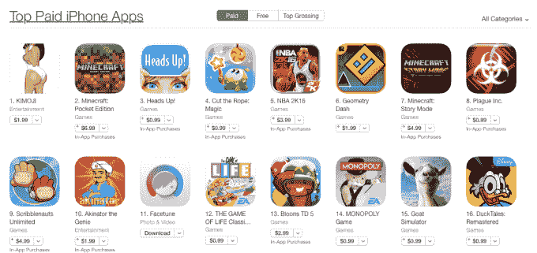
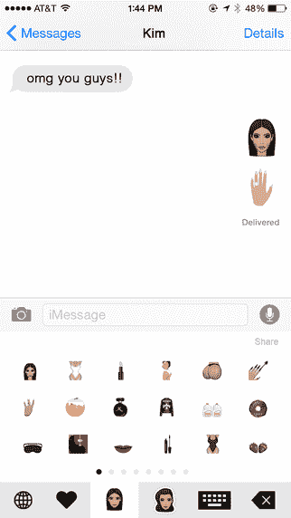

# 金·卡戴珊的 Buttmoji 拥有应用商店 

> 原文：<https://web.archive.org/web/https://techcrunch.com/2015/12/22/kim-kardashians-buttmoji-owns-the-app-store/>

# 金·卡戴珊的 Buttmoji 拥有 App Store

似乎 2015 年是“表情符号”之年。我的意思是，一个该死的表情符号是“年度词汇”由于金·卡戴珊和她的……资产，今年以 App Store 的大爆炸而告终。

在您的设备上打开应用商店，您会看到付费最高的应用程序:

这款名为 [KIMOJI 的应用售价 1.99 美元](https://web.archive.org/web/20221209001535/https://itunes.apple.com/us/app/kimoji/id1068019093?mt=8)。你得到了什么？当然，表情符号与金·卡戴珊有关。对一个键盘应用来说还不错，是吧？

它目前有 2 颗星，所以也许人们并不像他们想象的那样从中获益。最初的受欢迎程度当然吸引了大量的兴趣，因为 App Store 在一片混乱中神奇地关闭了:

卡戴珊*真的*拿下了 App Store 吗？

不，但它仍然是一个有趣的故事。

她的丈夫当然很自豪，我也会如此:

https://twitter.com/kanyewest/status/679183182126682112

祝大家卡戴珊假期快乐！